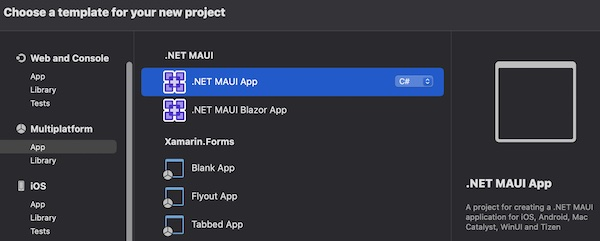
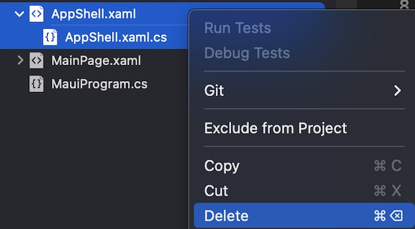

<!--more-->

Since the official release of .NET MAUI, it is not possible to create a new project where Visual Studio does not add a default Shell. Fortunately, there is a very simple way to get rid of it!

### Shell or not Shell? It's up to you!
When creating a new app in .NET MAUI, Visual Studio does not offer many configuration options:

<p align="center"></p>
<figure><figcaption class="image-caption">Of course, there is .NET MAUI Blazor, but it is a completely different framework.</figcaption></figure>


But every new .NET MAUI application created with Visual Studio comes with a Shell by default. And while the [Shell](https://learn.microsoft.com/en-us/dotnet/maui/fundamentals/shell/?view=net-maui-7.0) can reduce the complexity to develop an application, it is also a tool that any beginner must learn to master in additional to the rest.

Here is a small comparative table of the pros and cons of the Shell:


| Pros | Cons | 
| --- | --- |
| Brings a standard application structure with a side menu or tabs, as well as a navigation system with URLs. | A bit complex at first for a beginner, may slow down the opening of the app, and is not necessary for basic cases. | 


Finally, the use of Shell in a .NET MAUI project remains a personal choice and should not be enforced by Visual Studio. But then, how would you get an app without a Shell, like in the tuto <a href="../../tutos/my-first-app/">My First App</a>? Let's have a look, it's very simple.

### Go without Shell
First of all, you need a .NET MAUI project. You can create a new one with Visual Studio, or reuse an existing project. Once your project is open in Visual Studio, delete the `AppShell` class by deleting the two files *AppShell.xaml* and *AppShell.xaml.cs*.

<p align="center"></p>
<figure><figcaption class="image-caption">Select both files at once, then right click and delete them.</figcaption></figure>


Visual Studio will probably ask you for a confirmation. Check that the selected files are the right ones and confirm the deletion:

<p align="center"></p>
<figure><figcaption class="image-caption">Never safe from mishandling!</figcaption></figure>


That's it! All that remains is reconfiguring the application's start page.

To do this, open the *App.xaml.cs* file and identify the following line of code in the class constructor:

<p align="center" style="margin-bottom:-10px"><strong>Filename:</strong><code>App.xaml.cs</code></p>

```csharp
MainPage = new AppShell();
```


Now that `AppShell` class does not refer to anything, it must be replaced. You just have to replace it by the class associated with the page that appears first when opening the app!

For example, for all new projects, this will result into:

<p align="center" style="margin-bottom:-10px"><strong>Filename:</strong><code>App.xaml.cs</code></p>

```csharp
MainPage = new MainPage();
```


Now, when the application is opened, the `MainPage` will be loaded first.

___
There you go, you don't have to develop your application around a Shell anymore!

Now, what if you learn how to <a href="../../tutos/my-first-app/5-how-to-navigate">navigate from page to page</a> without Shell?

