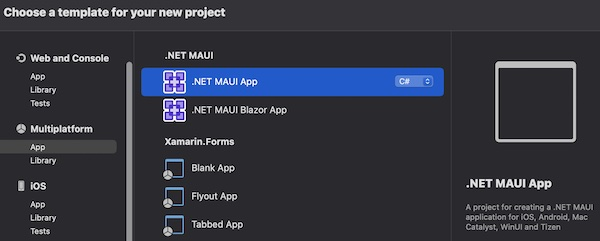
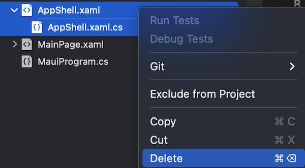
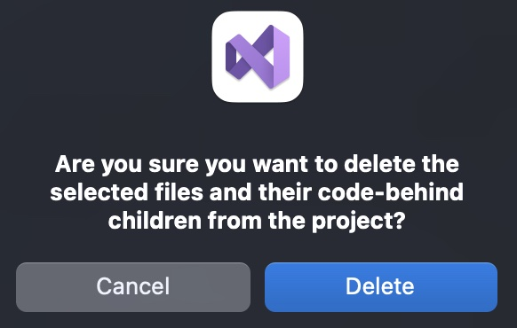

<!--more-->

Depuis la sortie officielle de .NET MAUI, il n’est pas possible de créer de nouveau projet sans que Visual Studio n’y ajoute un Shell par défaut. Heureusement, il existe une façon très simple de s’en débarrasser !

### Avec ou sans Shell ? À toi de voir !
Quand il s’agit de créer une nouvelle application en .NET MAUI, Visual Studio ne propose pas beaucoup d’options de configuration :

<p align="center"></p>
<figure><figcaption class="image-caption">Il y a bien sûr le choix de .NET MAUI Blazor, mais c’est un tout autre framework.</figcaption></figure>


Seulement, chaque nouvelle application .NET MAUI créée avec Visual Studio embarque un [Shell](https://learn.microsoft.com/fr-fr/dotnet/maui/fundamentals/shell/?view=net-maui-7.0) par défaut. Et bien que le Shell peut aider à réduire la complexité du développement d’une application, c’est également un outil que tout débutant doit apprendre à maîtriser en plus du reste.

Voici d’ailleurs un petit tableau comparatif des avantages et inconvénients du Shell :


| Les avantages | Les inconvénients | 
| --- | --- |
| Apporte une certaine structure standard à l’application avec un menu latéral ou des onglets, ainsi qu’un système de navigation avec des URLs. | Un peu complexe au premier abord pour un débutant, peut ralentir l’ouverture de l’app, et n’est pas nécessaire dans les cas les plus simples. | 


Finalement, recourir au Shell dans un projet .NET MAUI reste un choix personnel et ne devrait donc pas être imposé par Visual Studio. Mais alors, comment obtenir une application <u>sans Shell</u>, comme dans le cours <a href="../../tutos/my-first-app/">Ma Première App</a> ? Tu vas voir, c’est très simple.

### Se passer du Shell
Dans un premier temps, il te faut un projet .NET MAUI. Tu peux en créer un nouveau avec Visual Studio, ou bien réutiliser un projet existant. Une fois ton projet ouvert dans Visual Studio, supprime la classe `AppShell` en effaçant les deux fichiers *AppShell.xaml* et *AppShell.xaml.cs*.

<p align="center"></p>
<figure><figcaption class="image-caption">Sélectionne les deux fichiers à la fois, puis fais un clic droit et supprime-les.</figcaption></figure>


Visual Studio te demandera probablement une confirmation. Vérifie que les fichiers sélectionnés sont les bons et confirme la suppression :

<p align="center"></p>
<figure><figcaption class="image-caption">On n’est jamais à l’abri d’une fausse manip !</figcaption></figure>


Voilà, c’est fait ! Il ne reste alors plus qu’à reconfigurer la page de démarrage de l’application.

Pour cela, ouvre le fichier *App.xaml.cs* et repère la ligne de code suivante dans le constructeur de la classe :

<p align="center" style="margin-bottom:-10px"><strong>Nom du fichier :</strong><code>App.xaml.cs</code></p>

```csharp
MainPage = new AppShell();
```


Maintenant que la classe `AppShell` ne fait plus référence à rien, elle doit donc être remplacée. Il te suffit de la remplacer par la classe associée à la page qui apparaît en premier lors de l’ouverture de l’app !

Par exemple, pour tous les nouveaux projets, cela donnera :

<p align="center" style="margin-bottom:-10px"><strong>Nom du fichier :</strong><code>App.xaml.cs</code></p>

```csharp
MainPage = new MainPage();
```


Et maintenant, à l’ouverture de l’application, c’est la page `MainPage` qui sera chargée en premier.

___
Voilà, tu n’es plus obligé·e de développer ton application autour d’un Shell !

Et maintenant, que dirais-tu d’apprendre à <a href="../../tutos/my-first-app/5-how-to-navigate">naviguer de pages en pages</a> sans le Shell ?


