<!--more-->

Que ce soit pour le développement d’applications mobiles, de logiciels ou de sites Web, il est courant de mettre en place plusieurs environnements pour son projet. En effet, cela facilite le test de nouvelles fonctionnalités sans risquer d’impacter les données de nos utilisateurs.

Dans le cadre de cet article, nous verrons comment une application .NET MAUI peut cibler différents environnements, grâce à plusieurs configurations de projet.



Pour simplifier la lecture de cet article, nous nous concentrerons uniquement sur les plateformes iOS & Android. Cependant, le procédé est similaire pour les autres plateformes.

# Identifier toutes les configurations nécessaires au projet
Dans un premier temps, tu dois déterminer combien de configurations différentes tu as besoin selon le nombre d’environnements créés pour ton projet.

Cependant, si tu n’es qu’au début de ton projet, tu ne disposes peut-être que d’un environnement de développement. Voici donc quelques pistes de réflexion pour t’aider :

* Es-tu seul·e à développer cette application ? Y-a-t’il des testeurs dans ton équipe ?
* Ton projet est-il soumis à des critères de sécurité ou de performance ?
* Est-ce que tu dois l’exposer au client avant sa publication ?



Par défaut, il est important d’isoler l’environnement de production de ton environnement de développement.



Pour notre démonstration, nous nous référerons aux 3 environnements suivants :

* une configuration “DEV” pour travailler de manière totalement isolée sur sa machine (i.e. “en local”) et ne pas impacter l’activité des autres développeurs de son équipe,
* une configuration “TEST” pour faire valider tous les développements avant leur publication,
* et une configuration “PROD” qui représente l’état final de l’application, une fois disponible sur les stores.


Allez, il est temps de passer à la pratique ! Dans la prochaine section, nous allons créer ces 3 configurations pour exécuter notre application mobile dans 3 environnements distincts.



Je t’invite à sauter la partie suivante dans le cas où tu aurais déjà défini toutes les configurations nécessaires à ton projet dans Visual Studio.

# Créer les différentes configurations du projet dans Visual Studio
Maintenant que nous avons identifié tous les environnements ciblés, voyons comment créer les différentes configurations pour notre application.

Commence par ouvrir le fichier de configuration du projet dans Visual Studio.



<p align="center">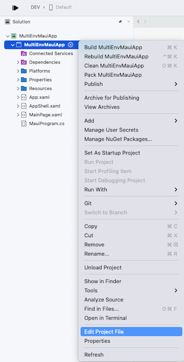</p>
<figure><figcaption class="image-caption">Il est possible d’accéder au fichier de configuration à l’aide d’un clic droit sur le projet dans Visual Studio.</figcaption></figure>
Le fichier de configuration d’un projet se termine par l’extension .csproj et peut être édité par n’importe quel éditeur de texte (e.g. Visual Studio Code). On le retrouve généralement via l’explorateur de fichiers à la racine du projet.




Une fois le fichier *.csproj* ouvert, ajoute à la fin du fichier le code suivant :

<p align="center" style="margin-bottom:-10px"><strong>Nom du fichier :</strong><code>MultiEnvMauiApp.csproj</code></p>

```xml
<Project Sdk="Microsoft.NET.Sdk">
...
	<PropertyGroup>
		<Configurations>DEV;TEST;PROD</Configurations>
	</PropertyGroup>
</Project>
```
Nous venons d’ajouter un paramètre qui, comme son nom l’indique, définit les 3 nouvelles configurations possibles du projet : “DEV”, “TEST” et “PROD”.

Nous pouvons alors personnaliser la configuration du projet pour chacun des environnements ciblés. Pour cela, rajoute le code suivant à la fin du fichier *.csproj* :

<p align="center" style="margin-bottom:-10px"><strong>Nom du fichier :</strong><code>MultiEnvMauiApp.csproj</code></p>

```xml
<Project Sdk="Microsoft.NET.Sdk">
...
	<PropertyGroup Condition=" '$(Configuration)' == 'DEV' ">
	</PropertyGroup>
	
	<PropertyGroup Condition=" '$(Configuration)' == 'TEST' ">
	</PropertyGroup>
	
	<PropertyGroup Condition=" '$(Configuration)' == 'PROD' ">
	</PropertyGroup>
</Project>
```


Comme tu l’auras remarqué, nous avons ajouté une condition d’exécution à chacun de ces nouveaux groupes de propriétés. De cette façon, Visual Studio pourra appliquer la bonne configuration selon l’environnement ciblé.

Voyons maintenant pour ce qui est du contenu en lui-même (à adapter selon tes besoins) :

<p align="center" style="margin-bottom:-10px"><strong>Nom du fichier :</strong><code>MultiEnvMauiApp.csproj</code></p>

```xml
<PropertyGroup Condition=" '$(Configuration)' == 'DEV' ">
	<DebugSymbols>true</DebugSymbols>
	<Optimize>false</Optimize>

	<MtouchDebug>true</MtouchDebug>
</PropertyGroup>

<PropertyGroup Condition=" '$(Configuration)' == 'TEST' ">
	<DebugSymbols>false</DebugSymbols>
	<Optimize>true</Optimize>
</PropertyGroup>

<PropertyGroup Condition=" '$(Configuration)' == 'PROD' ">
	<DebugSymbols>false</DebugSymbols>
	<Optimize>true</Optimize>
</PropertyGroup>
```


Dans notre cas, on veut pouvoir débogguer l’application quand elle tourne en “DEV”, mais pas quand elle tourne en “TEST” ou en “PROD”. On a donc recours au paramètre `DebugSymbols` pour activer le déboggage de l’application, tandis que le paramètre `Optimize` permet d’optimiser les performances de l’app et son poids.



En raison d’un problème connu des équipes de Visual Studio, au moment de l’écriture de cet article, il est nécessaire d’appliquer `<MtouchDebug>true</MtouchDebug>` pour chaque configuration de déboggage.

___
Voilà, on en a fini avec le fichier *.csproj* !

Mais après avoir sauvegardé ce fichier, il est fort possible que Visual Studio affiche une petite icône rouge. Heureusement, c’est tout à fait normal !

<p align="center">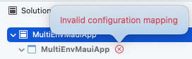</p>
<figure><figcaption class="image-caption">Visual Studio est rarement content qu’on bidouille les réglages du projet sans passer par son interface graphique.</figcaption></figure>


Le message indique qu’il y a un problème d’association des configurations. En effet, Visual Studio ne sait pas encore quoi faire de nos configurations “DEV”, “TEST” et “PROD”. Il nous faut donc aller un peu plus loin en définissant leur comportement au niveau de la solution.

Pour Visual Studio, une solution est comme un espace de travail : elle peut contenir plusieurs projets en même temps. Or il est possible de gérer des configurations pour la solution, comme pour les projets ! Et pour que cela fonctionne, chaque configuration de la solution doit être associée à une configuration de chaque projet présent dans l’espace de travail.

Tu vas vite comprendre. Commence par ouvrir les paramètres de la solution dans Visual Studio.



<p align="center">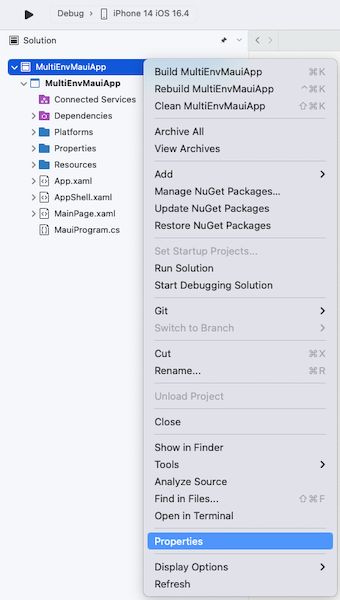</p>
<figure><figcaption class="image-caption">On peut également accéder aux paramètres de la solution à l’aide d’un double-clic sur le premier des items listés par Visual Studio.</figcaption></figure>


Lorsque la fenêtre des paramètres de la solution s’affiche à l’écran, rends-toi dans la section des configurations de compilation.

Puis, ajoute une nouvelle configuration pour “DEV”, “TEST” et enfin “PROD” comme ci-dessous :

<p align="center">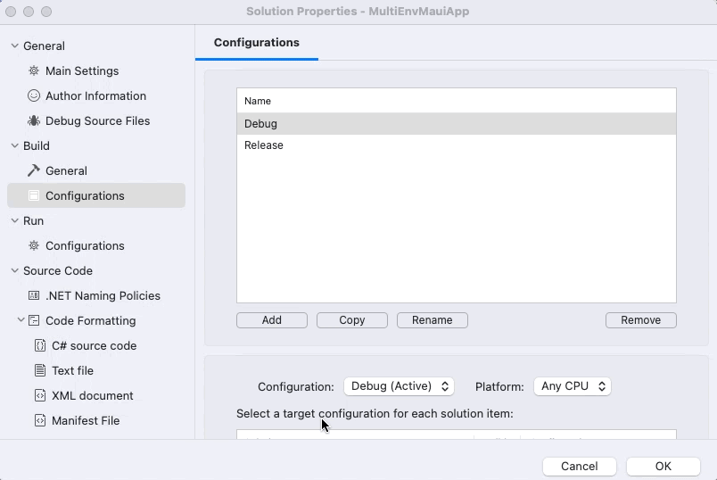</p>
<figure><figcaption class="image-caption">Par défaut, Visual Studio définit deux configurations de base : Debug and Release.</figcaption></figure>


Maintenant que nos configurations existent au niveau de la solution, on doit les associer à la bonne configuration du projet, comme présenté dans le tableau suivant :


| Configuration au niveau de la solution | Configuration au niveau du projet | 
| --- | --- |
| DEV | DEV | 
| TEST | TEST | 
| PROD | PROD | 


Rien de plus facile !

Pour cela, toujours dans la fenêtre des paramètres de la solution, défile vers le bas pour afficher la section d’association des configurations. Puis, sélectionne la configuration au niveau de la solution avant de l’associer à la bonne configuration du projet :

<p align="center">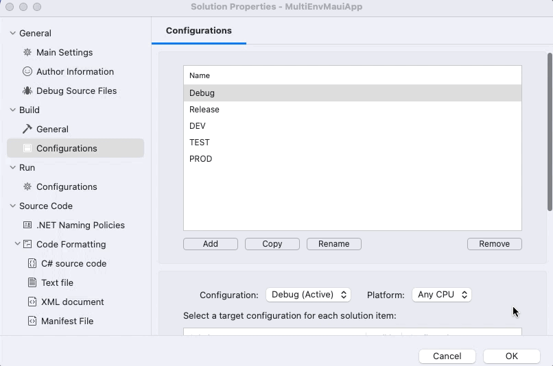</p>
<figure></figure>


Finalement, tu peux aussi supprimer les configurations *Debug* et *Release* qui ont été créées par défaut par Visual Studio :

<p align="center">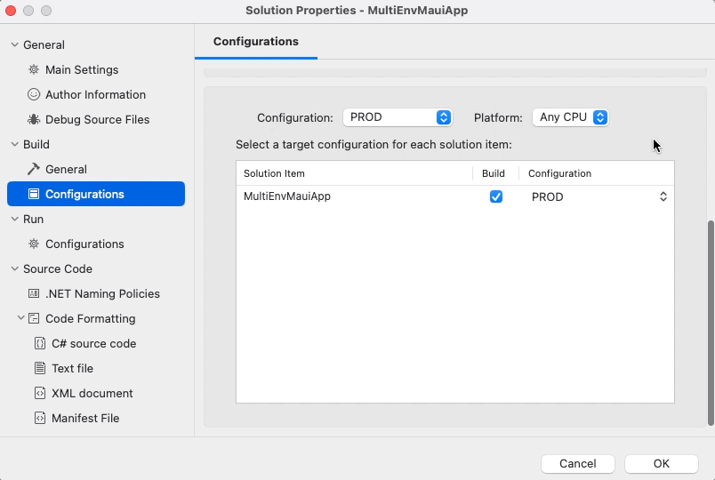</p>
<figure></figure>


Une fois que tu as suivi toutes ces étapes, ferme la fenêtre en cliquant sur OK et vérifie que tu n’as plus l’erreur signalée par la petite icône rouge.

Plus d’erreur ? Bravo ! Tu peux maintenant facilement exécuter ton application dans n’importe quel environnement !

<p align="center">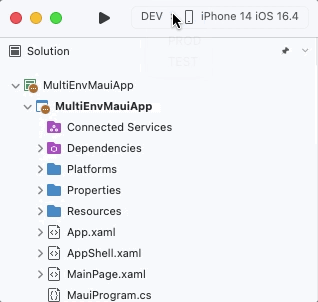</p>
<figure><figcaption class="image-caption">Visual Studio peut maintenant compiler le projet avec les configurations que l’on vient de créer.</figcaption></figure>


Voyons maintenant comment installer l’application sur ton téléphone pour chacun des environnements de ton projet !



La prochaine fois que tu rouvriras le projet dans Visual Studio, il se peut que les configurations *Debug* et *Release* soient re-créées automatiquement. C’est sans conséquence pour ton projet.

# Définir un nom d’application pour chaque environnement ciblé
Maintenant que les configurations de ton projet sont prêtes, nous allons donner un nom d’application spécifique pour chacun des environnements ciblés, afin d’éviter toute confusion entre l’application de développement et celle de production.

Le nom de l’application peut être modifié via le fichier de configuration du projet. Par défaut, tu y verras normalement un titre et un identifiant d’application déjà définis pour chaque nouveau projet .NET MAUI :

<p align="center" style="margin-bottom:-10px"><strong>Nom du fichier :</strong><code>MultiEnvMauiApp.csproj</code></p>

```xml
<PropertyGroup>
...
	<!-- Display name -->
	<ApplicationTitle>My App</ApplicationTitle>
	
	<!-- App Identifier -->
	<ApplicationId>com.companyname.multienvmauiapp</ApplicationId>
...
</PropertyGroup>
```


Dans l’exemple ci-dessus, ”My App” correspond au nom de base de l’application, et notre but est de le personnaliser pour chacune des configurations du projet.

Dans notre cas, nous allons inclure la dénomination de l’environnement ciblé dans le titre et dans l’identifiant d’application :

<p align="center" style="margin-bottom:-10px"><strong>Nom du fichier :</strong><code>MultiEnvMauiApp.csproj</code></p>

```xml
<PropertyGroup Condition=" '$(Configuration)' == 'DEV' ">
...
	<!-- Display name (Overridden) -->
	<ApplicationTitle>(DEV) My App</ApplicationTitle>

	<!-- App Identifier (Overridden) -->
	<ApplicationId>com.companyname.multienvmauiapp.dev</ApplicationId>
...
</PropertyGroup>

<PropertyGroup Condition=" '$(Configuration)' == 'TEST' ">
...
	<!-- Display name (Overridden) -->
	<ApplicationTitle>(TEST) My App</ApplicationTitle>

	<!-- App Identifier (Overridden) -->
	<ApplicationId>com.companyname.multienvmauiapp.test</ApplicationId>
...
</PropertyGroup>
```


Désormais, pour les configurations “DEV” et “TEST”, l’appellation de l’environnement ciblé apparaîtra au début du nom d’application et à la fin de l’identifiant d’application. Cette mesure n'est pas nécessaire pour la configuration "PROD", car le titre et l'identifiant de base seront utilisés par défaut pour toutes les configurations.



C’est parce que le paramètre *ApplicationId* a une valeur différente pour chaque configuration qu’il est possible d'installer plusieurs versions de l'application.



Tu peux maintenant différencier l’application de développement de celle de production sur ton téléphone. Cool ! Et si on allait un peu plus loin ?

Dans la section suivante, tu apprendras à personnaliser l’icône de l’app.

# Définir une icône d’application pour chaque environnement ciblé
En plus de nommer l’application selon l’environnement ciblé, nous allons voir comment définir une icône pour chacune des configurations du projet.

Pour cela, il te faut d’abord concevoir une icône pour chaque environnement. Une fois que c’est fait, ajoute-les au projet dans un dossier adapté.

<p align="center"></p>
<figure><figcaption class="image-caption">Par défaut, tout projet .NET MAUI comporte un dossier AppIcon.</figcaption></figure>


Tout comme pour le nom de l’application, tu auras peut-être remarqué que [l’icône se définit aussi dans le fichier de configuration du projet](https://learn.microsoft.com/fr-fr/dotnet/maui/user-interface/images/app-icons?tabs=android#change-the-icon), avec la propriété `MauiIcon`.

Commence par supprimer ce paramètre du fichier *.csproj*, puis ajoute le code suivant :

<p align="center" style="margin-bottom:-10px"><strong>Nom du fichier :</strong><code>MultiEnvMauiApp.csproj</code></p>

```xml
<ItemGroup>
		<!-- App Icon -->
		<MauiIcon Include="Resources\AppIcon\icon_dev.png" Condition=" '$(Configuration)' == 'DEV' " />
		<MauiIcon Include="Resources\AppIcon\icon_test.png" Condition=" '$(Configuration)' == 'TEST' " />
		<MauiIcon Include="Resources\AppIcon\icon.png" Condition=" '$(Configuration)' == 'PROD' " />
</ItemGroup>
```


Et hop ! Ça y’est, on a défini une icône différente en fonction de la configuration choisie !

Enfin… presque ! Comme tu le sais, chaque application .NET MAUI s’appuie sur des fichiers de configuration liés à la plateforme cible. Il est également nécessaire de définir l'icône de l'application dans ces fichiers :

* dans le fichier [AndroidManifest.xml sur Android](https://learn.microsoft.com/fr-fr/dotnet/maui/android/manifest),
* et dans le fichier [Info.plist sur iOS](https://learn.microsoft.com/fr-fr/dotnet/maui/macios/info-plist?tabs=vs).


À l’heure où j’écris cet article, il n’est pas possible de générer automatiquement l’icône sur [iOS](https://github.com/xamarin/xamarin-macios/issues/12790) et [Android](https://github.com/xamarin/xamarin-android/issues/7147) sans modifier ces fichiers. Peut-être une fonctionnalité pour .NET 8 ?



Tout d’abord, nous devons associer chacun de ces fichiers à une configuration différente. Dans notre cas, nous aurons besoin de 3 fichiers *.plist* sur iOS et de 3 fichiers *.xml* sur Android :


|  | Android | iOS | 
| --- | --- | --- |
| DEV | AndroidManifest.dev.xml | Info.dev.plist | 
| TEST | AndroidManifest.test.xml | Info.test.plist | 
| PROD | AndroidManifest.xml | Info.plist | 


Commençons par iOS, rends-toi dans le dossier *Platforms/iOS* et crée deux copies du fichier *Info.plist* d’origine. Puis, renomme-les en *Info.dev.plist* et *Info.test.plist*.

<p align="center">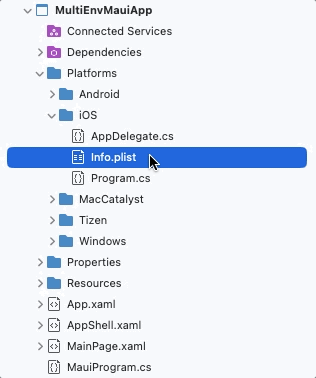</p>
<figure></figure>


Pour chaque fichier *.plist*, nous allons modifier la valeur du paramètre `XSAppIconAssets` de sorte à définir une icône par configuration. La [documentation](https://learn.microsoft.com/fr-fr/dotnet/maui/user-interface/images/app-icons?tabs=macios#platform-specific-configuration) indique que la valeur suit le format `Assets.xcassets/{name}.appiconset` et qu’il nous faut remplacer `{name}` par le nom de l’icône souhaitée (sans mentionner son chemin d’accès, ni son extension).

Dans notre cas, voici ce que cela donne pour le fichier *Info.dev.plist* :

<p align="center" style="margin-bottom:-10px"><strong>Nom du fichier :</strong><code>Info.dev.plist</code></p>

```xml
<key>XSAppIconAssets</key>
<string>Assets.xcassets/icon_dev.appiconset</string>
```


Enfin, lorsque tu as modifié l’icône dans tous les fichiers *.plist*, retourne dans le fichier de configuration du projet. En effet, nous devons lui indiquer quel fichier *.plist* considérer selon la configuration choisie :

<p align="center" style="margin-bottom:-10px"><strong>Nom du fichier :</strong><code>MultiEnvMauiApp.csproj</code></p>

```xml
<ItemGroup Condition=" '$(TargetFramework)' == 'net7.0-ios' ">
	<PartialAppManifest Include="Platforms\iOS\Info.dev.plist" Condition=" '$(Configuration)' == 'DEV' " />
	<PartialAppManifest Include="Platforms\iOS\Info.test.plist" Condition=" '$(Configuration)' == 'TEST' " />
</ItemGroup>
```


Par défaut, Visual Studio choisira le fichier *Info.plist*. On doit donc uniquement préciser quel fichier considérer pour les configurations “DEV” et “TEST”.



Aller plus loin avec la propriété [PartialAppManifest](https://github.com/xamarin/xamarin-macios/wiki/Project-file-properties#partialappmanifest).



Enfin, même chose pour Android. Rends-toi dans le dossier *Platforms/Android* et crée deux copies du fichier *AndroidManifest.xml*. Puis, renomme-les en *AndroidManifest.dev.xml* et *AndroidManifest.test.xml*.

Cependant, ici nous devons renommer le *AndroidManifest.xml* d’origine en *AndroidManifest.prod.xml*. Sans quoi, tu aurais des soucis à la compilation de l’app. 

<p align="center">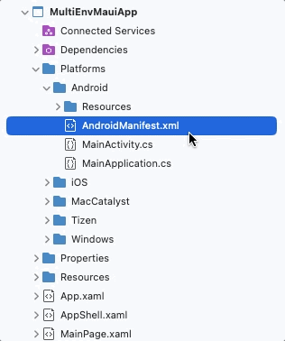</p>
<figure></figure>


Pour chaque fichier *.xml*, nous allons modifier la valeur des paramètres `android:icon` et `android:roundIcon` de sorte à définir une icône par configuration. La [documentation](https://learn.microsoft.com/fr-fr/dotnet/maui/user-interface/images/app-icons?tabs=android#platform-specific-configuration) indique que les valeurs suivent respectivement le format `@mipmap/{name}` et `@mipmap/{name}_round` et qu’il nous faut remplacer `{name}` par le nom de l’icône souhaitée (sans mentionner son chemin d’accès, ni son extension).

Dans notre cas, voici ce que cela donne pour le fichier *AndroidManifest.dev.xml* :

<p align="center" style="margin-bottom:-10px"><strong>Nom du fichier :</strong><code>AndroidManifest.dev.xml</code></p>

```xml
<application android:icon="@mipmap/icon_dev" android:roundIcon="@mipmap/icon_dev_round"></application>
```


Lorsque tu as modifié l’icône dans tous les fichiers *.xml*, retourne dans le fichier de configuration du projet. En effet, nous devons lui indiquer quel fichier *.xml* considérer selon la configuration choisie :

<p align="center" style="margin-bottom:-10px"><strong>Nom du fichier :</strong><code>MultiEnvMauiApp.csproj</code></p>

```xml
<PropertyGroup Condition=" '$(TargetFramework)' == 'net7.0-android' ">
		<AndroidManifest Condition=" '$(Configuration)' == 'DEV' ">Platforms\Android\AndroidManifest.dev.xml</AndroidManifest>
		<AndroidManifest Condition=" '$(Configuration)' == 'TEST' ">Platforms\Android\AndroidManifest.test.xml</AndroidManifest>
		<AndroidManifest Condition=" '$(Configuration)' == 'PROD' ">Platforms\Android\AndroidManifest.prod.xml</AndroidManifest>
</PropertyGroup>
```


Comme tu l’auras remarqué, nous avons du préciser quel fichier considérer pour les toutes les configurations.

Ouf ! Ça y’est c’est vraiment fini cette fois. Passons vite à la démo !

# Démonstration
Il est grand temps de vérifier que toute cette mise en place fonctionne. Tu peux maintenant déployer l’app pour chaque configuration, et pour chaque plateforme !



Pour les configurations n’autorisant pas le déboggage, tu dois démarrer l’application sans déboggage pour qu’elle se déploie sur le simulateur.

<p align="center">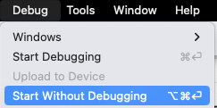</p>
<figure><figcaption class="image-caption">On doit passer par cette option pour les configurations “TEST” et “PROD”.</figcaption></figure>



<table>

<tr>

<td>

<p align="center">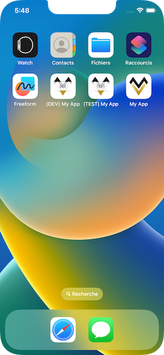</p>
<figure><figcaption class="image-caption">Il y a bien 3 applications installées sur mon simulateur iOS avec chacune un nom et une icône différents.</figcaption></figure>
</td>

<td>

<p align="center"></p>
<figure><figcaption class="image-caption">Il y a bien 3 applications installées sur mon émulateur Android avec chacune un nom et une icône différents.</figcaption></figure>
</td>

</tr>

</table>


Bravo ! 👏 Tu vas pouvoir maintenant développer de nouvelles fonctionnalités sans risquer les données de tes utilisateurs ! Et puis, c’est quand même pratique de pouvoir comparer le comportement de l’application entre l’environnement de développement et de production.



Si tu rencontres des problèmes, il se peut que cela soit lié aux données en mémoire sur le téléphone ou dans Visual Studio. Aussi, pense à nettoyer la solution et à supprimer l’application de ton téléphone avant tout déploiement !



Mais d’ailleurs, et s’il était possible d’installer une application pour chaque nouveau développement ? Tu pourrais alors tester séparément chaque nouvelle fonctionnalité (ou correctif) sans avoir besoin de désinstaller les anciennes versions de ton app !

Ça sera l’objet d’un prochain article 🤓

