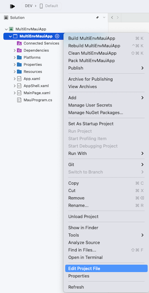
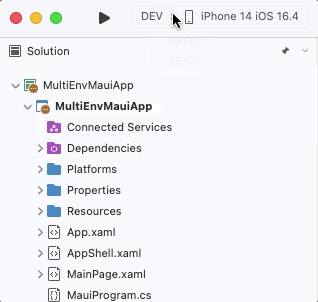

<!--more-->

Whether you're developing mobile applications, software or websites, it's common practice to set up multiple environments for a project. This makes it easy to test new features without risking the data of our users.

In this article, I will show you how a .NET MAUI application can target different environments through multiple project configurations.



To simplify the reading of this article, we will only focus on iOS & Android. However, the process is similar for other platforms.

## Identify all the configurations required for the project
First, you need to determine how many different configurations you need based on the number of environments created for your project.

However, if you are just starting your project, you may only have one development environment. So here are a few ideas for you:

* Are you the only one developing this application? Are there any testers in your team?

* Is your project subject to security or performance criteria?

* Do you have to present it to the client before its publication?



By default, it is important to isolate the production environment from your development environment.



For our demonstration, we will refer to the following 3 environments:

* a "DEV" configuration for working in a completely isolated manner on one's own machine (i.e. "locally") and not impacting the activity from other developers in your team,

* a "TEST" configuration to validate all developments before publication,

* and a "PROD" configuration that represents the final state of the app, once available on the app stores.


Alright, it's time to get practical! In the next section, we will create these 3 configurations to run our mobile application in 3 distinct environments.



I invite you to skip the following part if you have already defined all the necessary configurations for your project in Visual Studio.

## Create all project configurations in Visual Studio
Now that we've identified all the targeted environments, let's see how to create the different configurations for our application.

Start by opening the project configuration file in Visual Studio.



<p align="center"></p>
<figure><figcaption class="image-caption">You can access the configuration file by right-clicking on the project in Visual Studio.</figcaption></figure>

The project configuration file ends with the extension .csproj and can be edited by any text editor (e.g. Visual Studio Code). It can be found via the file explorer at the root of the project.




Once the *.csproj* file is open, add the following code to the end of the file:

<p align="center" style="margin-bottom:-10px"><strong>Filename:</strong><code>MultiEnvMauiApp.csproj</code></p>

```xml
<Project Sdk="Microsoft.NET.Sdk">
...
	<PropertyGroup>
		<Configurations>DEV;TEST;PROD</Configurations>
	</PropertyGroup>
</Project>
```
We've just added a parameter which, as its name suggests, defines the 3 new possible project configurations: "DEV", "TEST" and "PROD".

We can now customize the project configuration for each of the targeted environments. To do this, add the following code to the end of the *.csproj* file:

<p align="center" style="margin-bottom:-10px"><strong>Filename:</strong><code>MultiEnvMauiApp.csproj</code></p>

```xml
<Project Sdk="Microsoft.NET.Sdk">
...
	<PropertyGroup Condition=" '$(Configuration)' == 'DEV' ">
	</PropertyGroup>
	
	<PropertyGroup Condition=" '$(Configuration)' == 'TEST' ">
	</PropertyGroup>
	
	<PropertyGroup Condition=" '$(Configuration)' == 'PROD' ">
	</PropertyGroup>
</Project>
```


As you may have noticed, we've added a runtime condition to each of these new property groups. This way, Visual Studio is able to apply the right configuration according to the targeted environment.

Let's take a look at the content itself (to be adapted to your needs):

<p align="center" style="margin-bottom:-10px"><strong>Filename:</strong><code>MultiEnvMauiApp.csproj</code></p>

```xml
<PropertyGroup Condition=" '$(Configuration)' == 'DEV' ">
	<DebugSymbols>true</DebugSymbols>
	<Optimize>false</Optimize>

	<MtouchDebug>true</MtouchDebug>
</PropertyGroup>

<PropertyGroup Condition=" '$(Configuration)' == 'TEST' ">
	<DebugSymbols>false</DebugSymbols>
	<Optimize>true</Optimize>
</PropertyGroup>

<PropertyGroup Condition=" '$(Configuration)' == 'PROD' ">
	<DebugSymbols>false</DebugSymbols>
	<Optimize>true</Optimize>
</PropertyGroup>
```


In our case, we want to be able to debug the app when it's running in "DEV", but not when it's running in "TEST" or "PROD". We therefore use the `DebugSymbols` parameter to enable application debugging, while the `Optimize` parameter optimizes app performance and weight.



Due to a problem known to the Visual Studio teams, at the time of writing this article, it is required to apply `<MtouchDebug>true</MtouchDebug>` for each debugging configuration.

___
That's it, we're done with the *.csproj* file!

But after saving the file, Visual Studio may display a small red icon. Fortunately, this is perfectly normal!

<p align="center"></p>
<figure><figcaption class="image-caption">Visual Studio is rarely pleased when you tinker with project settings without using its graphical interface.</figcaption></figure>


The message indicates that there is a configuration association problem. Visual Studio doesn't yet know what to do with our "DEV", "TEST" and "PROD" configurations. So we need to go a step further and define their behavior at solution level.

For Visual Studio, a solution is like a workspace: it can contain several projects at the same time. But it's possible to manage configurations for the solution, as well as for the projects! And for this to work, each solution configuration has to be associated with a configuration for each project in the workspace.

You'll soon understand. Start by opening the solution parameters in Visual Studio.



<p align="center"></p>
<figure><figcaption class="image-caption">You can also access solution parameters by double-clicking on the first of the items listed by Visual Studio.</figcaption></figure>



When the solution settings window pops up, go to the compiler configurations section.

Then add a new configuration for "DEV", "TEST" and finally "PROD" as shown below:

<p align="center"></p>
<figure><figcaption class="image-caption">By default, Visual Studio defines two basic configurations: Debug and Release.</figcaption></figure>


Now that we have our configurations at the solution level, we need to associate them with the proper project configuration, as shown in the next table:


| Configuration at the solution level | Configuration at the project level | 
| --- | --- |
| DEV | DEV | 
| TEST | TEST | 
| PROD | PROD | 


It couldn't be easier!

To do this, still from the solution parameters window, scroll down to display the configuration association section. Then select the configuration at solution level and associate it with the correct project configuration:

<p align="center"></p>
<figure></figure>


Finally, you can also delete the *Debug* and *Release* configurations created by default by Visual Studio:

<p align="center"></p>
<figure></figure>


Once you've followed all these steps, close the window by clicking on OK and check that you no longer have the error indicated by the small red icon.

No more errors? Congratulations! You can now easily run your application in any environment!

<p align="center"></p>
<figure><figcaption class="image-caption">Visual Studio can now compile the project with these configurations.</figcaption></figure>


Now let's see how to install the application on your phone for each of the environments in your project!



Next time you reopen the project in Visual Studio, the *Debug* and *Release* configurations may be automatically re-created. This has no effect on your project.

## Define an application title for each targeted environment
Now that your project configurations are ready, we're going to give a specific application name for each of the targeted environments, to avoid any confusion between the development app and the production one.

The application name can be modified via the project configuration file. By default, you will normally see an application title and identifier already defined for each new .NET MAUI project:

<p align="center" style="margin-bottom:-10px"><strong>Filename:</strong><code>MultiEnvMauiApp.csproj</code></p>

```xml
<PropertyGroup>
...
	<!-- Display name -->
	<ApplicationTitle>My App</ApplicationTitle>
	
	<!-- App Identifier -->
	<ApplicationId>com.companyname.multienvmauiapp</ApplicationId>
...
</PropertyGroup>
```


In above example, "My App" is the app's basic name, and our goal is to customize it for each of the project's configurations.

In our case, we'll include the name of the target environment in the title and in the app identifier:

<p align="center" style="margin-bottom:-10px"><strong>Filename:</strong><code>MultiEnvMauiApp.csproj</code></p>

```xml
<PropertyGroup Condition=" '$(Configuration)' == 'DEV' ">
...
	<!-- Display name (Overridden) -->
	<ApplicationTitle>(DEV) My App</ApplicationTitle>

	<!-- App Identifier (Overridden) -->
	<ApplicationId>com.companyname.multienvmauiapp.dev</ApplicationId>
...
</PropertyGroup>

<PropertyGroup Condition=" '$(Configuration)' == 'TEST' ">
...
	<!-- Display name (Overridden) -->
	<ApplicationTitle>(TEST) My App</ApplicationTitle>

	<!-- App Identifier (Overridden) -->
	<ApplicationId>com.companyname.multienvmauiapp.test</ApplicationId>
...
</PropertyGroup>
```


From now on, for "DEV" and "TEST" configurations, the name of the targeted environment will appear at the beginning of the app name and at the end of the app identifier. This is not needed for the "PROD" configuration, as the basic title and identifier will be used by default for all configurations.



Because *ApplicationId* parameter has a different value for each configuration, it is possible to install several versions of the application.



You can now differentiate the development application from the production one on your phone. Cool! How about taking it a step further?

In the next section, you will learn how to customize the app icon.

## Define an application icon for each targeted environment
In addition to naming the app according to the targeted environment, we'll see how to define an icon for each of the project's configurations.

To do so, you first need to design an icon for each environment. Once you've done that, add them to the project in a suitable folder.

<p align="center"></p>
<figure><figcaption class="image-caption">By default, every .NET MAUI project includes an AppIcon folder.</figcaption></figure>


As for the application name, you may have noticed that the [icon is also defined in the project configuration file](https://learn.microsoft.com/en-us/dotnet/maui/user-interface/images/app-icons?tabs=android#change-the-icon), with the `MauiIcon` property.

Start removing this parameter from the *.csproj* file, then add the following code:

<p align="center" style="margin-bottom:-10px"><strong>Filename:</strong><code>MultiEnvMauiApp.csproj</code></p>

```xml
<ItemGroup>
		<!-- App Icon -->
		<MauiIcon Include="Resources\AppIcon\icon_dev.png" Condition=" '$(Configuration)' == 'DEV' " />
		<MauiIcon Include="Resources\AppIcon\icon_test.png" Condition=" '$(Configuration)' == 'TEST' " />
		<MauiIcon Include="Resources\AppIcon\icon.png" Condition=" '$(Configuration)' == 'PROD' " />
</ItemGroup>
```


That's it, we now have defined a different icon for each configuration!

Well... almost! As you know, every .NET MAUI application relies on configuration files linked to the targeted platform. It is also necessary to define the app icon in these :

* in the [AndroidManifest.xml file on Android](https://learn.microsoft.com/en-us/dotnet/maui/android/manifest),

* and in the [Info.plist file on iOS](https://learn.microsoft.com/en-us/dotnet/maui/macios/info-plist?tabs=vs).



At the time of writing, it is not possible to automatically generate the icon on [iOS](https://github.com/xamarin/xamarin-macios/issues/12790) and [Android](https://github.com/xamarin/xamarin-android/issues/7147) without modifying these files. Maybe a feature for .NET 8?



First, we need to associate each of these files with a different configuration. In our case, we'll need 3 *.plist* files on iOS and 3 *.xml* files on Android :


|  | Android | iOS | 
| --- | --- | --- |
| DEV | AndroidManifest.dev.xml | Info.dev.plist | 
| TEST | AndroidManifest.test.xml | Info.test.plist | 
| PROD | AndroidManifest.xml | Info.plist | 


Starting with iOS, go to the *Platforms/iOS* folder and create two copies of the original *Info.plist* file. Then rename them *Info.dev.plist* and *Info.test.plist*.

<p align="center"></p>
<figure></figure>


For each *.plist* file, we'll modify the value of the `XSAppIconAssets` parameter to define one icon per configuration. The [documentation](https://learn.microsoft.com/en-us/dotnet/maui/user-interface/images/app-icons?tabs=macios#platform-specific-configuration) indicates that the value follows the format `Assets.xcassets/{name}.appiconset` and that we must replace `{name}` with the name of the desired icon (without mentioning its path or extension).

In our case, this is how it looks like for *Info.dev.plist* file:

<p align="center" style="margin-bottom:-10px"><strong>Filename:</strong><code>Info.dev.plist</code></p>

```xml
<key>XSAppIconAssets</key>
<string>Assets.xcassets/icon_dev.appiconset</string>
```


Finally, once you've modified the icon in all the *.plist* files, go back to the project configuration file. In fact, we need to tell it which *.plist* file to consider according to the targeted configuration:

<p align="center" style="margin-bottom:-10px"><strong>Filename:</strong><code>MultiEnvMauiApp.csproj</code></p>

```xml
<ItemGroup Condition=" '$(TargetFramework)' == 'net7.0-ios' ">
	<PartialAppManifest Include="Platforms\iOS\Info.dev.plist" Condition=" '$(Configuration)' == 'DEV' " />
	<PartialAppManifest Include="Platforms\iOS\Info.test.plist" Condition=" '$(Configuration)' == 'TEST' " />
</ItemGroup>
```


By default, Visual Studio will choose the *Info.plist* file. You therefore only need to specify which file to use for the "DEV" and "TEST" configurations.



Going further with the [PartialAppManifest](https://github.com/xamarin/xamarin-macios/wiki/Project-file-properties#partialappmanifest) property.



Finally, the same goes for Android. Go to the *Platforms/Android* folder and create two copies of the *AndroidManifest.xml* file. Then rename them into *AndroidManifest.dev.xml* and *AndroidManifest.test.xml*.

However, here we need to rename the original *AndroidManifest.xml* to *AndroidManifest.prod.xml*. Otherwise, you'll have trouble compiling the app.

<p align="center"></p>
<figure></figure>


For each *.xml* file, we'll modify the values of the `android:icon` and `android:roundIcon` parameters to define one icon per configuration. The [documentation](https://learn.microsoft.com/en-us/dotnet/maui/user-interface/images/app-icons?tabs=android#platform-specific-configuration) indicates that the values follow the `@mipmap/{name}` and `@mipmap/{name}_round` format respectively, and that we need to replace `{name}` with the name of the desired icon (without mentioning its path or extension).

In our case, this is what it looks like for *AndroidManifest.dev.xml* file:

<p align="center" style="margin-bottom:-10px"><strong>Filename:</strong><code>AndroidManifest.dev.xml</code></p>

```xml
<application android:icon="@mipmap/icon_dev" android:roundIcon="@mipmap/icon_dev_round"></application>
```


Once you've modified the icon in all the *.xml* files, go back to the project configuration file. In fact, we need to tell it which *.xml* file to consider according to the targeted configuration:

<p align="center" style="margin-bottom:-10px"><strong>Filename:</strong><code>MultiEnvMauiApp.csproj</code></p>

```xml
<PropertyGroup Condition=" '$(TargetFramework)' == 'net7.0-android' ">
		<AndroidManifest Condition=" '$(Configuration)' == 'DEV' ">Platforms\Android\AndroidManifest.dev.xml</AndroidManifest>
		<AndroidManifest Condition=" '$(Configuration)' == 'TEST' ">Platforms\Android\AndroidManifest.test.xml</AndroidManifest>
		<AndroidManifest Condition=" '$(Configuration)' == 'PROD' ">Platforms\Android\AndroidManifest.prod.xml</AndroidManifest>
</PropertyGroup>
```


As you may have noticed, here we had to specify which file to consider for all configurations.

Phew! It's finally over now. Let's get on with the demo!

## Demo
Now it's time to check that all this setup is working. You can now deploy the app for each configuration, and for each platform!



For configurations that don't allow debugging, you need to start the app without debugging for it to deploy on the simulator.

<p align="center"></p>
<figure><figcaption class="image-caption">This option must be used for "TEST" and "PROD" configurations.</figcaption></figure>




<table>

<tr>

<td>

<p align="center"></p>
<figure><figcaption class="image-caption">There are 3 apps installed on my iOS simulator, each with a different name and icon.</figcaption></figure>

</td>

<td>

<p align="center"></p>
<figure><figcaption class="image-caption">There are 3 apps installed on my Android simulator, each with a different name and icon.</figcaption></figure>

</td>

</tr>

</table>


Congratulations! 👏 Now you can develop new features without risking your users' data! And it's really handy to be able to compare the app's behavior between the development and production environments.



If you encounter any problems, it may be related to the data in memory on the phone or in Visual Studio. So remember to clean up the solution and delete the app from your phone before deploying it!



But what if we can install an app for each new development? Then you could test each new feature (or patch) separately, without having to uninstall any older versions of your app!

That's a good topic for a future article 🤓

