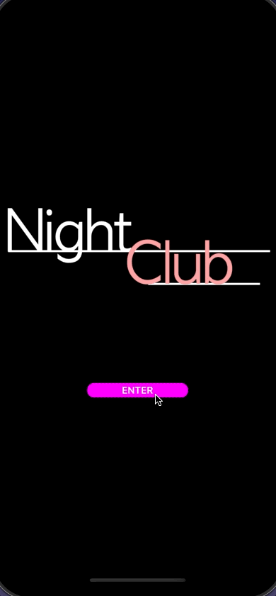

<!--more-->



To ease your read, please start from the project containing all the different steps applied so far in this tutorial. To do so, refer to the <a href="../2-setup-the-project/">project setup guide</a> and resume from the sample located in the folder *"4 - All Media Controls"*.

Before starting this new chapter, I wanted to congratulate you on all the progress you've made!

Now that we're well advanced on the visual side, we can develop the core of the application and make it a little more functional. And if there's one feature to think about first, it's playing music!

# The MediaElement
In the mobile world, media handling is completely different from a system to another. Fortunately, Microsoft has made life easier for us with its [Community Toolkit](https://learn.microsoft.com/en-us/dotnet/communitytoolkit/maui/), which precisely offers the right thing for playing audio files from any platform: the [MediaElement](https://learn.microsoft.com/en-us/dotnet/communitytoolkit/maui/views/mediaelement)!

According to the [documentation](https://learn.microsoft.com/en-us/dotnet/communitytoolkit/maui/get-started?tabs=CommunityToolkitMauiMediaElement#adding-the-nuget-packages), this component is supplied in a dedicated NuGet package. To install this dependency, open the NuGet package manager and search for the library named *CommunityToolkit.Maui.MediaElement*.

<p align="center"></p>
<figure></figure>


Once you found it, add the latest version to the project and accept all associated licenses:

<p align="center"></p>
<figure></figure>



A *ReadMe.txt* file opens automatically in Visual Studio. It provides additional instructions that we will apply when using the *MediaElement*.



Now that the library has been added to the project, one last step remains. The *MediaElement* component must be initialized at application startup in the `MauiProgram.cs` file.

Open this file and modify the *CreateMauiApp()* method as follows:

<p align="center" style="margin-bottom:-10px"><strong>Filename:</strong><code>MauiProgram.cs</code></p>

```csharp
public static MauiApp CreateMauiApp()
{
	Console.WriteLine("[NightClub] MauiProgram - CreateMauiApp");

	var builder = MauiApp.CreateBuilder()
		.UseMauiCommunityToolkit()
		.UseMauiCommunityToolkitMarkup()
		// You must add the line below:
		.UseMauiCommunityToolkitMediaElement()
		.UseMauiApp<App>();

	return builder.Build();
}
```



🐒‎ ‎ But what exactly is this *UseMauiCommunityToolkitMediaElement()* method doing?



Good reflex! When manipulating new snippets of code, it's always best to understand what happens behind. And in this case, the code is open-source and can be viewed [here](https://github.com/CommunityToolkit/Maui/blob/77213ae1e2ad5730fd29126bb2cf85960ba89bbd/src/CommunityToolkit.Maui.MediaElement/AppBuilderExtensions.shared.cs).

Unsurprisingly, the sole purpose of the *UseMauiCommunityToolkitMediaElement()* method is to make the *MediaElement* available to our application. In a nutshell, this consists of specifying which classes implement its behavior, for each of the targeted platforms.



For more information, please consult the [documentation on custom controls](https://learn.microsoft.com/en-us/dotnet/maui/user-interface/handlers/create).



And now we can listen to music!

# Make some noise!
Let's now look at how to define an instance of the *MediaElement* in the *MusicPlayerView*.



🐒‎ ‎ But shouldn't we treat the *MediaElement* as a service and add it to the *ViewModel*?



Excellent point! Indeed, in <a href="../4-mvvm-is-the-key-to-succeed/">the chapter on MVVM</a>, we presented the **View** as the layer corresponding to the user interface. So, logically, you might think that media playback only takes place in the **ViewModel**!

But once you've read the [documentation](https://learn.microsoft.com/en-us/dotnet/communitytoolkit/maui/views/mediaelement), you'll see that the *MediaElement* provides the basic visual controls for manipulating media according to the target platform. And even though we won't use them (since we're creating our own controls), the *MediaElement* is indeed an element of the user interface! And to respect the MVVM breakdown, I prefer to define an instance of the *MediaElement* in the *MusicPlayerView*.



It's also possible to accomplish the same thing by placing the *MediaElement* in the *ViewModel* instead of the *View*, but this is likely to make your project maintenance more complex.



Open the `MusicPlayerView.cs` file, then define a new *MediaElement* property in the controls area, and a method *InitMusicPlayer()* to initialize it:

<p align="center" style="margin-bottom:-10px"><strong>Filename:</strong><code>MusicPlayerView.cs</code></p>

```csharp
#region Controls
	...
	#region MusicPlayer // Why not another region!

		MediaElement MusicPlayer = new MediaElement();

		void InitMusicPlayer()
		{
		MusicPlayer.ShouldAutoPlay = true;

		string trackURL = "https://prod-1.storage.jamendo.com/?trackid=1890762&format=mp31&from=b5bSbOTAT1kXawaT8EV9IA%3D%3D%7CGcDX%2BeejT3P%2F0CfPwtSyYA%3D%3D";
		MusicPlayer.Source = MediaSource.FromUri(trackURL);
		}

	#endregion
	...
#endregion
```


With the `ShouldAutoPlay` parameter, we configure our new control to automatically play the next track, as soon as it's defined. After all, our buttons remain dummy controls, and we need to hear some music to verify *MediaElement* is working!



🐒‎ ‎ And is this music from audio streaming?



That's right! I grabbed a few songs from [Jamendo](https://www.jamendo.com/) for our application, a free website for music produced by independent artists.

As you may have noticed, we've defined a song to be played by default through the `trackURL` variable. Indeed, this URL is then declared as a `Source` of media for the *MediaElement*, with the help of the *MediaSource.FromUri()* method.


Now back to our page constructor. First, we need to initialize the `MediaPlayer` with the method called *InitMusicPlayer()* that we've just introduced. Finally, we also need to add this component as an element of the view to make it available. Otherwise, it won't be detected by the page and it won't work!

This is how the *MusicPlayerView* constructor now looks:

<p align="center" style="margin-bottom:-10px"><strong>Filename:</strong><code>MusicPlayerView.cs</code></p>

```csharp
using CommunityToolkit.Maui.Views; // You must add this using!
...
namespace NightClub.Views;
public class MusicPlayerView : ContentPage
{
	public MusicPlayerView()
	{
		Console.WriteLine("[NightClub] MusicPlayerView - Constructor");

		NavigationPage.SetHasNavigationBar(this, false);
		BackgroundColor = Colors.DimGray;

		InitMusicPlayer(); // Control is initialized with its own method
		InitMuteButton();

		Content = new Grid
		{
			RowDefinitions = Rows.Define(
			Stars(60),
			Stars(40)),
			RowSpacing = 0,
			Children =
			{
				MusicPlayer, // Then we add the control to the page content!
				TopLayout.Row(0),
				BottomLayout.Row(1)
			}
		};
	}
	...
}
```



There's no need to specify where the element will be defined in the grid. The *MusicPlayer* will remain invisible to the user anyway!



Why not give it a try? First, take the time to adjust the volume on your device so that it's neither too loud nor too soft. Then relaunch the project to start the app.



You must close the application or stop debugging the project in Visual Studio to stop the music!



So, are you happy to finally hear some music? After so much effort, it's well deserved! 🙂

But let's take the opportunity to bring that play button to life.

# Control media playback
Now that we've checked that media playback works, it would be nice to control it directly with the “Play” button! Following the same principle as before, let's initialize the `PlayButton` control via a new method called *InitMediaControlPanel()*, triggered from the page constructor. Here are the changes to the *MusicPlayerView*:

<p align="center" style="margin-bottom:-10px"><strong>Filename:</strong><code>MusicPlayerView.cs</code></p>

```csharp
public class MusicPlayerView : ContentPage
{
	public MusicPlayerView()
	{
		...
		InitMusicPlayer();
		InitMediaControlPanel(); // A new initialization method...
		InitMuteButton();
		...
	}
	...
	#region Media Control Panel
	...
	// The “=>” sign has been replaced with “=”
	ImageButton PlayButton = new ImageButton
	{
		CornerRadius = 50,
		HeightRequest = 100,
		WidthRequest = 100,
		BackgroundColor = Colors.Black,
		Source = "play.png"
	};

	void InitMediaControlPanel() // ... which is defined here!
	{
		PlayButton.Bind(
			targetProperty: ImageButton.SourceProperty,
			source: MusicPlayer,
			path: nameof(MusicPlayer.CurrentState),
			convert: (MediaElementState currentState)
				=> currentState != MediaElementState.Playing ? "play.png" : "pause.png");

		PlayButton.Clicked += PlayButton_Clicked;
	}
	...
	#endregion
}
```


First, we want the icon associated with our central button to change its appearance depending on whether the song is playing (image: *pause.png*) or not (image: *play.png*). To achieve this, we apply the Binding technique (cf: <a href="../4-mvvm-is-the-key-to-succeed/#data-binding">MVVM</a>) to the *Source* property of the `PlayButton`, which is nothing else than the property used to define the button icon.

Here is the logic used to modify the value automatically:

* We monitor the value changes of the *CurrentState* property that is attached to the `MusicPlayer` object,

* And we modify the `PlayButton` image according to whether the *CurrentState* value is equivalent to the play or pause state.



Make sure you replace the “=>” sign with “=” when declaring the `PlayButton`. Indeed, we only want to create one instance of the `ImageButton` and modify it in the *InitMediaControlPanel()* method.



Then, let’s define a specific behavior when the user clicks on the `PlayButton` with the *PlayButton_Clicked()* method. Here's what it does:

<p align="center" style="margin-bottom:-10px"><strong>Filename:</strong><code>MusicPlayerView.cs</code></p>

```csharp
public class MusicPlayerView : ContentPage
{
	...
	#region Events // If you like being organized, you must use regions!
	protected override void OnAppearing()...

	protected override void OnDisappearing()...

	void PlayButton_Clicked(object sender, EventArgs e)
	{
		if (MusicPlayer.CurrentState != MediaElementState.Playing)
		{
			MusicPlayer.Play();
		}
		else
		{
			MusicPlayer.Pause();
		}
	}
	#endregion
}
```


As you can see, this event is pretty straightforward. It detects at each click the current state of the music player, and depending on this, either requests playback or it will put the track on pause.

___
That's all for this chapter. Rebuild the project and turn off the music with the pause button!

<p align="center"></p>
<figure><figcaption class="image-caption">Music plays as soon as the music player page appears, and then you can turn the music off with the pause button.</figcaption></figure>


Isn't it great to be able to interact with our app? Personally, that's my favorite part of mobile app development!

It becomes real and this is just the beginning. <a href="../11-binding-playhead-control/">Next time</a>, we'll see how to implement volume and the management of playback head.

___
More articles in the series:

