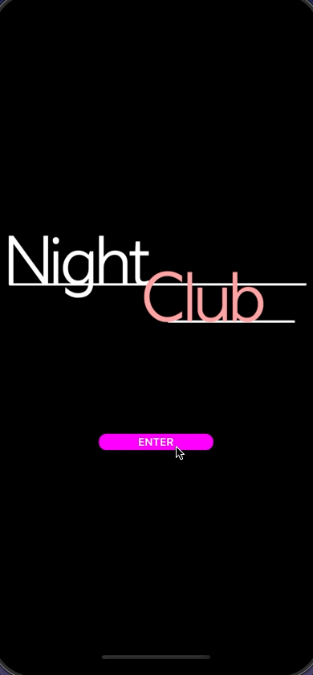

<!--more-->



Pour assurer le bon déroulement de cet article, je t’invite à récupérer le projet reprenant toutes les étapes appliquées jusqu’ici dans ce cours. Pour cela, réfère-toi au <a href="../2-setup-the-project/">guide d’installation du projet</a> et repars de l’exemple situé dans le dossier *“4 - All Media Controls”*.

Avant d’entamer ce nouveau chapitre, je voulais te féliciter pour tout ce chemin parcouru !

Maintenant qu’on a bien avancé sur la partie visuelle, on va pouvoir développer le cœur de l’application et ainsi la rendre un peu plus fonctionnelle. Et s’il y a bien une fonctionnalité à implémenter en priorité, c’est la lecture de titres musicaux !

## Le MediaElement
Dans l’univers du mobile, la manipulation des médias est complètement différente d’un système à un autre. Heureusement, Microsoft nous simplifie la vie avec son [Community Toolkit](https://learn.microsoft.com/fr-fr/dotnet/communitytoolkit/maui/) qui propose justement de quoi lire des fichiers audio depuis n’importe quelle plateforme: le [MediaElement](https://learn.microsoft.com/fr-fr/dotnet/communitytoolkit/maui/views/mediaelement) !

D’après la [documentation](https://learn.microsoft.com/fr-fr/dotnet/communitytoolkit/maui/get-started?tabs=CommunityToolkitMauiMediaElement#adding-the-nuget-packages), ce composant est fourni dans un paquet NuGet qui lui est dédié. Pour installer cette dépendance, ouvre le gestionnaire de paquets NuGet et recherche la librairie nommée *CommunityToolkit.Maui.MediaElement.*

<p align="center"></p>
<figure></figure>


Une fois trouvée, ajoute la version la plus récente au projet et accepte toutes les licences associées :

<p align="center"></p>
<figure></figure>



Un fichier *ReadMe.txt* s’ouvre automatiquement dans Visual Studio. Il donne des indications supplémentaires que nous allons appliquer pour utiliser le *MediaElement*.



Maintenant que la librairie est ajoutée au projet, il reste une dernière étape pour utiliser le composant *MediaElement*. En effet, il est nécessaire de l’initialiser au démarrage de l’application dans le fichier `MauiProgram.cs`.

Ouvre donc ce fichier et modifie la méthode *CreateMauiApp()* de la façon suivante :

<p align="center" style="margin-bottom:-10px"><strong>Nom du fichier :</strong><code>MauiProgram.cs</code></p>

```csharp
public static MauiApp CreateMauiApp()
{
	Console.WriteLine("[NightClub] MauiProgram - CreateMauiApp");

	var builder = MauiApp.CreateBuilder()
		.UseMauiCommunityToolkit()
		.UseMauiCommunityToolkitMarkup()
		// Tu dois ajouter la ligne ci-dessous:
		.UseMauiCommunityToolkitMediaElement()
		.UseMauiApp<App>();

	return builder.Build();
}
```



🐒‎ ‎ Ok, mais qu’est-ce qu’elle fait exactement cette méthode *UseMauiCommunityToolkitMediaElement()* ?



Bon réflexe ! Quand on manipule des nouveaux bouts de code, c’est toujours mieux de comprendre ce qu’ils déclenchent derrière. Et dans le cas présent, le code est open-source et peut être consulté [ici](https://github.com/CommunityToolkit/Maui/blob/77213ae1e2ad5730fd29126bb2cf85960ba89bbd/src/CommunityToolkit.Maui.MediaElement/AppBuilderExtensions.shared.cs).

Sans grande surprise, la méthode *UseMauiCommunityToolkitMediaElement()* n’a pour but que de mettre à disposition le fameux *MediaElement* pour notre application. Dans les grandes lignes, cela consiste à préciser quelles classes implémentent son comportement, pour chacune des plateformes ciblées.



Pour plus d’information, consulte la [documentation sur les contrôles personnalisés](https://learn.microsoft.com/fr-fr/dotnet/maui/user-interface/handlers/create).



Ça y’est, on va pouvoir écouter de la musique !

## Faites du bruit !
Voyons désormais comment définir une instance du *MediaElement* dans la vue *MusicPlayerView*.



🐒‎ ‎ Mais finalement, est-ce qu’on ne devrait pas considérer le *MediaElement* comme un service et l’ajouter au *ViewModel* ?



C’est une très bonne remarque ! En effet, dans <a href="../4-mvvm-for-successful-apps/">le chapitre sur le MVVM</a>, on a présenté la **View** comme la couche correspondant à l’interface utilisateur. En toute logique, on pourrait donc penser que la lecture de médias intervient uniquement dans le **ViewModel** !

Seulement, après avoir lu la [documentation](https://learn.microsoft.com/fr-fr/dotnet/communitytoolkit/maui/views/mediaelement), tu constateras que le *MediaElement* fournit les contrôles visuels de base pour manipuler des médias selon la plateforme cible. Et même si nous ne les utiliserons pas (puisque nous créons nos propres contrôles), le *MediaElement* est bien un élément de l’interface utilisateur ! Et c’est pour respecter le découpage du MVVM que je préfère définir une instance du *MediaElement* dans la vue *MusicPlayerView*.



Il est tout à fait possible d’accomplir la même chose en plaçant le *MediaElement* dans le *ViewModel* au lieu de la *View*, mais il y a des chances que cela complexifie la maintenance du projet.



Ouvre donc le fichier `MusicPlayerView.cs`, puis définis une nouvelle propriété de type *MediaElement* dans la region dédiée aux contrôles, ainsi qu’une méthode *InitMusicPlayer()* pour l’initialiser :

<p align="center" style="margin-bottom:-10px"><strong>Nom du fichier :</strong><code>MusicPlayerView.cs</code></p>

```csharp
#region Controls
	...
	#region MusicPlayer // Et pourquoi pas une nouvelle région !

		MediaElement MusicPlayer = new MediaElement();

		void InitMusicPlayer()
		{
		MusicPlayer.ShouldAutoPlay = true;

		string trackURL = "https://prod-1.storage.jamendo.com/?trackid=1890762&format=mp31&from=b5bSbOTAT1kXawaT8EV9IA%3D%3D%7CGcDX%2BeejT3P%2F0CfPwtSyYA%3D%3D";
		MusicPlayer.Source = MediaSource.FromUri(trackURL);
		}

	#endregion
	...
#endregion
```


Avec le paramètre `ShouldAutoPlay`, on configure notre nouveau contrôle pour automatiquement jouer le prochain titre, aussitôt qu’il est défini. En effet, nos boutons sont toujours factices, or on a besoin d’entendre de la musique pour vérifier que le *MediaElement* fonctionne !



🐒‎ ‎ Et la musique en question, c’est du streaming audio ?



Oui c’est ça ! Pour notre application, j’ai récupéré quelques chansons depuis [Jamendo](https://www.jamendo.com/), un site Web gratuit de musique produite par des artistes indépendants.

Comme tu as du le remarquer, nous avons donc défini un morceau à jouer par défaut à travers la variable `trackURL`. En effet, cette URL est alors déclarée comme une `Source` de média pour le *MediaElement*, avec l’aide de la méthode *MediaSource.FromUri()*.


Retournons maintenant au constructeur de notre page. Dans un premier temps, nous devons initialiser le `MediaPlayer` avec la méthode *InitMusicPlayer()* que l’on vient de présenter. Enfin, nous devons également rajouter ce composant en tant qu’élément de la vue pour le rendre disponible. Autrement, il ne serait pas détecté par la page et ne pourrait pas fonctionner !

Voici donc à quoi ressemble désormais le constructeur de la vue *MusicPlayerView* :

<p align="center" style="margin-bottom:-10px"><strong>Nom du fichier :</strong><code>MusicPlayerView.cs</code></p>

```csharp
using CommunityToolkit.Maui.Views; // Attention à bien ajouter ce using !
...
namespace NightClub.Views;
public class MusicPlayerView : ContentPage
{
	public MusicPlayerView()
	{
		Console.WriteLine("[NightClub] MusicPlayerView - Constructor");

		NavigationPage.SetHasNavigationBar(this, false);
		BackgroundColor = Colors.DimGray;

		InitMusicPlayer(); // On initialise le contrôle avec sa méthode dédiée
		InitMuteButton();

		Content = new Grid
		{
			RowDefinitions = Rows.Define(
			Stars(60),
			Stars(40)),
			RowSpacing = 0,
			Children =
			{
				MusicPlayer, // Et on ajoute le contrôle au contenu de la page !
				TopLayout.Row(0),
				BottomLayout.Row(1)
			}
		};
	}
	...
}
```



Il n’est pas nécessaire de préciser où l’élément sera défini dans la grille. En effet, le  *MusicPlayer* restera de toute manière invisible pour l’utilisateur !



Et si on faisait un essai ? Prends d'abord le temps de régler le volume de ton appareil de sorte à ce que cela ne soit ni trop fort, ni trop faible. Puis, relance le projet pour démarrer l'application.



Pense à quitter l'application ou arrêter le déboggage du projet dans Visual Studio pour arrêter la musique !



Alors, content·e d’entendre enfin un peu de musique ? Après tant d'efforts, c'est mérité ! 🙂

Mais voyons si on ne peut pas en profiter pour donner vie à ce bouton de lecture.

## Contrôler la lecture du média
Maintenant qu'on a vérifié que la lecture de média fonctionnait, ce serait mieux de pouvoir la contrôler directement avec le bouton “Play” ! Suivant le même principe que tout à l’heure, initialisons le contrôle `PlayButton` via une nouvelle méthode *InitMediaControlPanel()*, appelée depuis le constructeur de la page. Voici les modifications apportées à la vue *MusicPlayerView* :

<p align="center" style="margin-bottom:-10px"><strong>Nom du fichier :</strong><code>MusicPlayerView.cs</code></p>

```csharp
public class MusicPlayerView : ContentPage
{
	public MusicPlayerView()
	{
		...
		InitMusicPlayer();
		InitMediaControlPanel(); // Une nouvelle méthode d'initialisation ...
		InitMuteButton();
		...
	}
	...
	#region Media Control Panel
	... 
	// Le signe “=>” a été remplacé par “=”
	ImageButton PlayButton = new ImageButton
	{
		CornerRadius = 50,
		HeightRequest = 100,
		WidthRequest = 100,
		BackgroundColor = Colors.Black,
		Source = "play.png"
	};

	void InitMediaControlPanel() // ... dont voici la définition !
	{
		PlayButton.Bind(
			targetProperty: ImageButton.SourceProperty,
			source: MusicPlayer,
			path: nameof(MusicPlayer.CurrentState),
			convert: (MediaElementState currentState)
				=> currentState != MediaElementState.Playing ? "play.png" : "pause.png");

		PlayButton.Clicked += PlayButton_Clicked;
	}
	...
	#endregion
}
```


Dans un premier temps, on souhaite que l’icône associée à notre bouton central change d’apparence selon si la chanson est en train d’être jouée (image: *pause.png*) ou pas (image: *play.png*). Pour cela, on applique la technique du Binding (cf: <a href="../4-mvvm-for-successful-apps/#le-data-binding">MVVM</a>) sur la propriété *Source* du `PlayButton` qui n’est autre que la propriété pour définir l’icône du bouton.

Voici donc la logique mise en place pour en modifier la valeur automatiquement :

* On surveille les changements de valeur de la propriété *CurrentState* rattachée à l’objet `MusicPlayer`,

* Et on modifie l’image du `PlayButton` selon si la valeur du *CurrentState* équivaut à l’état de lecture ou l’état de pause.



Attention à bien remplacer le signe “=>” par “=” à la déclaration du `PlayButton`. En effet, on ne veut créer qu’une seule instance d’`ImageButton` et la modifier dans la méthode *InitMediaControlPanel()*.



Ensuite, on définit un comportement spécifique au clic de l’utilisateur sur le `PlayButton` avec la méthode *PlayButton_Clicked()*. Voici à quoi correspond cette méthode :

<p align="center" style="margin-bottom:-10px"><strong>Nom du fichier :</strong><code>MusicPlayerView.cs</code></p>

```csharp
public class MusicPlayerView : ContentPage
{
	...
	#region Events // Quand on aime l'organisation, on utilise les régions !
	protected override void OnAppearing()...

	protected override void OnDisappearing()...

	void PlayButton_Clicked(object sender, EventArgs e)
	{
		if (MusicPlayer.CurrentState != MediaElementState.Playing)
		{
			MusicPlayer.Play();
		}
		else
		{
			MusicPlayer.Pause();
		}
	}
	#endregion
}
```


Comme tu peux le voir, cet événement est plutôt simple. À chaque clic, on détecte quel est l’état actuel du lecteur de musique, et selon, on demande la mise en lecture ou la mise en pause du morceau.

___
Voilà, c’est tout pour ce chapitre. Recompile le projet et mets en pause la musique !

<p align="center"></p>
<figure><figcaption class="image-caption">Le morceau est joué dès que la page du lecteur de musique apparaît, puis on peut stopper la lecture avec le bouton pause.</figcaption></figure>


Quel plaisir de pouvoir interagir avec notre app, n’est-ce pas ? Personnellement, c’est la partie que je préfère dans le développement d’une application !

Ça se concrétise et ce n’est que le début. <a href="../11-control-playback-position-with-mediaelement/">La prochaine fois</a>, on verra comment implémenter la gestion du volume et de la tête de lecture.


___
Plus d'articles dans la même série:

