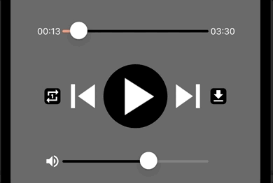
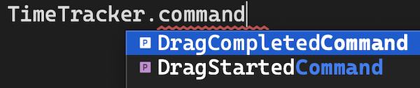

<!--more-->



Afin d’assurer le bon déroulement de cet article, je t’invite à repartir depuis <a href="../10-play-music/">ce chapitre</a> où l’on a configuré le *MediaElement*.

Dans l’article précédent, on avait découvert le *[MediaElement](https://learn.microsoft.com/fr-fr/dotnet/communitytoolkit/maui/views/mediaelement)* pour lire des fichiers audio, mais avec l’aide de nos propres contrôles. Tu te rappelles des *Sliders* qu’on avait mis en place ? Ils sont cools mais ils ne servent à rien ! 😄

Alors aujourd’hui, nous allons commencer par implémenter le contrôle de la tête de lecture, pour permettre à l’utilisateur de se déplacer à un endroit précis du morceau.

# Binding des composants
Si tu te rappelles bien, dans le <a href="../7-time-tracker/">chapitre sur l’affichage du temps d’écoute</a>, nous avions introduit 3 composants :

* `ElapsedTime` qui est un *Label* pour afficher le temps écoulé de lecture,

* `TotalTime` qui est aussi un *Label*, mais pour afficher la durée totale de la piste audio,

* et enfin le *Slider* `TimeTracker`, pour contrôler la tête de lecture de la piste.


Adieu les données factices ! Nous allons désormais donner vie à ces composants avec l’aide du **Data Binding**. Et on isolera tout ça dans une méthode d’initialisation *InitTimeTracker()* :

<p align="center" style="margin-bottom:-10px"><strong>Nom du fichier :</strong><code>MusicPlayerView.cs</code></p>

```csharp
#region Time Tracker // Repère bien la région pour ajouter le nouveau code
...
void InitTimeTracker() // Voici la nouvelle méthode d'initialisation
{
        TimeTracker.Bind(
            Slider.ValueProperty,
            nameof(MusicPlayer.Position),
            source: MusicPlayer,
            convert: (TimeSpan currentPosition) => currentPosition.TotalSeconds);

        TimeTracker.Bind(
            Slider.MaximumProperty,
            nameof(MusicPlayer.Duration),
            source: MusicPlayer,
            convert: (TimeSpan duration) => duration.TotalSeconds);

        ElapsedTime.Bind(
            Label.TextProperty,
            nameof(MusicPlayer.Position),
            source: MusicPlayer,
            stringFormat: "{0:mm\\:ss}");

        TotalTime.Bind(
            Label.TextProperty,
            nameof(MusicPlayer.Duration),
            source: MusicPlayer,
            stringFormat: "{0:mm\\:ss}");
}
#endregion
```
Oui je sais c’est un peu dense, courage ! Tout est détaillé juste après.

Pour commencer, nous avons modifié le comportement du `TimeTracker` pour lui associer deux propriétés :

* la position actuelle du curseur sur le *Slider*,

* et la valeur maximale du curseur (quand il est positionné tout à droite).


Intéressons-nous maintenant d’un peu plus près au *MediaElement* incarné par notre composant `MusicPlayer`. Celui-ci expose justement ce qu’il nous faut :

* la position de la tête de lecture en temps réel (`MusicPlayer.Position`), à associer à la position du curseur sur le *Slider* (`TimeTracker.Value`),

* et la durée totale du morceau (`MusicPlayer.Duration`), à associer à la valeur maximale du *Slider* (`TimeTracker.Maximum`).


Enfin, si tu te rappelles bien, le *Slider* ne peut considérer que des valeurs de type *double*. C’est pourquoi nous avons besoin de convertir les valeurs obtenues avec `MusicPlayer.Position` et `MusicPlayer.Duration`, depuis le type *TimeSpan* vers le type *double*, avec la propriété `TotalSeconds`.



🐒‎ ‎ Et du coup, l’utilisateur pourra avancer ou reculer la lecture du morceau à la seconde près !

Tout juste ! 🙂 Voyons maintenant pour les *Labels*.

Pour le composant `ElapsedTime`, on veut qu’il affiche depuis combien de temps le morceau est joué en se basant lui aussi sur la propriété `MusicPlayer.Position`. Seulement, on ne veut pas afficher n’importe quoi ! On veut en effet afficher une durée en minutes et en secondes. Pour cela, on a besoin de lui appliquer le format de texte souhaité avec l’aide du code : `{0:mm\\:ss}`.

Pour le composant `TotalTime`, on veut afficher le temps total d’écoute du morceau en se basant sur la propriété `MusicPlayer.Duration`. Et de la même façon, on applique le même format de texte pour afficher une durée en minutes et en secondes.



Pour plus d’information, voir le [StringFormat](https://learn.microsoft.com/fr-fr/dotnet/standard/base-types/custom-timespan-format-strings).



Au fait, n’oublie pas de remplacer le signe “=>” par “=” à la déclaration de chacun de ces composants ! Sinon ça ne marchera pas puisque le même objet sera retourné à chaque appel à ces variables. On peut d’ailleurs en profiter aussi pour retirer les valeurs factices qu’on avait définies par défaut pour certaines propriétés :

* `Text` pour les *Labels*,

* `Maximum` et `Value` pour le *Slider*.


Et voici donc la déclaration actualisée pour ces 3 composants :

<p align="center" style="margin-bottom:-10px"><strong>Nom du fichier :</strong><code>MusicPlayerView.cs</code></p>

```csharp
#region Time Tracker

Label ElapsedTime = new Label // Le signe “=>” a été remplacé par “=”
{
    FontSize = 14,
    TextColor = Colors.White
}.TextCenter();

Slider TimeTracker = new Slider // Le signe “=>” a été remplacé par “=”
{
    Minimum = 0,
    MinimumTrackColor = Colors.LightSalmon,
    MaximumTrackColor = Colors.Black
};

Label TotalTime = new Label // Le signe “=>” a été remplacé par “=”
{
    FontSize = 14,
    TextColor = Colors.White
}.TextCenter();
#endregion
```
Enfin, la méthode d’initialisation de ces composants devra être appelée depuis le constructeur de la page :

<p align="center" style="margin-bottom:-10px"><strong>Nom du fichier :</strong><code>MusicPlayerView.cs</code></p>

```csharp
...
namespace NightClub.Views;
public class MusicPlayerView : ContentPage
{
    public MusicPlayerView()
    {
        ...
        InitTimeTracker(); // Sans cela, rien ne marche !
        ...
    }
    ...
}
```
Allez vas-y, relances le projet ! Je suis sûr que tu en meurs d’envie 😄

Normalement, tu devrais voir les textes s’initialiser correctement en se basant sur de vraies valeurs. Également, le curseur devrait se déplacer tout seul selon la progression de la lecture du morceau.



🐒‎ ‎ Ah ouais ça marche ! Mais j’ai l’impression que l’interface bouge toute seule, y’a pas un bug avec notre *Grid* ?

Bon, c’est vrai, l’affichage est un peu saccadé !

<p align="center"></p>
<figure></figure>

On peut s’amuser à colorer l’arrière-plan de nos *Labels* pour mieux se rendre compte de ce qu’il se passe :

<p align="center"></p>
<figure><figcaption class="image-caption">En jouant avec les couleurs, on voit bien que le Label change de taille à chaque mise à jour de son texte.</figcaption></figure>

Quand la lecture de la chanson progresse, le texte est actualisé à chaque seconde et une nouvelle valeur remplace l’ancienne. Seulement, on dirait que certaines valeurs nécessitent plus d’espace que d’autres ! 😄



🐒‎ ‎ Mais on n’avait pas défini des tailles fixes pour nos colonnes ?!

Eh si, tu as raison ! Il est possible qu’il s’agisse d’un bug, je n’ai pas trouvé de bonnes raisons qui expliqueraient ce comportement. Mais .NET MAUI n’existe que depuis l’an dernier, alors il lui fallait bien quelques petits défauts à ce framework ! Juste le temps que les ingénieurs de Microsoft les corrigent (ou même des contributeurs open-source !).



Après une mise à jour vers .NET 8, je n’ai plus reproduit ce bug.

Pas de panique, nous allons vite contourner ce problème ! Ça fait parti des aléas de la vie du développeur 🤓

Si tu te rappelles le <a href="../6-scaffolding/">chapitre sur les fondations</a>, on y avait défini un composant *Grid* nommé `BottomLayout`, que l’on a divisé en 7 colonnes de tailles différentes :

<p align="center" style="margin-bottom:-10px"><strong>Nom du fichier :</strong><code>MusicPlayerView.cs</code></p>

```csharp
Grid BottomLayout => new Grid
{
    ...
    ColumnDefinitions = Columns.Define(
            Stars(10),
            Stars(10), // Cette colonne contient le Label ElapsedTime
            Stars(20),
            Stars(20),
            Stars(20),
            Stars(10), // Cette colonne contient le Label TotalTime
            Stars(10)),
    ...
};
```
On va retravailler la structure de notre *Grid* en fusionnant les deux premières colonnes, et les deux dernières…

<p align="center" style="margin-bottom:-10px"><strong>Nom du fichier :</strong><code>MusicPlayerView.cs</code></p>

```csharp
Grid BottomLayout => new Grid
{
    ...
    ColumnDefinitions = Columns.Define(
            Stars(20), // On fusionne les deux premières colonnes...
            Stars(20),
            Stars(20),
            Stars(20),
            Stars(20)), // ... et les deux dernières !
    ...
};
```
… puis retravailler la disposition des éléments du `BottomLayout` :

<p align="center" style="margin-bottom:-10px"><strong>Nom du fichier :</strong><code>MusicPlayerView.cs</code></p>

```csharp
Grid BottomLayout => new Grid
{
    ...
    Children =
    {
        ElapsedTime.Row(0).Column(0).End(),
        TimeTracker.Row(0).Column(1).ColumnSpan(3),
        TotalTime.Row(0).Column(4).Start(),

        RepeatOnceButton.Row(1).Column(0).End(),
        MediaControlLayout.Row(1).Column(1).ColumnSpan(3),
        DownloadButton.Row(1).Column(4).Start(),

        MuteButton.Row(2).Column(0).End(),
        VolumeTracker.Row(2).Column(1).ColumnSpan(3),
    }
};
```
Comme on a supprimé deux colonnes de notre *Grid* initiale, on a dû corriger le positionnement de nos composants sur la grille, en modifiant leur colonne assignée ainsi que leur alignement horizontal. Pour cela, nous avons eu recours aux méthodes *[Start()](https://learn.microsoft.com/fr-fr/dotnet/communitytoolkit/maui/markup/extensions/view-extensions#start)* et *[End()](https://learn.microsoft.com/fr-fr/dotnet/communitytoolkit/maui/markup/extensions/view-extensions#end)*. Elles permettent respectivement d’aligner un composant horizontalement au début ou à la fin de l’espace qui lui est disponible.

Et voilà le travail :

<p align="center"></p>
<figure><figcaption class="image-caption">Le design initial est respecté, et les saccades ont disparu !</figcaption></figure>



🐒‎ ‎ Parfait ! Mais je n’arrive pas à avancer, ni à reculer dans le morceau… là aussi, c’est un bug avec le *Slider* ?

Pas tout à fait. En fait, le *Slider* n’a pas encore été configuré pour cela, et c’est le but de la prochaine section !

# Contrôler la tête de lecture
Pour contrôler la tête de lecture, l’utilisateur doit simplement glisser le curseur du *Slider* d’un point A à un point B. En décomposant un peu plus son geste, on pourrait dire que :

1. L’utilisateur doit d’abord poser le doigt sur le curseur à un point A du *Slider*,

1. Puis il déplacera ce curseur en maintenant son doigt appuyé dessus,

1. Et enfin, il le relâchera à un point B du *Slider* en levant son doigt de l’écran.

En lisant cette description, est-ce que ça t’a mis la puce à l’oreille ?



🐒‎ ‎ Je me rappelle qu’on avait mis en place des events pour détecter les gestes de l’utilisateur… c’est ça ?

Oui, bravo ! On aura ici besoin de deux évènements du *Slider* pour :

* Détecter le moment où l’utilisateur commence à déplacer le curseur,

* Et détecter quand il le relâche.

Rattachons ces deux évènements à notre `TimeTracker` depuis la méthode *InitTimeTracker()* :

<p align="center" style="margin-bottom:-10px"><strong>Nom du fichier :</strong><code>MusicPlayerView.cs</code></p>

```csharp
void InitTimeTracker()
{
    ...
    TimeTracker.DragStarted += TimeTracker_DragStarted;
    TimeTracker.DragCompleted += TimeTracker_DragCompleted;
}
```


On aurait pu tout aussi bien utiliser les commandes fournies par le *Slider* et travailler depuis le **ViewModel**, mais on avait déjà expliqué <a href="../10-play-music/">ici</a> qu’il était préférable de garder la logique dans la **View** du fait que le *MediaElement* est un composant purement <a href="https://en.wikipedia.org/wiki/User_interface">UI</a>.

<p align="center"></p>
<figure></figure>

Maintenant, définis ces nouveaux évènements dans la région des *Events* avec le code suivant :

<p align="center" style="margin-bottom:-10px"><strong>Nom du fichier :</strong><code>MusicPlayerView.cs</code></p>

```csharp
#region Events
    ...
    void TimeTracker_DragStarted(object sender, EventArgs e)
    {
        if (MusicPlayer.CurrentState == MediaElementState.Playing)
        {
            mustResumePlayback = true;
		        MusicPlayer.Pause();
        }
    }

    void TimeTracker_DragCompleted(object sender, EventArgs e)
    {
        // Il est recommandé de toujours se référer à l'objet qui est
        // la source de l'évènement à travers le paramètre "sender"
        if (sender is Slider timeTrackerControl)
        {
            // On met à jour la position selon l'endroit où l'utilisateur
            // a arrêté son doigt
            MusicPlayer.SeekTo(TimeSpan.FromSeconds(timeTrackerControl.Value));

            if (mustResumePlayback)
            {
                // La musique reprend si elle était jouée avant que
                // l'utilisateur déplace le curseur
                MusicPlayer.Play();
                mustResumePlayback = false;
            }
        }
    }
#endregion
```
Le premier évènement *TimeTracker_DragStarted()* correspond au moment où l’utilisateur commence à déplacer le curseur sur le *Slider*. Quand cela se produit, la lecture du morceau est mise en pause pour ne pas que la musique continue de jouer. Et d’ailleurs, le curseur continuerait de se déplacer tout seul !

Bien sûr, pour que l’expérience utilisateur soit bonne, il faut que la lecture du morceau reprenne aussitôt que l’utilisateur a terminé son mouvement. Pour cela, nous devons garder en mémoire le fait de devoir reprendre la lecture avec l’aide de la variable `mustResumePlayback`.



🐒‎ ‎ Mais d’où elle sort cette variable ? Jamais vue ! 😄

C’est normal, on va l’ajouter tout de suite ! Nous avons une nouvelle région dédiée en haut de la classe :

<p align="center" style="margin-bottom:-10px"><strong>Nom du fichier :</strong><code>MusicPlayerView.cs</code></p>

```csharp
#region Properties

	bool mustResumePlayback;

#endregion
```
Pour le second évènement *TimeTracker_DragCompleted()*, c’est le moment où l’utilisateur a fini de déplacer le curseur sur le *Slider*. Quand cela arrive, on repère la position du curseur pour alors réajuster la tête de lecture du `MusicPlayer` conformément. Pour cela, on a recours à la méthode *SeekTo()* exposée par la classe du *MediaElement*, avec un temps de référence pour paramètre (au format *TimeSpan*).



Cela aura un effet immédiat sur la valeur sur la propriété `MusicPlayer.Position`.

Enfin, la lecture du morceau reprendra aussitôt après, à partir de la nouvelle position choisie.

Relance le projet et vérifie que tu peux avancer ou reculer dans le morceau !

<p align="center"></p>
<figure><figcaption class="image-caption">Et hop, je reviens au tout début du morceau !</figcaption></figure>

Tu viens de terminer l’implémentation d’une belle fonctionnalité pour l’utilisateur, bravo !

<a href="../12-binding-volume-control/">La prochaine fois</a>, nous verrons comment implémenter la gestion du volume. À très vite !

___
Plus d'articles dans la même série:

