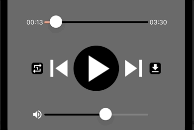

<!--more-->



To ease your read, please resume <a href="../10-play-music-with-mediaelement/">from this chapter</a> where we have set up the *MediaElement*.

In the previous article, we discovered the *[MediaElement](https://learn.microsoft.com/en-us/dotnet/communitytoolkit/maui/views/mediaelement)* for playing audio files, but with the help of our own controls. Remember the *Sliders* we set up? They're cool, but they're useless! 😄

So today, we are going to implement the playhead control, to allow the user to move to a specific frame in the track.

## Binding our components
If you remember, in the <a href="../7-music-player-display-time-tracker/">chapter on timing display</a>, we introduced 3 components:

* `ElapsedTime`, a *Label* for displaying elapsed playback time,

* `TotalTime`, also a *Label* but to display the total duration of the audio track,

* and finally the *Slider* `TimeTracker`, to control the track's playback head.


Goodbye dummy data! We are now going to bring these components to life with the help of **Data Binding**. And for this, we will use an initialization method, *InitTimeTracker()*:

<p align="center" style="margin-bottom:-10px"><strong>Filename:</strong><code>MusicPlayerView.cs</code></p>

```csharp
#region Time Tracker // Find the region where to add the code below
...
void InitTimeTracker() // And here is the init method
{
        TimeTracker.Bind(
            Slider.ValueProperty,
            nameof(MusicPlayer.Position),
            source: MusicPlayer,
            convert: (TimeSpan currentPosition) => currentPosition.TotalSeconds);

        TimeTracker.Bind(
            Slider.MaximumProperty,
            nameof(MusicPlayer.Duration),
            source: MusicPlayer,
            convert: (TimeSpan duration) => duration.TotalSeconds);

        ElapsedTime.Bind(
            Label.TextProperty,
            nameof(MusicPlayer.Position),
            source: MusicPlayer,
            stringFormat: "{0:mm\\:ss}");

        TotalTime.Bind(
            Label.TextProperty,
            nameof(MusicPlayer.Duration),
            source: MusicPlayer,
            stringFormat: "{0:mm\\:ss}");
}
#endregion
```
Yes, I know it's a bit dense, but cheer up! It's all explained below.

To get started, we have modified the behaviour of the `TimeTracker` to associate two properties with it:

* the current position of the cursor on the *Slider*,

* and the maximum value of the cursor (when it’s all to the right).


Let's take a closer look at the *MediaElement* represented by our `MusicPlayer` component. It has exactly what we need:

* the real time position of the playback head (`MusicPlayer.Position`), to be associated with the cursor position on the *Slider* (`TimeTracker.Value`),

* and the total duration of the song (`MusicPlayer.Duration`), to be associated with the maximum value of the *Slider* (`TimeTracker.Maximum`).


And now, if you remember, the *Slider* can only consider values of *double* type. This is why we need to convert the values obtained from `MusicPlayer.Position` and `MusicPlayer.Duration`, from the *TimeSpan* type to the *double* type, with the property named `TotalSeconds`.



🐒‎ ‎ And that mean, users will be able to advance or rewind playback to the nearest second!

Exactly ! 🙂 Now let’s see for the *Labels*.

For the `ElapsedTime` component, we want it to display how long the song has been playing, also based on the property `MusicPlayer.Position`. But only in a special way! We want to display the duration in minutes and seconds. To do this, we need to apply the desired text format using the code: `{0:mm\\:ss}`.

For the `TotalTime` component, we want to display the total listening time of the song, based on the property `MusicPlayer.Duration`. In the same way, we apply the identical text format to display a duration in minutes and seconds.



Going further with [StringFormat](https://learn.microsoft.com/en-us/dotnet/standard/base-types/custom-timespan-format-strings).



By the way, don't forget to replace the “=>” sign with “=” when declaring each of these components! Otherwise it won't work, as the same object will be returned each time you call these variables. You can use this opportunity to remove the dummy values we had defined by default for some properties:

* `Text` property for the two *Labels*,

* `Maximum` and `Value` properties for the *Slider*.

Here is the revised declaration for these 3 components:

<p align="center" style="margin-bottom:-10px"><strong>Filename:</strong><code>MusicPlayerView.cs</code></p>

```csharp
#region Time Tracker

Label ElapsedTime = new Label // The “=>” sign has been replaced with “=”
{
    FontSize = 14,
    TextColor = Colors.White
}.TextCenter();

Slider TimeTracker = new Slider // The “=>” sign has been replaced with “=”
{
    Minimum = 0,
    MinimumTrackColor = Colors.LightSalmon,
    MaximumTrackColor = Colors.Black
};

Label TotalTime = new Label // The “=>” sign has been replaced with “=”
{
    FontSize = 14,
    TextColor = Colors.White
}.TextCenter();
#endregion
```
Finally, the initialization method for these components must be called from the page constructor:

<p align="center" style="margin-bottom:-10px"><strong>Filename:</strong><code>MusicPlayerView.cs</code></p>

```csharp
...
namespace NightClub.Views;
public class MusicPlayerView : ContentPage
{
    public MusicPlayerView()
    {
        ...
        InitTimeTracker(); // Without this, nothing would work!
        ...
    }
    ...
}
```
Go on, relaunch the project! I'm sure you really want to 😄

Normally, you should see the texts are correctly initialized with real values. Also, the cursor should move on its own as the song progresses.



🐒‎ ‎ Oh yeah, it works! But I have the impression that the interface moves by itself, isn't there a bug with our *Grid*?

Well, it's true, the display is a bit jumpy!

<p align="center"></p>
<figure></figure>

We can play around with coloring the *Labels* background to get a better idea of the situation:

<p align="center"></p>
<figure><figcaption class="image-caption">By playing with the colors, you can see that the Label changes size each time its text is updated.</figcaption></figure>

As the song progresses, the text is updated every second and a new value replaces the old one. But it looks like some values require more space than others! 😄



🐒‎ ‎ But didn't we define fixed sizes for the columns?!

You are definitely right! It may be a bug, but I haven't found any good reason for why it happens. But .NET MAUI has only been around for a year, it may hide a few little flaws! We just need patience for Microsoft engineers to fix them (or even open-source contributors!).



After having upgraded the app to .NET 8, I couldn’t reproduce the bug.

No panic, we will woraround this in no time! It's all part of a developer's life. 🤓

If you remember the <a href="../6-arrange-elements-on-a-page/">scaffolding chapter</a>, we defined there a *Grid* component named `BottomLayout`, which we divided into 7 columns of different sizes:

<p align="center" style="margin-bottom:-10px"><strong>Filename:</strong><code>MusicPlayerView.cs</code></p>

```csharp
Grid BottomLayout => new Grid
{
    ...
    ColumnDefinitions = Columns.Define(
            Stars(10),
            Stars(10), // This column contains the ElapsedTime Label
            Stars(20),
            Stars(20),
            Stars(20),
            Stars(10), // This column contains the TotalTime Label
            Stars(10)),
    ...
};
```
Let’s rework the structure of our *Grid* by merging the first two columns, and the last two…

<p align="center" style="margin-bottom:-10px"><strong>Filename:</strong><code>MusicPlayerView.cs</code></p>

```csharp
Grid BottomLayout => new Grid
{
    ...
    ColumnDefinitions = Columns.Define(
            Stars(20), // We merge the first two columns...
            Stars(20),
            Stars(20),
            Stars(20),
            Stars(20)), // ... and the last two!
    ...
};
```
... then rearrange the positioning of the `BottomLayout` elements:

<p align="center" style="margin-bottom:-10px"><strong>Filename:</strong><code>MusicPlayerView.cs</code></p>

```csharp
Grid BottomLayout => new Grid
{
    ...
    Children =
    {
        ElapsedTime.Row(0).Column(0).End(),
        TimeTracker.Row(0).Column(1).ColumnSpan(3),
        TotalTime.Row(0).Column(4).Start(),

        RepeatOnceButton.Row(1).Column(0).End(),
        MediaControlLayout.Row(1).Column(1).ColumnSpan(3),
        DownloadButton.Row(1).Column(4).Start(),

        MuteButton.Row(2).Column(0).End(),
        VolumeTracker.Row(2).Column(1).ColumnSpan(3),
    }
};
```
As we removed two columns from our initial *Grid*, we had to readjust the positioning of our components, by modifying their assigned column and their horizontal alignment. To do this, we used the *[Start()](https://learn.microsoft.com/en-us/dotnet/communitytoolkit/maui/markup/extensions/view-extensions#start)* and *[End()](https://learn.microsoft.com/en-us/dotnet/communitytoolkit/maui/markup/extensions/view-extensions#end)* methods. These respectively align a component horizontally at the beginning or end of the available space.

And here is the outcome:

<p align="center"></p>
<figure><figcaption class="image-caption">The original design has been respected, and the jerkiness has disappeared!</figcaption></figure>



🐒‎ ‎ Perfect! But I can't move forward or backward in the song... another bug with the *Slider*?

Not exactly. Actually, this *Slider* has not yet been configured for that, and it’s time do it in the next section!

## Move the playhead control
To control the playback head, the user must simply drag the *Slider* cursor from point A to point B. If we break down his gesture, we could say that:

1. The user first puts his finger on the cursor at point A of the *Slider*,

1. Then he moves the cursor by keeping his finger pressed down,

1. Finally, he releases it at point B of the *Slider* by lifting his finger from the screen.

Now you have read this, did it ring a bell?



🐒‎ ‎ I remember we set up some events to detect user gestures... right?

Well done! Here we will use two events exposed by the *Slider* in order to:

* Detect when user starts moving the cursor,

* And detect when he releases it.

Let's attach these two events to our `TimeTracker` using the method *InitTimeTracker()*:

<p align="center" style="margin-bottom:-10px"><strong>Filename:</strong><code>MusicPlayerView.cs</code></p>

```csharp
void InitTimeTracker()
{
    ...
    TimeTracker.DragStarted += TimeTracker_DragStarted;
    TimeTracker.DragCompleted += TimeTracker_DragCompleted;
}
```


We could have used as well the commands provided by the *Slider* and worked from the **ViewModel**, but we had already explained <a href="../10-play-music-with-mediaelement/">here</a> that it was preferable to keep the logic in the **View** given that the *MediaElement* is purely a <a href="https://en.wikipedia.org/wiki/User_interface">UI</a> component.

<p align="center"></p>
<figure></figure>

Now define these new events in their dedicated region with the following code:

<p align="center" style="margin-bottom:-10px"><strong>Filename:</strong><code>MusicPlayerView.cs</code></p>

```csharp
#region Events
    ...
    void TimeTracker_DragStarted(object sender, EventArgs e)
    {
        if (MusicPlayer.CurrentState == MediaElementState.Playing)
        {
            mustResumePlayback = true;
		        MusicPlayer.Pause();
        }
    }

    void TimeTracker_DragCompleted(object sender, EventArgs e)
    {
        // We will always refer to the object that is the source
        // of the event through the parameter "sender"
        if (sender is Slider timeTrackerControl)
        {
            // Update the position based on where the User finger ended
            MusicPlayer.SeekTo(TimeSpan.FromSeconds(timeTrackerControl.Value));

            if (mustResumePlayback)
            {
                // Resume playback if it was playing prior dragging the cursor
                MusicPlayer.Play();
                mustResumePlayback = false;
            }
        }
    }
#endregion
```
The first event *TimeTracker_DragStarted()* corresponds to the moment when the user starts moving the cursor on the *Slider*. When this happens, playback is paused to prevent the music from continuing to play. Or else, the slider would continue to move on its own!

And for a better user experience, the song must resume playback as soon as user has finished his gesture. To achieve this, we must refer to the variable `mustResumePlayback`  to assess if soundtrack must be resumed.



🐒‎ ‎ Where did this variable come from? Never seen it before! 😄

We will add it right away! In a new dedicated region, at the top of the class:

<p align="center" style="margin-bottom:-10px"><strong>Filename:</strong><code>MusicPlayerView.cs</code></p>

```csharp
#region Properties

	bool mustResumePlayback;

#endregion
```
For the second event *TimeTracker_DragCompleted()*, this is the moment when the user has finished moving the cursor on the *Slider*. When this happens, we need to readjust the playback head of the `MusicPlayer` accordingly to the new cursor position. To do this, we use the *SeekTo()* method that is exposed by the *MediaElement* class, with a time reference as parameter (in *TimeSpan* format).



This will have an immediate effect on the value of the `MusicPlayer.Position`.

Finally, playback will resume immediately afterwards, from the newly selected position.

Relaunch the project and make sure you can move forward or backward in the piece!

<p align="center"></p>
<figure><figcaption class="image-caption">Hop, I just moved to the start of the track!</figcaption></figure>

You have just finished implementing a great feature for the user, well done!

<a href="../12-control-volume-with-mediaelement/">Next time</a>, we will see how to implement the volume management. See you soon!

___
More articles in the series:

