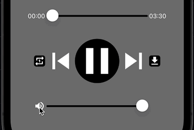
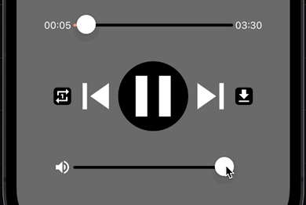
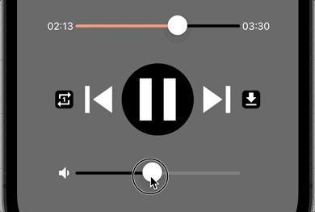
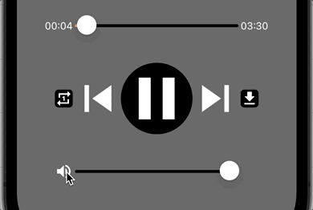

<!--more-->



Afin d’assurer le bon déroulement de cet article, je t’invite à repartir depuis <a href="../10-play-music/">ce chapitre</a> où l’on a configuré le *MediaElement*.

Dans l’article précédent, on avait vu comment déplacer la tête de lecture avec notre propre contrôle de type *Slider*. Et je sais que c’était un peu long ! Accroche-toi, on n’est plus très loin de la fin de ce cours 🙂

Nous allons donc voir aujourd’hui comment implémenter le contrôle du volume, lui aussi avec l’aide d’un *Slider*. Eh oui, comme dans tout bon lecteur musical, on veut que notre utilisateur puisse monter ou baisser le niveau sonore à sa guise !

# Définir un niveau de volume
Si tu te rappelles bien, dans le <a href="../9-volume-tracker/">chapitre sur l’affichage du volume</a>, nous avions introduit 2 composants :

* le `MuteButton`, qui est un contrôle de type *ImageButton* pour couper le son,

* et le *Slider* `VolumeTracker`, pour contrôler le volume sonore de manière précise.

Comme on a l’habitude de le faire, rendons-les maintenant utilisables avec l’aide du **Data Binding**, et tout ça dans une méthode d’initialisation nommée *InitVolumeTracker()* :

<p align="center" style="margin-bottom:-10px"><strong>Nom du fichier :</strong><code>MusicPlayerView.cs</code></p>

```csharp
// Comme toujours, chaque morceau de code a sa région !
#region Volume Tracker
    ...
    Slider VolumeTracker = new Slider
    {
        Minimum = 0,
        MinimumTrackColor = Colors.Black,
        Maximum = 100,
        MaximumTrackColor = Colors.Gray,
        // On n'a plus besoin de valeur factice, tu peux supprimer cette ligne
        // Value = 60
    };

    void InitVolumeTracker() // Et voici la nouvelle méthode d'initialisation
    {
        VolumeTracker.Bind(
            Slider.ValueProperty,
            nameof(MusicPlayer.Volume),
            source: MusicPlayer,
            convert: (double mediaElementVolume) => mediaElementVolume * 100,
            convertBack: (double sliderValue) => sliderValue / 100);
    }
#endregion
```
Ça va, pas de problème jusqu’ici ? Finalement, c’est très proche de ce qu’on a mis en place pour le contrôle de la tête de lecture !



🐒‎ ‎ Ah oui ! Mais euh… c’est nouveau le *convertBack* ?

Hé-hé, rien ne t’échappe !

Concrètement, nous avons associé la position du curseur sur le *Slider* (`VolumeTracker.Value`) à la valeur du volume qui est exposé par le *MediaElement* (`MusicPlayer.Volume`). Et si tu as bien lu la [documentation du Slider](https://learn.microsoft.com/fr-fr/dotnet/maui/user-interface/controls/slider?view=net-maui-8.0), il est dit que l’association de la propriété `Value` du *Slider* est bidirectionnelle (`BindingMode.TwoWay`), c’est-à-dire que :

* Tout changement de valeur depuis le composant source (ici, le `MusicPlayer`) aura un impact sur le composant cible (c’est le `VolumeTracker`),

* Et inversement, toute nouvelle valeur depuis le composant cible (`VolumeTracker`) aura un impact sur le composant source (`MusicPlayer`) !

En d’autres mots, si le volume du *MediaElement* descendait à 0, alors le curseur du *Slider* glisserait tout à gauche, et si l’utilisateur déplaçait le curseur tout à droite, alors le volume du *MediaElement* serait défini à 1.



La propriété *convert* agit dans le sens “source → cible”, alors que la propriété *convertBack* agit dans le sens contraire, “cible → source”.

Seulement, il est précisé dans la [documentation du MediaElement](https://learn.microsoft.com/fr-fr/dotnet/communitytoolkit/maui/views/mediaelement#properties) que la propriété `Volume` n’accepte que des valeurs de type *double* qui sont comprises entre 0 et 1.

C’est pourquoi, lors du *convert*, nous devons multiplier par 100 la valeur du `MusicPlayer.Volume` pour définir la position du curseur sur le *Slider* (`VolumeTracker.Value`). Et à l’inverse dans le *convertBack*, on doit diviser par 100 la valeur choisie par l’utilisateur via le *Slider* pour modifier correctement la valeur du *MediaElement*.

Enfin, tu n’as plus qu’à appeler la méthode d’initialisation *InitVolumeTracker()* depuis le constructeur de la page :

<p align="center" style="margin-bottom:-10px"><strong>Nom du fichier :</strong><code>MusicPlayerView.cs</code></p>

```csharp
...
namespace NightClub.Views;
public class MusicPlayerView : ContentPage
{
    public MusicPlayerView()
    {
        ...
        InitVolumeTracker(); // Et voilà, avec ça on est bons !
        ...
    }
    ...
}
```
Allez, relance le projet et vérifie que tu peux modifier le volume !



🐒‎ ‎ Déjà !? Hééé mais, et le `MuteButton`, qu’est-ce qu’on en fait ?

Parfois, il suffit de peu de code pour débloquer de nouvelles fonctionnalités ! Profites-en pour vérifier que ça fonctionne bien, on se revoit juste après pour la suite !

# Couper le son
Pour le `MuteButton`, c’est encore plus simple ! En effet, c’est déjà pris en compte par le *MediaElement* avec la propriété `ShouldMute` de type *boolean*. Et donc, tout ce que nous avons à faire, c’est détecter le clic de l’utilisateur sur le bouton et modifier sa valeur.

Pour cela, commençons par définir un nouvel évènement nommé *MuteButton_Clicked()*…

<p align="center" style="margin-bottom:-10px"><strong>Nom du fichier :</strong><code>MusicPlayerView.cs</code></p>

```csharp
#region Events
    ...
    void MuteButton_Clicked(object sender, EventArgs e)
    {
        MusicPlayer.ShouldMute = !MusicPlayer.ShouldMute;
    }
#endregion
```
… qui sera initialisé depuis notre méthode existante, dans le *InitMuteButton()* :

<p align="center" style="margin-bottom:-10px"><strong>Nom du fichier :</strong><code>MusicPlayerView.cs</code></p>

```csharp
#region Mute Button Visual States
    ...
    void InitMuteButton()
    {
        ...
        MuteButton.Clicked += MuteButton_Clicked;
    }
#endregion
```
Cet évènement est plutôt simple, non ? Il suffit d’inverser la valeur de la propriété `MusicPlayer.ShouldMute` pour alternativement couper ou remettre le son.

Bon, mais c’est pas tout ! Car si jamais tu voulais essayer, voici ce que cela donne :

<p align="center"></p>
<figure><figcaption class="image-caption">Le bouton fonctionne bien ! Mais il y a quelque chose qui cloche visuellement.</figcaption></figure>

Le son est bien coupé quand on clique une première fois sur le `MuteButton`, et il se réactive au clic suivant. C’est pas mal du tout !

Cependant, quelque chose dérange visuellement. Ça donne comme un effet bizarre quand le son est coupé :

* L’icône du `MuteButton` aurait du changer pour représenter le son coupé,

* Et le curseur du `VolumeTracker` aurait du glisser tout à gauche, pour la même raison.

En fait, il aurait fallu que ces deux contrôles s’adaptent au niveau de volume sonore…  Aurais-tu une idée ? 😊



🐒‎ ‎ Eh bien, on doit modifier la valeur du volume nous-mêmes, tout simplement !

Hé oui, c’est ça ! Mais as-tu pensé à ce qui se passerait quand l’utilisateur réactivera le son ?

L’idéal serait que le volume sonore remonte au niveau où il était avant d’être coupé. On va donc enregistrer le niveau du volume lorsque l’utilisateur clique sur le `MuteButton` !

Pour cela, on aura besoin à nouveau d’une variable :

<p align="center" style="margin-bottom:-10px"><strong>Nom du fichier :</strong><code>MusicPlayerView.cs</code></p>

```csharp
#region Properties

    bool mustResumePlayback;
    double savedVolumeBeforeGoingMute; // Une nouvelle variable de type double

#endregion
```
La variable `savedVolumeBeforeGoingMute` doit être de type *double* pour correspondre à la valeur contenue dans la propriété `Volume` du *MediaElement*.

Et maintenant, tu n’as plus qu’à modifier l’évènement *MuteButton_Clicked()* comme ceci :

<p align="center" style="margin-bottom:-10px"><strong>Nom du fichier :</strong><code>MusicPlayerView.cs</code></p>

```csharp
#region Events
    ...
    void MuteButton_Clicked(object sender, EventArgs e)
    {
        if (!MusicPlayer.ShouldMute)
        {
            // On enregistre bien le volume actuel avant de couper le son...
            savedVolumeBeforeGoingMute = MusicPlayer.Volume;
            MusicPlayer.Volume = 0;
        }
        else
        {
            // ... et quand le son est réactivé, on le rétablit comme avant !
            MusicPlayer.Volume = savedVolumeBeforeGoingMute;
        }
				
        // Et bien sûr ici, ça ne change pas !
        MusicPlayer.ShouldMute = !MusicPlayer.ShouldMute;
    }
    ...
#endregion
```
Désormais quand on détecte que le son va être désactivé, on garde en mémoire la valeur du volume sonore dans la variable `savedVolumeBeforeGoingMute`, puis on modifie nous-mêmes la valeur de la propriété `MusicPlayer.Volume` à 0.

D’ailleurs, je me suis demandé pourquoi ce n’était déjà pas intégré dans la librairie [.NET MAUI Community Toolkit](https://learn.microsoft.com/fr-fr/dotnet/communitytoolkit/maui/). Et j’ai donc posé la question sur [Github](https://github.com/CommunityToolkit/Maui/discussions/950#discussioncomment-7245223) directement à l’auteur de la fonctionnalité ! C’est ça la magie de l’Open Source.



En lisant la réponse à ma question, tu auras peut-être compris qu’il existe une autre façon d’implémenter la désactivation du son. Partage-moi ton essai en commentaires !

Allez, voyons ce que ça donne avec ces derniers changements :

<p align="center"></p>
<figure><figcaption class="image-caption">Ah, eh bien là c’est plus clair quand on coupe le son !</figcaption></figure>

Super ! Mais on doit parer tous les cas d’utilisation possibles et imaginables… C’est ce que nous allons voir juste après.

# Quelques optimisations
On va en effet appliquer quelques améliorations, car il reste deux situations où le comportement de notre fonctionnalité est bancal.

Par exemple, on a un premier cas où le curseur du volume reste bloqué tout à gauche :

<p align="center"></p>
<figure><figcaption class="image-caption">On a beau cliquer sur le bouton pour réactiver le son, rien ne se passe !</figcaption></figure>

C’est complètement normal ! Bien que le volume ait diminué jusqu’à 0, la variable `MusicPlayer.ShouldMute` n’est finalement pas passée à `true`. Techniquement, l’utilisateur n’est donc pas en train de réactiver le son !



Essaye de mettre des points de déboggage dans la méthode *MuteButton_Clicked()* !

Dans la deuxième situation inattendue, le son ne se réactive tout simplement pas :

<p align="center"></p>
<figure><figcaption class="image-caption">Après avoir coupé le son, monter le volume ne change rien du tout !</figcaption></figure>

Mais finalement, là aussi, rien d’étrange. D’ailleurs, la cause d’origine est la même que dans le cas précédent ! En effet, même si le volume a augmenté, la variable `MusicPlayer.ShouldMute` n’est jamais passée à `false`. Rebelotte donc, l’utilisateur n’est pas en train de réactiver le son !



🐒‎ ‎ Mais du coup, tout ce qu’on a fait est faux ?

Non, pas du tout ! Il y a évidemment des dizaines d’autres façons d’implémenter tout ça (et libre à toi d’essayer !), mais dans notre cas, il nous reste juste une petite partie à coder.

Mais alors, que manque-t’il d’après toi ? Un indice : tout commence par le changement de valeur du volume.

Et ça, ce n’est possible qu’avec le déplacement du curseur sur le *Slider*… Alors, on va optimiser le comportement actuel avec un nouvel évènement nommé *VolumeTracker_DragCompleted()* :

<p align="center" style="margin-bottom:-10px"><strong>Nom du fichier :</strong><code>MusicPlayerView.cs</code></p>

```csharp
#region Events
		...
		void VolumeTracker_DragCompleted(object sender, EventArgs e)
		{
        // Il est recommandé de toujours se référer à l'objet qui est
        // la source de l'évènement à travers le paramètre "sender"
		    if (sender is Slider volumeTrackerControl)
		    {
		        if (volumeTrackerControl.Value == 0)
		        {
		            // Le volume sonore doit toujours être suffisamment
		            // élevé quand le son est réactivé
		            savedVolumeBeforeGoingMute = 0.2;
		            MusicPlayer.ShouldMute = true;
		        }
		        else if(MusicPlayer.ShouldMute)
		        {
		            // On doit réactiver le son quand le curseur
		            // définit une valeur strictement positive
		            MusicPlayer.ShouldMute = false;
		        }
		    }
		}
#endregion
```
Et bien sûr, on n’oublie pas d’initialiser cet évènement depuis la bonne méthode…

<p align="center" style="margin-bottom:-10px"><strong>Nom du fichier :</strong><code>MusicPlayerView.cs</code></p>

```csharp
#region Volume Tracker
		...
		void InitVolumeTracker()
		{
		    VolumeTracker.DragCompleted += VolumeTracker_DragCompleted;
			...
		}
#endregion
```
Relance le projet, vérifie que tout fonctionne, et surtout, profite du résultat de tes efforts !

J’espère que tu auras appris plein de nouvelles choses aujourd’hui. De manière générale, inspire-toi de ce que tu observes pour expérimenter de nouvelles choses. Et en allant un peu plus loin à chaque fois, tu deviendras de plus en plus à l’aise !

Allez, on se revoit très vite pour un nouveau chapitre ! 🙂

___
Plus d'articles dans la même série:

