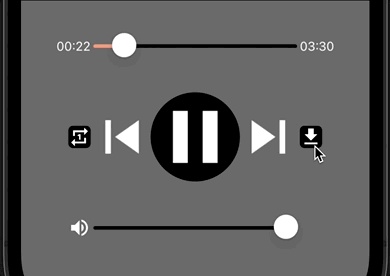
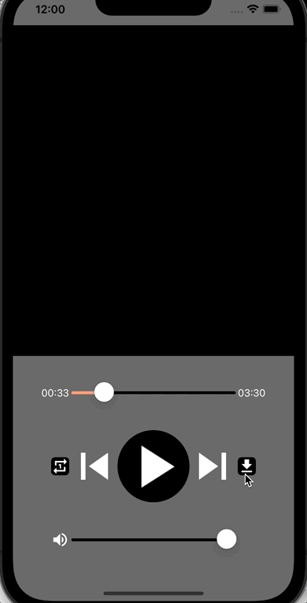

<!--more-->



Afin d’assurer le bon déroulement de cet article, je t’invite à repartir depuis <a href="../10-play-music/">ce chapitre</a> où l’on a configuré le *MediaElement*.

Et nous voilà reparti pour un nouveau chapitre !

C’est déjà l’épisode n°13 de cette série, alors j’espère que c’est toujours relativement simple à suivre ! Mais il se peut que tu aies des questions ou des remarques. Si c’est le cas, pose-les moi en commentaires en bas de l’article ou écris-moi directement par e-mail ([jeanemmanuel.baillat@gmail.com](mailto:jeanemmanuel.baillat@gmail.com)) !

Aujourd’hui, nous allons voir comment permettre à l’utilisateur de télécharger la musique qui est en cours de lecture. Depuis le temps qu’on écoute la même chanson en boucle, je suis sûr que tu rêvais de pouvoir la télécharger depuis l’application ! 😄

# Création d’un nouveau ViewModel
Avant tout, nous devons mettre en place un nouveau **ViewModel** pour la vue *MusicPlayerView*. Pour cela, ajoute une nouvelle classe nommée *MusicPlayerViewModel* dans le dossier *ViewModels*, et définis-la avec le code suivant :

<p align="center" style="margin-bottom:-10px"><strong>Nom du fichier :</strong><code>MusicPlayerViewModel.cs</code></p>

```csharp
using CommunityToolkit.Mvvm.ComponentModel;
using CommunityToolkit.Mvvm.Input;

namespace NightClub.ViewModels;

public partial class MusicPlayerViewModel : ObservableObject
{
    #region Properties
    #endregion

    public MusicPlayerViewModel()
    {
    }

    #region Commands
    #endregion
}
```


Si déchiffrer ce bout de code est difficile pour toi, alors ne te décourage pas et prends le temps de relire le <a href="../4-mvvm-is-the-key-to-succeed/">chapitre sur le MVVM</a>.

Évidemment, ce **ViewModel** ne fait rien pour le moment, mais il est prêt à être associé à sa **View**. Ouvre donc le fichier `MusicPlayerView.cs` et modifie-le comme suit :

<p align="center" style="margin-bottom:-10px"><strong>Nom du fichier :</strong><code>MusicPlayerView.cs</code></p>

```csharp
...
// Ce using est obligatoire pour retrouver la définition du MusicPlayerViewModel
using NightClub.ViewModels;

namespace NightClub.Views;
public class MusicPlayerView : ContentPage
{
    public MusicPlayerView()
    {
        Console.WriteLine("[NightClub] MusicPlayerView - Constructor");

        // C'est ici que l'association s'opère !
        BindingContext = new MusicPlayerViewModel();

        NavigationPage.SetHasNavigationBar(this, false);
        BackgroundColor = Colors.DimGray;
        ...
    }
    ...
}
```
Comme pour le *HomeViewModel* que l’on avait associé avec la *HomeView*, on a modifié ici le `BindingContext` de la *MusicPlayerView* pour lui associer le nouveau *MusicPlayerViewModel*.

Bon, c’était rapide ! Voyons maintenant comment structurer les données de l’application en définissant le **Model** des pistes musicales.

# Une classe pour les pistes musicales
Chaque piste musicale lue dans l’application se définit par un panel d’informations que l’on va regrouper dans une classe nommée `MusicTrack`. Et comme tu l’auras compris, ce nouvel objet fait parti du **Model** de notre application.

Commence donc par créer un nouveau dossier intitulé *Models*, puis ajoutes-y une nouvelle classe définie par le code suivant :

<p align="center" style="margin-bottom:-10px"><strong>Nom du fichier :</strong><code>MusicTrack.cs</code></p>

```csharp
namespace NightClub.Models;

public class MusicTrack
{
    public string AudioURL { get; set; }
    public string AudioDownloadURL { get; set; }
    public string Title { get; set; }
    public string Author { get; set; }
}
```
Pour les besoins de ce cours, 4 propriétés de type *string* sont nécessaires pour contenir les informations suivantes :

* Le lien d’écoute du morceau (`AudioURL`),

* Le lien de téléchargement du morceau (`AudioDownloadURL`),

* Le nom du morceau (`Title`),

* Et le nom de l’auteur du morceau (`Author`).


Comme il est désormais possible de manipuler des pistes musicales, on va ajouter une propriété de type `MusicTrack` au *MusicPlayerViewModel* pour définir la chanson en cours de lecture :

<p align="center" style="margin-bottom:-10px"><strong>Nom du fichier :</strong><code>MusicPlayerViewModel.cs</code></p>

```csharp
...
using NightClub.Models; // Obligatoire pour utiliser la classe MusicTrack !

namespace NightClub.ViewModels;

public partial class MusicPlayerViewModel : ObservableObject
{
    #region Properties

    [ObservableProperty]
    MusicTrack currentTrack;

    #endregion
    ...
}
```
Une propriété qui s’adapte parfaitement au découpage **Model-View-ViewModel** (MVVM) puisqu’on l’a déclarée comme étant une `[ObservableProperty]`, une annotation fournie par la librairie [MVVM Toolkit](https://learn.microsoft.com/fr-fr/dotnet/communitytoolkit/mvvm/).

Cette annotation va alors [générer tout le code](https://learn.microsoft.com/fr-fr/dotnet/communitytoolkit/mvvm/generators/observableproperty#how-it-works) nécessaire pour déclencher des évènements (généralement vers la **View**) en cas de changement de valeur. En effet, on souhaite calquer les informations affichées dans la **View** sur le **ViewModel** qui lui est associé.



🐒‎ ‎ Compris ! Mais comment va-t’on faire pour définir cette chanson ?

Pour l’instant c’est facile car notre application ne supporte la lecture que d’une seule chanson. On va donc tout simplement l’initialiser depuis le constructeur du *MusicPlayerViewModel*, comme ceci :

<p align="center" style="margin-bottom:-10px"><strong>Nom du fichier :</strong><code>MusicPlayerViewModel.cs</code></p>

```csharp
public MusicPlayerViewModel()
{
    CurrentTrack = new MusicTrack()
    {
        AudioURL = "https://prod-1.storage.jamendo.com/?trackid=1890762&format=mp31&from=b5bSbOTAT1kXawaT8EV9IA%3D%3D%7CGcDX%2BeejT3P%2F0CfPwtSyYA%3D%3D",
        AudioDownloadURL = "https://prod-1.storage.jamendo.com/download/track/1890762/mp32/",
        Author = "Alfonso Lugo",
        Title = "Baila",
    };
}
```


Toutes ces informations sont fournies par [Jamendo](https://www.jamendo.com/), un site de musique gratuite et indépendante.

Mais puisqu’on a défini la piste musicale dans le *MusicPlayerViewModel*, il nous faut maintenant retravailler la *MusicPlayerView* pour reconfigurer le `MusicPlayer`.

Pour cela, il va falloir modifier la méthode `InitMusicPlayer()` dans le *MusicPlayerView*, et appliquer le **Data Binding** à la propriété `Source` du *MediaElement* :

<p align="center" style="margin-bottom:-10px"><strong>Nom du fichier :</strong><code>MusicPlayerView.cs</code></p>

```csharp
...
using NightClub.Models; // Obligatoire pour utiliser la classe MusicTrack !

namespace NightClub.Views;
public class MusicPlayerView : ContentPage
{
    ...
    #region MusicPlayer

    MediaElement MusicPlayer = new MediaElement();

    // Et voici la nouvelle définition de la méthode...
    void InitMusicPlayer()
    {
        MusicPlayer.ShouldAutoPlay = true;

        // ... avec ici le binding sur le MusicPlayer.
        MusicPlayer.Bind(
            MediaElement.SourceProperty,
            nameof(MusicPlayerViewModel.CurrentTrack),
            convert: (MusicTrack musicTrack) => MediaSource.FromUri(musicTrack.AudioURL)
            );
    }

    #endregion
    ...
}
```
Souviens-toi, la propriété `Source` du *MediaElement* permet de définir la source du média qu’il doit jouer. Et désormais, la propriété `MusicPlayer.Source` est rattachée dynamiquement à la propriété `CurrentTrack` définie dans le *MusicPlayerViewModel*.

Bien-sûr, on n’oublie pas dans le *convert* de transformer le lien streaming audio (`musicTrack.AudioURL`) avec la méthode *MediaSource.FromUri()*, pour se conformer au type de la propriété `Source` du *MediaElement*.

Et voilà ! Relance donc le projet et vérifie que tout fonctionne comme avant. Je ne voudrais pas te perdre en route ! 😛

Tout est bien en place ? Alors passons vite à la partie la plus intéressante de ce chapitre : le téléchargement !

# Télécharger un morceau
Continuons maintenant notre petit bout de chemin en implémentant le bouton de téléchargement.

Pour cela, on va déjà associer une action déclenchée au clic sur le `DownloadButton`…

<p align="center" style="margin-bottom:-10px"><strong>Nom du fichier :</strong><code>MusicPlayerView.cs</code></p>

```csharp
#region Media Control Panel
    ...
    // N'oublie pas de transformer le signe "=>" en "=" !
    ImageButton DownloadButton = new ImageButton
    {
        CornerRadius = 5,
        HeightRequest = 25,
        WidthRequest = 25,
        Source = "download.png",
        BackgroundColor = Colors.Black
    } .BindCommand("DownloadCurrentTrackCommand"); // Et voici la commande associée

#endregion
```
… et dont le comportement sera défini dans *MusicPlayerViewModel* :

<p align="center" style="margin-bottom:-10px"><strong>Nom du fichier :</strong><code>MusicPlayerViewModel.cs</code></p>

```csharp
...
using CommunityToolkit.Maui.Alerts; // Ce using est nouveau...
using CommunityToolkit.Maui.Storage; // ... ainsi que celui-ci !

namespace NightClub.ViewModels;
public partial class MusicPlayerViewModel : ObservableObject
{
    ...
    #region Commands

    [RelayCommand]
    async Task DownloadCurrentTrack(CancellationToken cancellationToken)
    {
        await Toast
            .Make($"[TEST] You have successfully downloaded \"{CurrentTrack.Title} - {CurrentTrack.Author}\"!")
            .Show(cancellationToken);
    }

    #endregion
}
```
Tu te rappelles de l’annotation `[RelayCommand]` ? On y avait déjà eu recours dans le <a href="../4-mvvm-is-the-key-to-succeed/">chapitre sur le MVVM</a>. C’est elle qui permet à notre méthode *DownloadCurrentTrack()* d’être appelée depuis la **View** !

Et je t’arrête tout de suite, la méthode *Toast()* n’a rien à voir avec ton petit-déjeuner ce matin 😄

Cette [méthode fournie par la librairie .NET MAUI Community Toolkit](https://learn.microsoft.com/fr-fr/dotnet/communitytoolkit/maui/alerts/toast?tabs=ios) permet d’afficher temporairement un message à l’écran, à la manière d’une notification directement intégrée dans l’application.

À ce stade, on peut déjà tester que notre bouton fonctionne bien :

<p align="center"></p>
<figure><figcaption class="image-caption">Finalement, ce message est bien utile !</figcaption></figure>



🐒‎ ‎ Oui mais tu essaies de m’arnaquer là, ça ne télécharge rien du tout ! 😄

Je vais te partager le code final juste après... patience ! 🤓

Juste avant, j’aurais aimé attirer ton attention sur le paramètre requis par notre nouvelle commande, le `cancellationToken`. Il s’agit d’un objet de type [CancellationToken](https://learn.microsoft.com/fr-fr/dotnet/api/system.threading.cancellationtoken) qui permet de garder un lien avec le code initiateur de l’appel à la méthode *DownloadCurrentTrack()* en cas de demande d’annulation de son exécution.

C’est très utile pour les opérations un peu longues, par exemple si notre utilisateur décidait d’annuler le téléchargement par manque de réseau. On ne va pas implémenter cette fonctionnalité aujourd’hui, mais ça serait une très bonne amélioration !



Aller plus loin avec la [gestion des demandes d’annulation des opérations](https://learn.microsoft.com/fr-fr/dotnet/standard/threading/cancellation-in-managed-threads).

Passons maintenant au téléchargement en lui-même avec l’implémentation complète de la méthode :

<p align="center" style="margin-bottom:-10px"><strong>Nom du fichier :</strong><code>MusicPlayerViewModel.cs</code></p>

```csharp
#region Commands

[RelayCommand]
async Task DownloadCurrentTrack(CancellationToken cancellationToken)
{
    // On lève une exception quand l'annulation de l'opération est demandée
    cancellationToken.ThrowIfCancellationRequested();

    try
    {
        // On a besoin d'un client HTTP pour gérer nos requêtes sur le réseau
        HttpClient client = new HttpClient();
        client.MaxResponseContentBufferSize = 100000000; // On peut télécharger jusqu'à ~100Mo de données par fichier !

        // On envoie une requête HTTP vers le lien de téléchargement du morceau
        using var httpResponse =
            await client.GetAsync(
                new Uri(CurrentTrack.AudioDownloadURL), cancellationToken);

        httpResponse.EnsureSuccessStatusCode();

        var downloadedImage = await httpResponse.Content.ReadAsStreamAsync(cancellationToken);

        try
        {
            string fileName = $"{CurrentTrack.Title} - {CurrentTrack.Author}.mp3";

            // Puis on transfère les données récupérées dans un fichier
            // Note : on a besoin de mettre à jour CommunityToolkit.Maui au moins vers version 5.1.0
            var fileSaveResult = await FileSaver.SaveAsync(fileName, downloadedImage, cancellationToken);

            fileSaveResult.EnsureSuccess();

            await Toast.Make($"File saved at: {fileSaveResult.FilePath}").Show(cancellationToken);
        }
        catch (Exception ex)
        {
            await Toast.Make($"Cannot save file because: {ex.Message}").Show(cancellationToken);
        }
    }
    catch (Exception ex)
    {
        await Toast.Make($"Cannot download file because: {ex.Message}").Show(cancellationToken);
    }
}

#endregion
```
C’est un gros bout de code, mais rien d’insurmontable !

Décortiquons cela ensemble pas à pas :

1. On définit d’abord un client HTTP pour nous permettre d’effectuer une requête vers le lien de téléchargement du morceau en cours de lecture (`CurrentTrack.AudioDownloadURL`),

1. Nous espérons alors en retour une réponse positive du serveur pour nous fournir les données correspondantes,

1. Et puis si tout va bien, on ouvre un canal de lecture pour transférer ces données dans un fichier et demander sa sauvegarde sur l’appareil.

Comme tu vois, il n’y a vraiment aucune logique complexe ici. C’est seulement un peu technique ! Alors comme à chaque fois, prends le temps pour approfondir le sujet si besoin.



Aller plus loin avec [la gestion des requêtes HTTP](https://learn.microsoft.com/fr-fr/dotnet/fundamentals/networking/http/httpclient).

Comme tu l’auras remarqué, la sauvegarde du fichier audio est rendue possible grâce au [FileSaver](https://learn.microsoft.com/fr-fr/dotnet/communitytoolkit/maui/essentials/file-saver?tabs=android). Cet utilitaire est fourni à partir de la [version 5.1.0 de la librairie CommunityToolkit.Maui](https://www.nuget.org/packages/CommunityToolkit.Maui/5.1.0) et nécessite quelques configurations supplémentaires pour cibler la plateforme Android.

Pour cela, rends-toi dans le dossier *Platforms*, puis *Android*, et ouvre le fichier *AndroidManifest.xml* pour y rajouter les lignes suivantes :

<p align="center" style="margin-bottom:-10px"><strong>Nom du fichier :</strong><code>AndroidManifest.xml</code></p>

```xml
<uses-permission android:name="android.permission.READ_EXTERNAL_STORAGE" android:maxSdkVersion="32" />
<uses-permission android:name="android.permission.WRITE_EXTERNAL_STORAGE" />
```
Enfin, on a codé quelques messages pour aider l’utilisateur à comprendre ce qu’il se passe en arrière-plan. En effet, on ne voudrait pas qu’une erreur survienne pendant le téléchargement et que l’utilisateur attende indéfiniment ! Et comme il ne s’agit que de messages informels, sans aucune action requise, j’ai préféré utiliser le fameux *Toast* pour afficher des notifications éphémères.

Et voilà, c’est terminé. Fais vite un essai !

<p align="center"></p>
<figure><figcaption class="image-caption">Cette fois-ci, le téléchargement est bien réel !</figcaption></figure>

Je te félicite pour tout ce travail ! Encore un dernier effort et la manipulation des médias n’aura plus aucun secret pour toi. Rendez-vous au <a href="../14-change-music-track/">prochain chapitre</a> pour gérer la playlist musicale !

___
Plus d'articles dans la même série:

