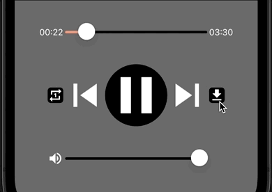
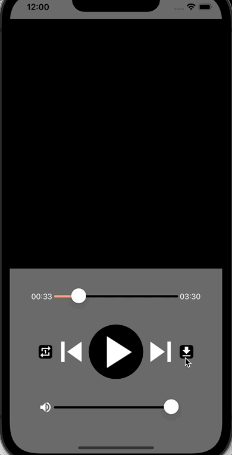

<!--more-->



To ease your read, please resume <a href="../10-play-music-with-mediaelement/">from this chapter</a> where we have set up the *MediaElement*.

Here we go again for a new chapter!

It's already episode 13 of this series, so I hope it's still relatively easy to follow! But you may have questions or comments. If you do, ask me in the comments at the bottom of the article, or e-mail me directly ([jeanemmanuel.baillat@gmail.com](mailto:jeanemmanuel.baillat@gmail.com))!

Today, we will have a look at how to enable the user to download the music that is currently playing. We have been listening to the same song over and over, I'm sure you have been dreaming of being able to download it from the app! 😄

## Adding a new ViewModel
First of all, we need to set up a new **ViewModel** for the *MusicPlayerView*. To do this, add a new class named *MusicPlayerViewModel* to the *ViewModels* folder, and define it with the following code:

<p align="center" style="margin-bottom:-10px"><strong>Filename:</strong><code>MusicPlayerViewModel.cs</code></p>

```csharp
using CommunityToolkit.Mvvm.ComponentModel;
using CommunityToolkit.Mvvm.Input;

namespace NightClub.ViewModels;

public partial class MusicPlayerViewModel : ObservableObject
{
    #region Properties
    #endregion

    public MusicPlayerViewModel()
    {
    }

    #region Commands
    #endregion
}
```


If figuring out this bit of code is difficult for you, then don't get discouraged and take some time to read again the <a href="../4-mvvm-for-successful-apps/">chapter on MVVM</a>.

Of course, this **ViewModel** doesn't do anything at the moment, but it's ready to be associated with its **View**. So open the file `MusicPlayerView.cs` and modify it as follows:

<p align="center" style="margin-bottom:-10px"><strong>Filename:</strong><code>MusicPlayerView.cs</code></p>

```csharp
...
// This using is mandatory to resolve the definition of MusicPlayerViewModel
using NightClub.ViewModels;

namespace NightClub.Views;
public class MusicPlayerView : ContentPage
{
    public MusicPlayerView()
    {
        Console.WriteLine("[NightClub] MusicPlayerView - Constructor");

        // Here is where the association is happening
        BindingContext = new MusicPlayerViewModel();

        NavigationPage.SetHasNavigationBar(this, false);
        BackgroundColor = Colors.DimGray;
        ...
    }
    ...
}
```
As with the *HomeViewModel* associated with the *HomeView*, here we have modified the *MusicPlayerView*'s `BindingContext` to associate it with the new *MusicPlayerViewModel*.

Well, that was quick. Now let's see how to structure application data by defining the **Model** of music tracks!

## A new class for music tracks
Each music track played in the application is defined by a panel of information that we'll group together in a class called `MusicTrack`. As you'll have guessed, this new object is part of our application's **Model**.

Start by creating a new folder called *Models*, then add a new class defined by the following code:

<p align="center" style="margin-bottom:-10px"><strong>Filename:</strong><code>MusicTrack.cs</code></p>

```csharp
namespace NightClub.Models;

public class MusicTrack
{
    public string AudioURL { get; set; }
    public string AudioDownloadURL { get; set; }
    public string Title { get; set; }
    public string Author { get; set; }
}
```
For the purposes of this course, 4 *string* properties are required to contain the following information:

* The link for streaming audio (`AudioURL`),

* The link for downloading audio (`AudioDownloadURL`),

* The music track name (`Title`),

* And the name of his author (`Author`).


Since it is now possible to manipulate music tracks, we will add a `MusicTrack` property to the *MusicPlayerViewModel* to define the song currently playing:

<p align="center" style="margin-bottom:-10px"><strong>Filename:</strong><code>MusicPlayerViewModel.cs</code></p>

```csharp
...
using NightClub.Models; // This is required to resolve MusicTrack object!

namespace NightClub.ViewModels;

public partial class MusicPlayerViewModel : ObservableObject
{
    #region Properties

    [ObservableProperty]
    MusicTrack currentTrack;

    #endregion
    ...
}
```
This perfectly fits in with the **Model-View-ViewModel** (MVVM) breakdown, since we've declared it as an `[ObservableProperty]`, which is an annotation provided by the [MVVM Toolkit library](https://learn.microsoft.com/en-us/dotnet/communitytoolkit/mvvm/).

This annotation will then [generate all the code](https://learn.microsoft.com/en-us/dotnet/communitytoolkit/mvvm/generators/observableproperty#how-it-works) required to trigger events (generally towards the **View**) in case of a value change. Indeed, we want to match the information displayed in the **View** to its associated **ViewModel**.



🐒‎ ‎ Got it! But how are we going to define this song?

For the moment, it's easy because our application only supports the playback of a single song. So we'll simply initialize it from the *MusicPlayerViewModel* constructor, as follows:

<p align="center" style="margin-bottom:-10px"><strong>Filename:</strong><code>MusicPlayerViewModel.cs</code></p>

```csharp
public MusicPlayerViewModel()
{
    CurrentTrack = new MusicTrack()
    {
        AudioURL = "https://prod-1.storage.jamendo.com/?trackid=1890762&format=mp31&from=b5bSbOTAT1kXawaT8EV9IA%3D%3D%7CGcDX%2BeejT3P%2F0CfPwtSyYA%3D%3D",
        AudioDownloadURL = "https://prod-1.storage.jamendo.com/download/track/1890762/mp32/",
        Author = "Alfonso Lugo",
        Title = "Baila",
    };
}
```


All the information is provided by [Jamendo](https://www.jamendo.com/), a website for free & independent music.

But since we've defined the music track inside the *MusicPlayerViewModel*, we now need to rework the *MusicPlayerView* to reconfigure the `MusicPlayer`.

To do this, we need to modify the `InitMusicPlayer()` method inside the *MusicPlayerView*, and apply the **Data Binding** to the `Source` property of the *MediaElement*:

<p align="center" style="margin-bottom:-10px"><strong>Filename:</strong><code>MusicPlayerView.cs</code></p>

```csharp
...
using NightClub.Models; // This is required to resolve MusicTrack object!

namespace NightClub.Views;
public class MusicPlayerView : ContentPage
{
    ...
    #region MusicPlayer

    MediaElement MusicPlayer = new MediaElement();

    // And here's the new definition for that method...
    void InitMusicPlayer()
    {
        MusicPlayer.ShouldAutoPlay = true;

        // ... with the binding logic on the MusicPlayer.
        MusicPlayer.Bind(
            MediaElement.SourceProperty,
            nameof(MusicPlayerViewModel.CurrentTrack),
            convert: (MusicTrack musicTrack) => MediaSource.FromUri(musicTrack.AudioURL)
            );
    }

    #endregion
    ...
}
```
Remember, the *MediaElement*'s `Source` property is used to define the source of the media to play. And now, the `MusicPlayer.Source` property is dynamically linked to the `CurrentTrack` property defined inside the *MusicPlayerViewModel*.

Also in the *convert*, we must not forget to transform the audio streaming link (`musicTrack.AudioURL`) with the *MediaSource.FromUri()* method, to conform to the type of the *MediaElement*'s `Source` property.

That's it! Relaunch the project and check that everything is working as before. I wouldn't want you to be lost in the middle! 😛

Is everything OK? Then let's move on quickly to the most interesting part of this chapter: downloading!

## Download a song track
Let's continue our journey by implementing the download button.

To do this, we're going to associate an action triggered by clicking on the `DownloadButton`…

<p align="center" style="margin-bottom:-10px"><strong>Filename:</strong><code>MusicPlayerView.cs</code></p>

```csharp
#region Media Control Panel
    ...
    // The “=>” sign has been replaced with “=”
    ImageButton DownloadButton = new ImageButton
    {
        CornerRadius = 5,
        HeightRequest = 25,
        WidthRequest = 25,
        Source = "download.png",
        BackgroundColor = Colors.Black
    } .BindCommand("DownloadCurrentTrackCommand"); // And here's the command to associate

#endregion
```
... and whose behavior will be defined inside *MusicPlayerViewModel*:

<p align="center" style="margin-bottom:-10px"><strong>Filename:</strong><code>MusicPlayerViewModel.cs</code></p>

```csharp
...
using CommunityToolkit.Maui.Alerts; // This "using" is new...
using CommunityToolkit.Maui.Storage; // ... and this one as well !

namespace NightClub.ViewModels;
public partial class MusicPlayerViewModel : ObservableObject
{
    ...
    #region Commands

    [RelayCommand]
    async Task DownloadCurrentTrack(CancellationToken cancellationToken)
    {
        await Toast
            .Make($"[TEST] You have successfully downloaded \"{CurrentTrack.Title} - {CurrentTrack.Author}\"!")
            .Show(cancellationToken);
    }

    #endregion
}
```
Remember the `[RelayCommand]` annotation? We already used it in the <a href="../4-mvvm-for-successful-apps/">MVVM chapter</a>. It allows our method *DownloadCurrentTrack()* to be called from the **View**!

And let me stop you right there, the *Toast()* method has nothing to do with your breakfast 😄

This [method is provided by the .NET MAUI Community Toolkit library](https://learn.microsoft.com/en-us/dotnet/communitytoolkit/maui/alerts/toast?tabs=ios), and it can be used as an in-app notification to temporarily display a message on the screen.

At this stage, we can already test that our button is working properly:

<p align="center"></p>
<figure><figcaption class="image-caption">Actually, this message is pretty useful!</figcaption></figure>



🐒‎ ‎ Are you cheating on me? It doesn't download anything at all! 😄

I'll share the final code with you right after... patience! 🤓

Just before, I'd like to bring your attention to the parameter that is required by our new command, the `cancellationToken`. This is an object of type [CancellationToken](https://learn.microsoft.com/en-us/dotnet/api/system.threading.cancellationtoken) that keeps a link with the code that initiated the call to the method *DownloadCurrentTrack()* in the event of a request to cancel its execution.

This is powerful for operations that take a little longer, for example if our user decides to cancel the download due to bad network. We're not going to implement this feature today, but it would be a great improvement!



Going further with [management of transaction cancellation requests](https://learn.microsoft.com/en-us/dotnet/standard/threading/cancellation-in-managed-threads).

Let's now move on to the download operation itself, with the full implementation below:

<p align="center" style="margin-bottom:-10px"><strong>Filename:</strong><code>MusicPlayerViewModel.cs</code></p>

```csharp
#region Commands

[RelayCommand]
async Task DownloadCurrentTrack(CancellationToken cancellationToken)
{
    // We raise an exception when cancellation is requested
    cancellationToken.ThrowIfCancellationRequested();

    try
    {
        // We need an HTTP client to send our request through the network
        HttpClient client = new HttpClient();
        client.MaxResponseContentBufferSize = 100000000; // We can download up to ~100MB of data per file!

        // We send an HTTP request to the link for downloading audio
        using var httpResponse =
            await client.GetAsync(
                new Uri(CurrentTrack.AudioDownloadURL), cancellationToken);

        httpResponse.EnsureSuccessStatusCode();

        var downloadedImage = await httpResponse.Content.ReadAsStreamAsync(cancellationToken);

        try
        {
            string fileName = $"{CurrentTrack.Title} - {CurrentTrack.Author}.mp3";

            // The retrieved data is then transferred to a file
            // Note: we need CommunityToolkit.Maui to be updated to 5.1.0 at least
            var fileSaveResult = await FileSaver.SaveAsync(fileName, downloadedImage, cancellationToken);

            fileSaveResult.EnsureSuccess();

            await Toast.Make($"File saved at: {fileSaveResult.FilePath}").Show(cancellationToken);
        }
        catch (Exception ex)
        {
            await Toast.Make($"Cannot save file because: {ex.Message}").Show(cancellationToken);
        }
    }
    catch (Exception ex)
    {
        await Toast.Make($"Cannot download file because: {ex.Message}").Show(cancellationToken);
    }
}

#endregion
```
This is a big piece of code, but nothing too complicated!

Let's walkthrough step by step:

1. We first define an HTTP client to enable us to make a request to the download link of the currently playing track (`CurrentTrack.AudioDownloadURL`),

1. In return, we expect a positive response from the server to provide us with the corresponding data,

1. And then, if everything’s fine, we open a read channel to transfer the data to a file and request that it be saved on the device.

As you can see, there's really no complex logic here. It's just a bit technical! So, as always, take some time to explore the subject if you need to.



Going further with [HTTP request management](https://learn.microsoft.com/en-us/dotnet/fundamentals/networking/http/httpclient).

As you'll have noticed, saving the audio file is made possible by [FileSaver](https://learn.microsoft.com/en-us/dotnet/communitytoolkit/maui/essentials/file-saver?tabs=android). This feature is provided as of [version 5.1.0 of the CommunityToolkit.Maui library](https://www.nuget.org/packages/CommunityToolkit.Maui/5.1.0), and requires a few more configurations to target Android.

To do this, go to the *Platforms* folder, then *Android*, and open the file *AndroidManifest.xml* to add the following lines:

<p align="center" style="margin-bottom:-10px"><strong>Filename:</strong><code>AndroidManifest.xml</code></p>

```xml
<uses-permission android:name="android.permission.READ_EXTERNAL_STORAGE" android:maxSdkVersion="32" />
<uses-permission android:name="android.permission.WRITE_EXTERNAL_STORAGE" />
```
Finally, we've coded a few messages to help the user understand what's going on in the background. After all, we wouldn't want the user to wait indefinitely because of an error that occurred during the download process! And as these are only informal messages, with no action required, I preferred to use the famous *Toast* to display ephemeral notifications.

And that's it. Give it a try!

<p align="center"></p>
<figure><figcaption class="image-caption">This time, the download is real!</figcaption></figure>

Congratulations on all your hard work! One last effort and manipulation of media will hold no secrets for you. See you in the <a href="../14-skip-next-or-previous-with-mediaelement/">next chapter</a> to manage the music playlist!

___
More articles in the series:

