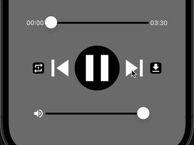
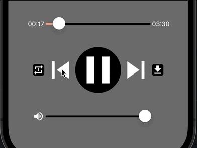
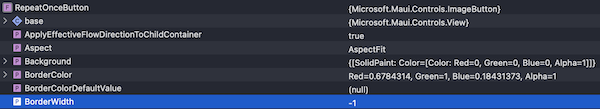
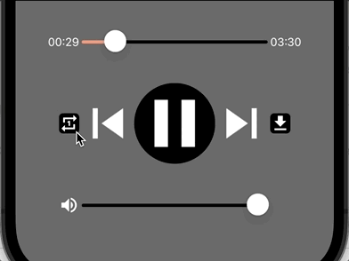
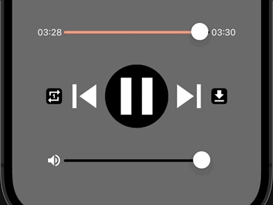

<!--more-->



To ease your read, please resume <a href="../10-play-music/">from this chapter</a> where we have set up the *MediaElement*.

Last time, we looked at how to download music directly from the app. But it's been the same music from the start!

Wouldn't the app be much nicer if you could listen to more songs? Well that’s ideal because today we're integrating a musical playlist!

# Playlist creation
To do this, let's define the list of songs available in the application as follows:

<p align="center" style="margin-bottom:-10px"><strong>Filename:</strong><code>MusicPlayerViewModel.cs</code></p>

```csharp
static readonly MusicTrack[] playlist = new MusicTrack[]
{
    new MusicTrack()
    {
        AudioURL = "https://prod-1.storage.jamendo.com/?trackid=1890762&format=mp31&from=b5bSbOTAT1kXawaT8EV9IA%3D%3D%7CGcDX%2BeejT3P%2F0CfPwtSyYA%3D%3D",
        AudioDownloadURL = "https://prod-1.storage.jamendo.com/download/track/1890762/mp32/",
        Author = "Alfonso Lugo",
        Title = "Baila",
    },
    new MusicTrack()
    {
        AudioURL = "https://prod-1.storage.jamendo.com/?trackid=619144&format=mp31&from=%2BJv5PkdWd%2BvsByBkyrboJA%3D%3D%7Co%2FKvdc5gcd6iQLjnqacjYA%3D%3D",
        AudioDownloadURL = "https://prod-1.storage.jamendo.com/download/track/619144/mp32/",
        Author = "Pablo Gómez",
        Title = "Devastation (remastered)",
    },
    new MusicTrack()
    {
        AudioURL = "https://prod-1.storage.jamendo.com/?trackid=1399476&format=mp31&from=LQFaB9%2FDVAE6QaK%2BsXtl%2FA%3D%3D%7CouuozaATpW3zoEvVwprgRw%3D%3D",
        AudioDownloadURL = "https://prod-1.storage.jamendo.com/download/track/1399476/mp32/",
        Author = "Singularity",
        Title = "How many times",
    },
    new MusicTrack()
    {
        AudioURL = "https://prod-1.storage.jamendo.com/?trackid=946449&format=mp31&from=blTB635bS8UiDVL%2FzZC2Xw%3D%3D%7CQO1Fj6AWgTrjIu7LELLCLA%3D%3D",
        AudioDownloadURL = "https://prod-1.storage.jamendo.com/download/track/946449/mp32/",
        Author = "Julien Gathy",
        Title = "Octave (HQ)",
    },
    new MusicTrack()
    {
        AudioURL = "https://prod-1.storage.jamendo.com/?trackid=1026396&format=mp31&from=nWYOo%2FxFcd1oJBINLSQAXg%3D%3D%7CI8xQbXqZfz2bfgmtqxmqyA%3D%3D",
        AudioDownloadURL = "https://prod-1.storage.jamendo.com/download/track/1026396/mp32/",
        Author = "dj alike",
        Title = "dj alike (new trance edition)",
    }
};
```
There's nothing extraordinary here, apart from the usefulness of our **Model**!



🐒‎ ‎ Ow yeah, 5 songs, this is groove!! 🙊

Yeah, laugh at me! 😂

The number of songs is limited to 5 for the purposes of this course, but imagine if we allowed the user to explore titles from all over the world!



I might think about a sequel to this series, perhaps in video!

But let's get back to business.

The logic we're going to implement consists in moving from one track to another in our `playlist`. It's a bit like a pointer sliding over the cells of an array of `MusicTrack` elements to define the next piece of music to be played.

To do this, we'll enhance the logic around the `CurrentTrack` property introduced in <a href="../13-download-music/">the previous chapter</a> with the following code:

<p align="center" style="margin-bottom:-10px"><strong>Filename:</strong><code>MusicPlayerViewModel.cs</code></p>

```csharp
#region Properties
...

// A new property to define the new "pointer" position
[ObservableProperty]
[NotifyPropertyChangedFor(nameof(CurrentTrack))]
int currentTrackPosition = 0;

// Be careful to rename property with "C" uppercase
public MusicTrack CurrentTrack => playlist[CurrentTrackPosition];

#endregion

public MusicPlayerViewModel()
{
    // We don't need this code anymore, remove this part!
    // CurrentTrack = new MusicTrack()
    // {
    //     ...
    // };
}
```
We've added a new property called `currentTrackPosition`, which corresponds in some way to our pointer mentioned above. It will define the position of the song to be played in the `playlist`, thanks to this new attribute: [NotifyPropertyChangedFor()](https://learn.microsoft.com/en-us/dotnet/communitytoolkit/mvvm/generators/observableproperty#notifying-dependent-properties).

In concrete terms, each time the value of the `currentTrackPosition` property changes, this attribute will trigger a notification to the **View** informing that the `CurrentTrack` property has just been updated.

Indeed, the `CurrentTrack` property has been adapted to return a music track from the `playlist` at the requested position (`playlist[CurrentTrackPosition]`).



By the way, we no longer need to initialize `CurrentTrack` from the *MusicPlayerViewModel* constructor! So you can delete this bit of code.

Time to relaunch the app!



🐒‎ ‎ But I haven't seen any changes, is that normal?

Yes, it's the same music again! And that's perfectly normal.

Have you noticed the initial value of the `currentTrackPosition` property? It's equal to 0, which corresponds to the first position in the `playlist` array, which is none other than the song "Baila" played from the <a href="../10-play-music/">chapter n°10</a>.

But let's move on quickly, because we want to hear other tracks!

# Binding components
Spoiler alert: we're now going to tackle the final dummy components of the app!

If you remember the <a href="../8-media-control/">chapter on displaying playback controls</a>, we still have 3 *ImageButton* components to implement:

* `SkipNextButton` to skip to the next song,

* `SkipPreviousButton` to skip to the previous song,

* et `RepeatOnceButton` to replay the music track (once only).

Moving on to the next song is easy. Start by adding the following command to the **ViewModel**:

<p align="center" style="margin-bottom:-10px"><strong>Filename:</strong><code>MusicPlayerViewModel.cs</code></p>

```csharp
#region Commands

[RelayCommand]
void GoToNextTrack()
{
    if (CurrentTrackPosition + 1 < playlist.Length) CurrentTrackPosition++;
    else CurrentTrackPosition = 0;
}
...
#endregion
```
Then associate the new command with the `SkipNextButton` from the **View** :

<p align="center" style="margin-bottom:-10px"><strong>Filename:</strong><code>MusicPlayerView.cs</code></p>

```csharp
#region Media Control Panel
...
ImageButton SkipNextButton = new ImageButton // The “=>” sign has been replaced with “=”
{
    HeightRequest = 75,
    WidthRequest = 75,
    Source = "skip_next.png"
} .BindCommand("GoToNextTrackCommand"); // and here the associated command
...
#endregion
```
The behavior defined in the *GoToNextTrack()* method consists of simply moving the pointer's position one step forward on the array. Of course, when last item of the array is reached, we return to the beginning of the `playlist`.

Let's try it out!

<p align="center"></p>
<figure><figcaption class="image-caption">Great, we can finally listen to some more songs!</figcaption></figure>



🐒‎ ‎ That was fast! And to go back in the playlist, we just do the reverse?

Almost! To get back to the previous song, we're going to implement a similar logic, albeit with one condition. First, I'd like the song to restart before switching to the previous song.

I'll explain how. For now, add the following command to the **ViewModel**:

<p align="center" style="margin-bottom:-10px"><strong>Filename:</strong><code>MusicPlayerViewModel.cs</code></p>

```csharp
#region Commands

[RelayCommand]
void GoToPreviousTrack(double elapsedTimeForCurrentTrack)
{
    if (elapsedTimeForCurrentTrack < 2)
    {
        // Move one step backward in the playlist
        if (CurrentTrackPosition - 1 >= 0) CurrentTrackPosition--;
        else CurrentTrackPosition = playlist.Length - 1;
    }
    else
    {
        // Or reset the current track by forcing notification to the View
        OnPropertyChanged("CurrentTrack");
    }
}
...
#endregion
```
The behavior defined in the *GoToPreviousTrack()* method consists of simply moving the pointer's position one step backward on the array. Of course, when the first cell of the array is reached, we switch to the last song in the playlist.

But did you notice the `if` condition? You can only return to the previous song if the current song has been playing for less than 2 seconds.



🐒‎ ‎ But how do we get this information?

Up to now, we've only seen commands without parameters. But this time, we're going to share the `TimeTracker.Value` as a parameter to the command to be associated with the `SkipPreviousButton`.

To do this, apply the following changes to the **View**:

<p align="center" style="margin-bottom:-10px"><strong>Filename:</strong><code>MusicPlayerView.cs</code></p>

```csharp
#region Media Control Panel
...
ImageButton SkipPreviousButton = new ImageButton // The “=>” sign has been replaced with “=”
{
    HeightRequest = 75,
    WidthRequest = 75,
    Source = "skip_previous.png"
} .BindCommand("GoToPreviousTrackCommand", // and here is the associated command, with parameter!
    parameterPath: nameof(TimeTracker.Value),
    parameterSource: TimeTracker);
...
#endregion
```
We still use *BindCommand()*, but we use two additional parameters for the purposes of our *GoToPreviousTrack()* method:

* The information to be passed as a parameter (`parameterPath`) is the `TimeTracker.Value` corresponding to the elapsed playback time,

* And the source of this property (`parameterSource`) is, of course, the `TimeTracker`.

Finally, if you need to restart the song, you can use the *OnPropertyChanged()* method. This will trigger a notification to the **View** informing that the `CurrentTrack` property has just been updated (even though its value hasn't changed at all!).

And that's it! Let's see what it looks like:

<p align="center"></p>
<figure><figcaption class="image-caption">The first click restarts the song. Subsequent clicks return to previous songs.</figcaption></figure>

Well, that's it! Now we just need to implement a button to repeat the song currently playing.

# Replay music once again
This is the home stretch of the series, so hang in there!

To enable a song to be repeated, we must first add the following property to the **ViewModel**:

<p align="center" style="margin-bottom:-10px"><strong>Filename:</strong><code>MusicPlayerViewModel.cs</code></p>

```csharp
#region Properties
...
[ObservableProperty]
bool mustRepeatCurrentTrackOnce;

#endregion
```
This is a classic boolean whose state will be modified via its dedicated command :

<p align="center" style="margin-bottom:-10px"><strong>Filename:</strong><code>MusicPlayerViewModel.cs</code></p>

```csharp
#region Commands

[RelayCommand]
void ToggleRepeatOnce()
{
    MustRepeatCurrentTrackOnce = !MustRepeatCurrentTrackOnce;
}
...
#endregion
```
The idea is that each time the user clicks, we invert the state of the boolean to enable or disable repetition. All that remains is to associate this command with the `RepeatOnceButton` from the **View**:

<p align="center" style="margin-bottom:-10px"><strong>Filename:</strong><code>MusicPlayerView.cs</code></p>

```csharp
#region Media Control Panel
...
ImageButton RepeatOnceButton = new ImageButton // The “=>” sign has been replaced with “=”
    {
        CornerRadius = 5,
        HeightRequest = 25,
        WidthRequest = 25,
        Source = "repeat_once.png",
        BackgroundColor = Colors.Black,
        BorderColor = Colors.GreenYellow // We add a colored border to the button
    } .BindCommand("ToggleRepeatOnceCommand"); // And here is the associated command
...
#endregion
```
As you may have noticed, I've defined a color for the outline of the `RepeatOnceButton` with the `BorderColor` property. This is to improve the visual rendering when the repeat is activated!

To do this, we'll use the `MustRepeatCurrentTrackOnce` property. Modify the *InitMediaControlPanel()* method to apply the following changes:

<p align="center" style="margin-bottom:-10px"><strong>Filename:</strong><code>MusicPlayerView.cs</code></p>

```csharp
void InitMediaControlPanel()
{
    ...
    RepeatOnceButton.Bind(
        targetProperty: ImageButton.BorderWidthProperty,
        path: nameof(MusicPlayerViewModel.MustRepeatCurrentTrackOnce),
        convert: (bool isEnabled) => isEnabled ? 2 : 0);
}
```
With this code, we play with the thickness of the borders (`BorderWidth`) of the `RepeatOnceButton`, depending on whether the repeat option is activated or not. Indeed, by default, the border thickness is negative!

<p align="center"></p>
<figure><figcaption class="image-caption">There's no risk of seeing a contour with negative thickness!</figcaption></figure>

In other words, we won't see any borders unless we change the `BorderWidth` value ourselves.

This is why, in the *convert*, we define a positive value to show a colored contour when `MustRepeatCurrentTrackOnce` is equal to `True`.

<p align="center"></p>
<figure><figcaption class="image-caption">It's easy to see when repetition is active. But tastes and colors are another matter!</figcaption></figure>



🐒‎ ‎ Fine, but it's not going to help us get the job done, is it?

That's right! In fact, we'll use the `MustRepeatCurrentTrackOnce` parameter to determine whether to restart the song when it’s over, or move on to the next song.

And this logic will be defined in the **ViewModel** with this new public method:

<p align="center" style="margin-bottom:-10px"><strong>Filename:</strong><code>MusicPlayerViewModel.cs</code></p>

```csharp
public void AssessRepeatOrSkip() // Method must be public
{
    if (MustRepeatCurrentTrackOnce)
    {
        // Either reset the current track by forcing notification to the View
        OnPropertyChanged("CurrentTrack");
        MustRepeatCurrentTrackOnce = false;
    }
    else
    {
        // Or move one step forward in the playlist
        GoToNextTrack();
    }
}
```
Depending on whether `MustRepeatCurrentTrackOnce` is set to `True` or `False`, we either use again the *OnPropertyChanged()* technique we saw earlier, or move on to the next song with the *GoToNextTrack()* method.

By the way, we only want to repeat the song once! So don't forget to disable repetition by setting the `MustRepeatCurrentTrackOnce` property to `False`.

Finally, to detect when the song ends, we'll rely on the *MediaEnded* event exposed by the *MediaElement*, as follows:

<p align="center" style="margin-bottom:-10px"><strong>Filename:</strong><code>MusicPlayerView.cs</code></p>

```csharp
void InitMusicPlayer()
{
    ...
    MusicPlayer.MediaEnded += MusicPlayer_MediaEnded;
}
```
And it's when the event is triggered that you'll ask to repeat the current song or move on to the next one:

<p align="center" style="margin-bottom:-10px"><strong>Filename:</strong><code>MusicPlayerView.cs</code></p>

```csharp
#region Events
...
void MusicPlayer_MediaEnded(object sender, EventArgs e)
{
    (BindingContext as MusicPlayerViewModel).AssessRepeatOrSkip();
}

#endregion
```
To do this, we use the *MusicPlayerView*'s `BindingContext` to call the *AssessRepeatOrSkip()* method we've just defined in the *MusicPlayerViewModel*.

It's demo time! Recompile the project and check that the current song restarts after clicking on the repeat button:

<p align="center"></p>
<figure><figcaption class="image-caption">If a repeat has been requested, then the song restarts (just once!).</figcaption></figure>

Then let the song finish to check that you are moving on to the next one:

<p align="center"></p>
<figure><figcaption class="image-caption">As soon as the song ends, it's on to the next!</figcaption></figure>

# Conclusion
Well then, do you like the result?

You can now enjoy the app and listen to a few songs in a row, at the desired volume, listen to a few passages again, and even download the tracks! 😎



To retrieve the project containing all the different steps applied so far in this series, please refer to the <a href="../2-setup-the-project/">project setup guide</a> and resume from the sample located in the folder *"5 - Music Player"*.

But it lacks a bit of animation for a "nightclub" atmosphere... Yet that was the <a href="../1-introduction/">promise of the beginning</a>!

We'll remedy that in the next article, and it'll be the last in this series!!!

___
More articles in the series:

