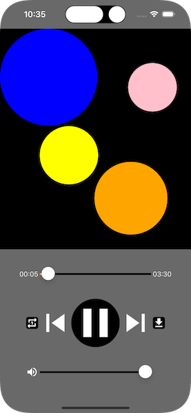
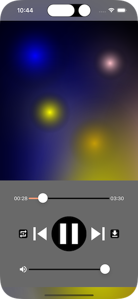
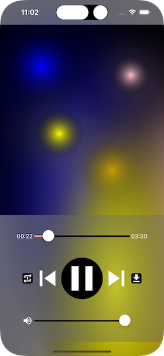
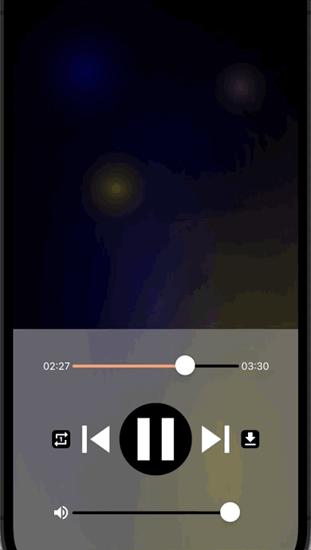
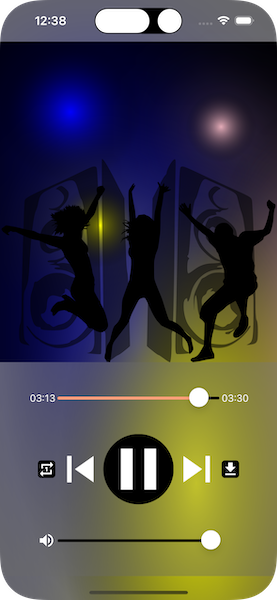

<!--more-->



This post is part of a series (<a href="..">*”My First App”*</a>).
To ease your read, please start from the project containing all the different steps applied so far in this tutorial. To do so, refer to the <a href="../2-setup-the-project/">project setup guide</a> and resume from the sample located in the folder *“5 - Music Player”*.

Welcome to the final episode of this series! ✌️ If you've followed the series so far, then you should have an app you can use to listen to a few music tracks.

But the mood remains a little dull, and I promised you a disco atmosphere <a href="../1-introduction/">at the very beginning of this course</a>! So today we're going to learn how to use [.NET MAUI animations](https://learn.microsoft.com/en-us/dotnet/maui/user-interface/animation/basic) to set the dance floor on fire.

Now it’s time to put on your sunglasses, because there will be flashes everywhere! 🪩

## Setting up the spotlights
As you can see, I want it to look like we're in a nightclub. So to start with, we're going to add a few spotlights to the upper part of the screen, which is represented by our *Grid* `TopLayout`.

Ideally, you'd want to place spotlights all over the place, in different sizes and colors... And this is clearly about parameters of an object! So we're going to define a new dedicated class: `Spotlight`.

Start by creating a new *Components* folder in the project. Then add a new *Spotlight.cs* file in this folder with the following content:

<p align="center" style="margin-bottom:-10px"><strong>Filename:</strong><code>Spotlight.cs</code></p>

```csharp
using Microsoft.Maui.Layouts;

namespace NightClub.Views.Components;
public class Spotlight : BoxView
{
    public Spotlight(Color color, double size, double positionX, double positionY)
    {
        this.Color = color;
        CornerRadius = size / 2;

        AbsoluteLayout.SetLayoutBounds(this, new Rect(positionX, positionY, size, size));
        AbsoluteLayout.SetLayoutFlags(this, AbsoluteLayoutFlags.PositionProportional);
    }
}
```
As you can see, this class takes the following 4 properties as parameters:

* the spotlight color (`color`),

* its size (`size`),

* and then, its horizontal (`positionX`) and vertical position (`positionY`).

By the way, did you notice that `Spotlight` inherits from [BoxView](https://learn.microsoft.com/en-us/dotnet/maui/user-interface/controls/boxview)? Remember, we already have used this object to <a href="../6-arrange-elements-on-a-page/#validating-the-rendering-on-screen">verify the components arrangement</a> of the *MusicPlayerView*.



🐒‎ ‎ Clear, but a *BoxView* isn't round at all!

I can guarantee you that our projectors won't be rectangular. We're going to round them off using the `CornerRadius` property, just as we did with <a href="../8-music-player-display-media-playback/#discovering-imagebutton">the play button</a>! To do this, the `CornerRadius` value must be half the requested size (`size`).

Precisely, let's see how the size and position of the `Spotlight` have been defined:

<p align="center" style="margin-bottom:-10px"><strong>Filename:</strong><code>Spotlight.cs</code></p>

```csharp
AbsoluteLayout.SetLayoutBounds(this, new Rect(positionX, positionY, size, size));
```
With the *SetLayoutBounds()* method, we apply the requested position and size to our *Spotlight* (`this`), passing it a [Rect](https://learn.microsoft.com/en-us/dotnet/api/microsoft.maui.graphics.rect.-ctor#microsoft-maui-graphics-rect-ctor(system-double-system-double-system-double-system-double)) object. This is a structure representing the coordinates of our component, as well as its dimensions.

Finally, the *SetLayoutFlags()* method is used to take this position into account proportionally:

```csharp
AbsoluteLayout.SetLayoutFlags(this, AbsoluteLayoutFlags.PositionProportional);
```
In short, the *Spotlight*'s size will be set in absolute values, but its coordinates will be passed in proportional values. However, these methods can only work on elements contained in an *AbsoluteLayout*.



🐒‎ ‎ Are we not using *Grid* after all?

Yes, it is! But our *Grid* `TopLayout` acts as the main container, while the projectors are added to an intermediate [AbsoluteLayout](https://learn.microsoft.com/en-us/dotnet/maui/user-interface/layouts/absolutelayout) component.

Indeed, this component also lets you align elements, but in a much freer way. That's why you need coordinates! So you can easily place the objects wherever you like.



Moreover, it is possible to align elements outside the limits of the zone established by *AbsoluteLayout*.

That's it for the `Spotlight` class! Now all we need to do is define an *AbsoluteLayout*, add a few *Spotlight* to it, and attach the whole thing to the `TopLayout`.

To do this, we declare a new *InitDanceFloor()* method in the *MusicPlayerView*:

<p align="center" style="margin-bottom:-10px"><strong>Filename:</strong><code>MusicPlayerView.cs</code></p>

```csharp
// Do not forget to add "using NightClub.Views.Components;" !
#region Dance Floor

void InitDanceFloor()
{
    // We define an intermediate container of type AbsoluteLayout... 
    AbsoluteLayout spotlights = new AbsoluteLayout()
    {
        Children =
        {
            // ... to which we add a few Spotlight...
            new Spotlight(Colors.Blue, 200, 0, 0),
            new Spotlight(Colors.Orange, 150, 0.8, 0.9),
            new Spotlight(Colors.Pink, 100, 0.9, 0.2),
            new Spotlight(Colors.Yellow, 120, 0.3, 0.6),
        }
    };

    // ... and it's all added to the main container!
    TopLayout.Add(spotlights);
}

#endregion
```
Then call this method from the *View* constructor:

<p align="center" style="margin-bottom:-10px"><strong>Filename:</strong><code>MusicPlayerView.cs</code></p>

```csharp
public MusicPlayerView()
{
    ...
    InitDanceFloor();
    ...
}
```
And finally, for this to work, we need to modify the declaration of `TopLayout` so that it is no longer immutable:

<p align="center" style="margin-bottom:-10px"><strong>Filename:</strong><code>MusicPlayerView.cs</code></p>

```csharp
Grid TopLayout = new Grid // The “=>” sign has been replaced with “=”
{
    BackgroundColor = Colors.Black
};
```
Tadam! Here's how it looks:

<p align="center"></p>
<figure><figcaption class="image-caption">A few colourful circles... a far cry from the discotheque!</figcaption></figure>

What do you mean, you're disappointed?! 🙊

I know, it's not super convincing... yet! So let's move on to the next part to get a better visual.

## Enhance visuals for greater realism
Until now, all we had to do to paint our visual elements was define a color and the magic would happen in the background. Now, however, there are different coloring techniques that can help us achieve a better visual effect: these are called [Brushes](https://learn.microsoft.com/en-us/dotnet/maui/user-interface/brushes/).

For example, we'll use [RadialGradientBrush](https://learn.microsoft.com/en-us/dotnet/maui/user-interface/brushes/radialgradient) to apply a nice radial gradient:

<p align="center" style="margin-bottom:-10px"><strong>Filename:</strong><code>Spotlight.cs</code></p>

```csharp
public Spotlight(Color color, double size, double positionX, double positionY)
{
    // You can now remove the following line:
    // this.Color = color;

    Background = new RadialGradientBrush()
    {
        GradientStops = new GradientStopCollection
        {
            new GradientStop(color, 0),
            new GradientStop(Colors.Transparent, 1)
        }
    };
    ...
}
```
In concrete terms, we defined a color gradient from the center of the *Spotlight* to its edges, using two [GradientStops](https://learn.microsoft.com/en-us/dotnet/api/microsoft.maui.controls.gradientstop.-ctor/#microsoft-maui-controls-gradientstop-ctor(microsoft-maui-graphics-color-system-single)):

1. With the instruction `GradientStop(color, 0)`, the center of the *Spotlight* (`0`) is first painted with the requested color (`color`),

1. Next, `GradientStop(Colors.Transparent, 1)` is used to gradient towards total [transparency](https://learn.microsoft.com/en-us/dotnet/api/microsoft.maui.graphics.colors.transparent/#microsoft-maui-graphics-colors-transparent) (`Colors.Transparent`) at the *Spotlight* circumference (`1`).

And thanks to the transparency effect, the black background of the `TopLayout` will appear.



No need for the `Color` property when using the `Background` property.

Next, we're going to use [Shadow](https://learn.microsoft.com/en-us/dotnet/maui/user-interface/shadow) to give a shiny effect:

<p align="center" style="margin-bottom:-10px"><strong>Filename:</strong><code>Spotlight.cs</code></p>

```csharp
public Spotlight(Color color, double size, double positionX, double positionY)
{
    ...
    Shadow = new Shadow()
    {
        Radius = (float)(size / 2),
        Brush = new SolidColorBrush(color)
    };
    ...
}
```
This code adds a shadow to the *Spotlight* that is both colored and blurred:

* It's the `Radius` property that gives this blurred effect, accentuated according to the object's size (`size / 2`),

* And the shadow is painted with a full color, thanks to the use of [SolidColorBrush](https://learn.microsoft.com/en-us/dotnet/maui/user-interface/brushes/solidcolor).

Let's see again how it looks like:

<p align="center"></p>
<figure><figcaption class="image-caption">The spotlights are much more realistic!</figcaption></figure>

Better there, isn't it? 🙂

But these new adjustments contrast a little bit with the `BottomLayout`, and the *Grid* should be made less opaque.



🐒‎ ‎ Can't you play with the `Opacity` property?

Not really... otherwise the entire content of the `BottomLayout` would become transparent! This means we wouldn't be able to see our controls, and that wouldn't be practical.

Instead, we'll change its color by adding a little transparency, like this:

<p align="center" style="margin-bottom:-10px"><strong>Filename:</strong><code>MusicPlayerView.cs</code></p>

```csharp
Grid BottomLayout => new Grid
{
    BackgroundColor = Colors.DimGray.WithAlpha(0.4f),
    ...
};
```
See, it's still the same color! But it now contains [40% transparency](https://learn.microsoft.com/en-us/dotnet/maui/user-interface/graphics/colors/#modify-a-color), thanks to the *WithAlpha()* method.

And here’s the result!

<p align="center"></p>
<figure><figcaption class="image-caption"> Transparency makes it more modern!</figcaption></figure>

Well, it's all very nice, but still very static. What we need is a little madness, some animation! Just in time, we'll be discovering [animations in .NET MAUI](https://learn.microsoft.com/en-us/dotnet/maui/user-interface/animation/basic) right after this.

## It's the time to Disco
In this part, we'll look at how to bring a little dynamism to our spotlights. After all, what we want is a real nightclub atmosphere 🙂

To do this, we're going to modify the *Spotlight* class to make our projectors blink, a bit like flashbulbs, you know? We'll use a [fade animation](https://learn.microsoft.com/en-us/dotnet/maui/user-interface/animation/basic/#fading) to gradually make our spotlights appear and disappear on the screen.

Let's get to work! Start by applying the following modifications:

<p align="center" style="margin-bottom:-10px"><strong>Filename:</strong><code>Spotlight.cs</code></p>

```csharp
public class Spotlight : BoxView
{
    // We've added 3 new properties...
    const string AnimationName = "fadeInAndOut";
    uint AnimationLength { get; set; }
    Animation SpotlightAnimation { get; set; }

    // ... and one more parameter to the constructor! 
    public Spotlight(Color color, double size, double positionX, double positionY, uint animationLength = 0)
    {
        ...
        // Finally, the animation time is persisted.
        this.AnimationLength = animationLength;
        SetAnimation();
    }
}
```
First of all, we've added a new parameter: `animationLength`. This defines the length of time (in milliseconds) over which the animation will repeat in a loop.

We've also taken the opportunity to add a few properties that we'll be using a little later. Among them is `SpotlightAnimation`, which contains the definition of the *Spotlight* animation.

Precisely, let's add a new method to the *Spotlight* class to define this animation:

<p align="center" style="margin-bottom:-10px"><strong>Filename:</strong><code>Spotlight.cs</code></p>

```csharp
void SetAnimation()
{
    if (AnimationLength <= 0) return;

    var fadeInAnimation = new Animation(v => Opacity = v, start: 0, end: 1, Easing.CubicOut);
    var fadeOutAnimation = new Animation(v => Opacity = v, start: 1, end: 0, Easing.CubicOut);

    SpotlightAnimation = new Animation
    {
        { 0, 0.5, fadeInAnimation }, // In action from 0 to 50% of the execution
        { 0.5, 1, fadeOutAnimation } // In action from 50 to 100% of the execution
    };

    StartAnimation();
}
```
It's a bit technical, but not complicated. I'll explain! 🤓

The `SpotlightAnimation` property is a [custom animation](https://learn.microsoft.com/en-us/dotnet/maui/user-interface/animation/custom) composed of two underlying animations:

1. A fade-in that gradually changes the *Spotlight*'s opacity from 0 to 1, throughout the first half of the animation: `{ 0, 0.5, fadeInAnimation }`,

1. And an outgoing fade, which does exactly the opposite throughout the second half of the animation: `{ 0.5, 1, fadeOutAnimation }`.

As for the `Easing.CubicOut` option, it's just a stylish effect to make the animation slow down quickly after it has started.



Going further with the [various types of animation rendering](https://learn.microsoft.com/en-us/dotnet/maui/user-interface/animation/easing).

That's it for the *SetAnimation()* method... well, almost!



🐒‎ ‎ Hey, hey, hey! What did we miss? 🙈

At the end of the method, you'll see the `StartAnimation();` instruction. This will trigger execution of the freshly initialized animation.

Here’s its definition:

<p align="center" style="margin-bottom:-10px"><strong>Filename:</strong><code>Spotlight.cs</code></p>

```csharp
public void StartAnimation()
{
    if (AnimationLength <= 0) return;

    SpotlightAnimation.Commit(this, AnimationName, length: AnimationLength, repeat: () => true);
}
```
As you can see, it's the [Commit()](https://learn.microsoft.com/en-us/dotnet/api/microsoft.maui.controls.animation.commit) method that launches the animation defined above. Breaking down the parameters passed to *Commit*, we have:

* An animation name (`AnimationName`), set arbitrarily by a constant,

* An execution length (`AnimationLength`), passed as a parameter to the *Spotlight* class constructor,

* And a repeat mode (`repeat: () => true`), to loop the animation indefinitely.

Take a moment to assimilate all these new changes!



In some cases, animations can be disabled by the system. For example, for accessibility or energy-saving reasons.

And when you're ready, return to the *MusicPlayerView* code to modify the *InitDanceFloor()* method and adapt the *Spotlight* initialization, like this:

<p align="center" style="margin-bottom:-10px"><strong>Filename:</strong><code>MusicPlayerView.cs</code></p>

```csharp
AbsoluteLayout spotlights = new AbsoluteLayout()
{
    Children =
    {
        // An animation length is defined for each Spotlight
        new Spotlight(Colors.Blue, 200, 0, 0, 2000),
        new Spotlight(Colors.Orange, 150, 0.8, 0.9, 1000),
        new Spotlight(Colors.Pink, 100, 0.9, 0.2, 500),
        new Spotlight(Colors.Yellow, 120, 0.3, 0.6, 1500),
    }
};
```
We simply defined a different animation time to make each of our spotlights unique.

Quickly rebuild the project to see the results!

<p align="center"></p>
<figure><figcaption class="image-caption">The projectors turn on and off at different speeds - now that's disco!</figcaption></figure>

Tadaaaam! Sounds like the real thing, what do you think?



🐒‎ ‎ Great! But if the animations are repeated over and over again, will it ever stop?

This infinite looping is indeed practical, but it could pose a problem for the user experience. Imagine if the music stopped playing! It would be better if the animation stopped playing too.

We'll see you right after!

### The final touch
Hang in there! We're going to tackle a few more small improvements and that'll be the end of this tutorial.

Let's start by looking at how to [stop a running animation](https://learn.microsoft.com/en-us/dotnet/maui/user-interface/animation/custom/#cancel-an-animation). To do this, go back to the *Spotlight* class and add the new following method:

<p align="center" style="margin-bottom:-10px"><strong>Filename:</strong><code>Spotlight.cs</code></p>

```csharp
public void StopAnimation()
{
    this.AbortAnimation(AnimationName);
    this.Opacity = 0;
}
```
All we need to do is call the *AbortAnimation()* method to cancel a running animation, using its name (`AnimationName`). Remember, this is one of the parameters we passed to the *Commit()* method!



You can't predict the state in which animation will stop. So we set the *Spotlight* opacity to 0 to hide it completely when the music stops playing.

Next, let's see how to play the animation depending on whether the music is playing or not. To do this, we need to establish a connection between the *Spotlight* and the *MediaElement*.

Let's begin by modifying the `Spotlight` class:

<p align="center" style="margin-bottom:-10px"><strong>Filename:</strong><code>Spotlight.cs</code></p>

```csharp
// Please note that 3 new using are required!
using CommunityToolkit.Maui.Core.Primitives;
using CommunityToolkit.Maui.Markup;
using CommunityToolkit.Maui.Views;
...
public class Spotlight : BoxView
{
    ...
    // A new parameter is added to the constructor...
    public Spotlight(Color color, double size, double positionX, double positionY, uint animationLength = 0, MediaElement bindableMediaElement = null)
    {
        ...
        // ... for animation setup purposes.
        SetAnimation(bindableMediaElement);
    }
    ...
}
```
To avoid code repetition, we've added a new `bindableMediaElement` parameter of type *MediaElement*. In fact, we're going to pass our `MusicPlayer` component to the initialization of each *Spotlight* for animation setup purposes.

We'll now modify the *SetAnimation()* method to apply the new animation execution conditions:

<p align="center" style="margin-bottom:-10px"><strong>Filename:</strong><code>Spotlight.cs</code></p>

```csharp
void SetAnimation(MediaElement mediaElement = null)
{
    ...
    if(mediaElement != null)
    {
        this.Bind(
            source: mediaElement,
            path: nameof(mediaElement.CurrentState),
            convert: (MediaElementState currentState) =>
            {
                if (currentState != MediaElementState.Playing)
                    StopAnimation();
                else
                    StartAnimation();

                return true;
            });
    }
}
```
Now that we have access to our *MediaElement*, we've applied the *Data Binding* technique to the `CurrentState` property so that the animation is :

* Started when music is playing,

* Or stopped if it’s paused.

And as always, don't forget to adapt *Spotlight* initialization in the *InitDanceFloor()* method, like this:

<p align="center" style="margin-bottom:-10px"><strong>Filename:</strong><code>MusicPlayerView.cs</code></p>

```csharp
AbsoluteLayout spotlights = new AbsoluteLayout()
{
    Children =
    {
        // We now pass the MusicPlayer to each Spotlight
        new Spotlight(Colors.Blue, 200, 0, 0, 2000, MusicPlayer),
        new Spotlight(Colors.Orange, 150, 0.8, 0.9, 1000, MusicPlayer),
        new Spotlight(Colors.Pink, 100, 0.9, 0.2, 500, MusicPlayer),
        new Spotlight(Colors.Yellow, 120, 0.3, 0.6, 1500, MusicPlayer),
    }
};
```
Here, we've simply switched the `MusicPlayer` to *Spotlight* initialization, so that each projector can be switched on and off as the music plays.

I trust you'll check that it's working properly before we add the final touches. Yes, our dance floor is still short of passionate dancers!

Start by downloading the following two new images in *.svg* format:

* The first shows large speakers (*speakers.svg*),

* And the other, our famous dancers (*joyful_dancers.svg*).


Once you've unpacked the *.zip* file, add the images to the *Resources/Images* folder.



If any doubts about how to do this, you can refer <a href="../8-music-player-display-media-playback/">to this chapter</a>.

Finally, add them to the `TopLayout` as follows:

```csharp
void InitDanceFloor()
{
    ...
    TopLayout.Add(spotlights);
    // .NET MAUI converts SVG files to PNG format.
    TopLayout.Add(new Image() { Source = "speakers.png" }.Bottom());
    TopLayout.Add(new Image() { Source = "joyful_dancers.png" }.Bottom());
}
```
With the *Add()* method, we add all our objects one after the other to the single cell that makes up the *Grid* `TopLayout`.



🐒‎ ‎ A single slot for 3 objects? But how is that possible?

Indeed, if you recall the [documentation](https://learn.microsoft.com/en-us/dotnet/maui/user-interface/layouts/grid/#rows-and-columns), the *Grid* has only one row and one column by default. In other words, it's nothing more or less than a grid made up of a single cell.

As a result, the elements will stack on top of each other! That's exactly what we're aiming for, to create a true sense of depth:

* In the background are our projectors (`spotlights`),

* Then the loud speakers,

* And finally, our dancers come to the foreground.

Come on, let's relaunch the app!

<p align="center"></p>
<figure><figcaption class="image-caption">Now that's a party!</figcaption></figure>

I hope you're happy with the result. In any case, congratulations on your work so far! 🤓



If the images don't display, remember to clean up and recompile the entire project.

## Conclusion
This post brings us to the end of this course, a total of 2h30 of reading which I hope you've enjoyed and will inspire you with lots of ideas. And thank you for your loyalty if you've taken the whole course! If you have a moment, drop me a comment or send me an e-mail to let me know what you thought about it.

By the way, if you want to have fun going further (and I heartily encourage you to! 🙂 ), you can try generating the projectors completely randomly. You can always compare your solution with mine by looking directly at the final project code!



To get the project containing all the steps applied so far in this tutorial, refer to the <a href="../2-setup-the-project/">project setup guide</a> and start from the example in the *"Full Solution"* folder.

And if you want even more, here are a few other ideas for improvement:

* Align the brightness of the spotlights with the volume of the music,

* Adjust their animation speed to the tempo of the songs,

* Regenerate all the spotlights when you change songs, etc.

I'd love to see your creativity at work, so if you can, share a link to your GitHub repo with me in the comments!

And that's all for today. See you soon for new tutorials! 👋

___
More articles in the series:

