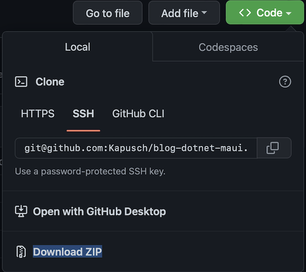
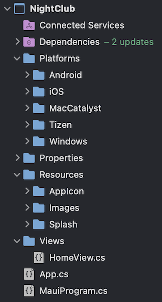

<!--more-->

Hi Devs! 🤓

Today we'll start building our first application! Let’s first set up your working environment, and then you’ll have something concrete soon. Let's get started!



Actually, there is no particular pre-requisite to develop an app with .NET MAUI, unless you own a very old fashion computer and you never did update anything… 🤔 Otherwise, it's mostly a matter of preference! Personally, I develop on macOS because it's an operating system I like, and the built in iPhone simulator is very powerful and quickly gives me a realistic render of what I'm programming.

But you can also develop under Windows or Linux! More concretely:

* for Windows or MacOS, it's easy, Microsoft offers a very powerful integrated development environment:
    * [Visual Studio](https://visualstudio.microsoft.com/vs/) for Windows,
    * and [Visual Studio for Mac](https://visualstudio.microsoft.com/vs/mac/) for… well for MacOS 😄
* and if you're on Linux, you'll have to be a bit more resourceful (and that's why you're on Linux, isn't it? 😛). In that case, I suggest you use the excellent source code editor [Visual Studio Code](https://code.visualstudio.com).



Let's move on to the installation of the working environment:

1. First, download Visual Studio from the official Microsoft website, choosing the appropriate version for your operating system ([Windows](https://visualstudio.microsoft.com/vs/) or [MacOS](https://visualstudio.microsoft.com/vs/mac/)),
1. Then comes the time to install Visual Studio and its development environment for .NET MAUI. In order to improve the reading of this blog, I suggest you directly follow the installation steps on the official website:
    1. [follow the installation steps for Windows](https://learn.microsoft.com/en-us/dotnet/maui/get-started/installation?view=net-maui-7.0&tabs=vswin#installation-1),
    1. [follow the installation steps for MacOS](https://learn.microsoft.com/en-us/dotnet/maui/get-started/installation?view=net-maui-7.0&tabs=vsmac#installation-2),
1. Finally, download the project from GitHub. To do this, go to the [blog's code repository](https://github.com/Kapusch/blog-dotnet-maui), click on the "Code" button and download the ZIP version.



Once you have unzipped the downloaded file, go to the Samples folder associated with our course (*Samples/NightClub*). The folders under it each correspond to a different part of the course:

For now, open the first folder (*0 - Get Started)* and double click on `NightClub.sln` to open the NightClub project in Visual Studio.



Actually, it already is! The project you just opened is brand new, but it includes several base files that are necessary for the proper functioning of a .NET MAUI application:

* All the libraries that are required for the proper functioning of the project are grouped in the **Dependencies** folder,
* In **Platforms**, you will find all the files needed to run the application, for each target platform,
* As for the **Properties** folder, it generally contains configuration files (and besides, there is one created by default for Windows),
* And then, you will be able to configure an icon and a loading screen for each application! For this, we usually use the **Resources** folder to store all our media (icons, images, audio and video tracks, ...),
* Finally, we have to display something when the app opens! And for that, we have the **Views** folder which at the moment contains our first page, the famous home page…

And that's it, how about if we <a href="../3-first-run-of-the-project/">launch that app</a> ? 🙂



