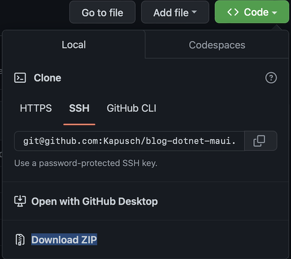
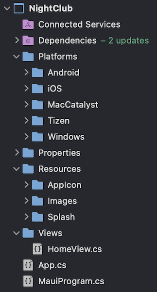

<!--more-->

Tu vas bientôt pouvoir créer ta première application mobile ! Juste le temps d'installer ton environnement de travail et on aura rapidement quelque chose de concret. Allez c'est parti !

# Quels outils pour développer ?
Voyons déjà les outils qui te permettront de développer ton appli.


🐒‎ ‎ Mais au fait, il faut être sous Windows, MacOS ou Linux ?


En fait, il n’y a pas de pré-requis particulier pour développer une app avec .NET MAUI, à moins que tu ne traînes un ordinateur de l’avant-guerre et que tu ne mettes rien à jour… 🤔 Sinon, c’est surtout une question de préférence ! Personnellement, je développe sous MacOS car c’est un système que j’affectionne, et le simulateur d’iPhone qui y est intégré est très performant et me permet d’avoir rapidement un rendu de ce que je programme.

Mais tu peux tout aussi bien développer sous Windows ou Linux ! Plus concrètement :

* sous Windows ou MacOS, c’est facile, Microsoft propose un environnement de développement intégré très performant:

    * [Visual Studio](https://visualstudio.microsoft.com/vs/) pour Windows,

    * et [Visual Studio for Mac](https://visualstudio.microsoft.com/vs/mac/) pour… eh bien pour MacOS 😄

* et si tu es sous Linux, il te faudra recourir à un peu plus d’ingéniosité (et c’est bien pour cela que tu es sous Linux, n’est-ce pas ? 😛). Dans ce cas-là, je te conseille d’utiliser l’excellent éditeur de code source [Visual Studio Code](https://code.visualstudio.com/).


Dans le cadre de ce blog, je me concentrerais uniquement sur le développement d’application mobile à l’aide de Visual Studio. En effet, son utilisation est bien plus intuitive et c’est justement cela qui plaît à tout vrai néophyte.

# Installation de l’environnement
Passons maintenant à l’installation de l’environnement de travail:

1. Dans un premier temps, télécharge Visual Studio depuis le site officiel de Microsoft, en choisissant la version appropriée à ton système ([Windows](https://visualstudio.microsoft.com/vs/) ou [MacOS](https://visualstudio.microsoft.com/vs/mac/)),

1. Puis vient le moment d’installer Visual Studio et son environnement de développement .NET MAUI. Pour améliorer la lecture de ce blog, je te propose de directement suivre les étapes d’installation sur le site officiel:

    1. [suivre les étapes d’installation sous Windows](https://learn.microsoft.com/fr-fr/dotnet/maui/get-started/installation?view=net-maui-7.0&tabs=vswin#installation-1)

    1. [suivre les étapes d’installation sous MacOS](https://learn.microsoft.com/fr-fr/dotnet/maui/get-started/installation?view=net-maui-7.0&tabs=vsmac#installation-2)

1. Enfin, télécharge mon cours depuis GitHub. Pour cela, rends-toi sur [le dépôt de code du blog](https://github.com/Kapusch/blog-dotnet-maui), clique sur le bouton “Code” et télécharge le tout au format .ZIP

<figure></figure>


Avant d’aller plus loin, si tu es sous MacOS, il te faudra t’assurer d’avoir [téléchargé la dernière version d’Xcode](https://developer.apple.com/xcode) qui est requise pour le simulateur d’iPhone. Son installation peut être très longue, aussi, je te conseille de le faire en parallèle de ta lecture.

# Description du projet
Une fois le fichier téléchargé décompressé, rends-toi dans le dossier des exemples associés à notre cours (*Samples/NightClub*). Les dossiers qui y sont entreposés correspondent chacun à une partie différente du cours:

<figure></figure>

Pour le moment, ouvre le premier dossier (*0 - Get Started)* et double-clique sur `NightClub.sln` pour ouvrir le projet NightClub dans Visual Studio.

<figure><figcaption class="image-caption">La structure du projet NightClub après ouverture dans Visual Studio.</figcaption></figure>


🐒‎ ‎ Ok ! J’ouvre le projet, ça charge… Mais il y a déjà plein de choses dans ce projet, on ne peut pas partir de zéro ?


En fait, c’est déjà le cas ! Le projet que tu as sous les yeux est tout neuf, mais il embarque plusieurs fichiers de base nécessaires au bon fonctionnement d’une application .NET MAUI:

* Toutes les librairies nécessaires au bon fonctionnement du projet sont regroupées dans le dossier **Dependencies**,

* Dans **Platforms**, tu retrouveras tous les fichiers nécessaires à l’exécution de l’application, et ce pour chaque plateforme cible,

* Quant au dossier **Properties**, on y retrouve généralement des fichiers de configuration (il y en a d’ailleurs une créée par défaut pour Windows),

* Et puis, tu auras la possibilité pour chaque application de lui configurer une icône et un écran de chargement ! Pour cela, on recourt généralement au dossier **Resources** pour stocker tous nos médias (icônes, images, pistes audio et vidéo, …),

* Enfin, il faudra bien pouvoir afficher quelque chose à l’ouverture de l’app ! Et pour ça, on a le dossier **Views** qui contient pour le moment notre première page, la fameuse page d’accueil…


Aller plus loin avec la [structure de base des projets Visual Studio](https://learn.microsoft.com/fr-fr/dotnet/maui/fundamentals/single-project?view=net-maui-7.0)

Et voilà c’est tout, et si on <a href="../3-first-run-of-the-project/">lançait cette app</a> ? 🙂

___
Plus d'articles dans la même série:

