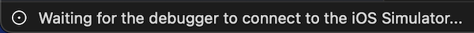

<!--more-->

<style>
.img-sizes{min-height:50px;max-height:600px;min-width:50px;max-width:600px;height:auto;width:auto}
</style>


To ease your read, please start from the project containing all the different steps applied in the previous articles. To do so, please [download the project](https://github.com/Kapusch/blog-dotnet-maui) if not already done, and open the NightClub project located in the folder named "0 - Get Started".



It's now time to get the app running. We'll also take the opportunity to look at the source code 🙂

But for our application to work, we still have two points to address: the app initialization and above all, managing its execution state.

### App initialization

For each targeted platform (iOS, Android, ...), a .NET MAUI application is initialized from a single entry point via the method `CreateMauiApp()` which is located in the file [MauiProgram.cs](https://github.com/Kapusch/blog-dotnet-maui/blob/main/Samples/NightClub/0%20-%20Get%20Started/NightClub/MauiProgram.cs). This is where you configure everything the app needs to work the way you want it to: web services, external dependencies, or specific fonts.

### App state management

But we also need something to define the current state of our application (which page to display, what if the application stops, ...). And for that, we have an `Application` class declared in the file [App.cs](https://github.com/Kapusch/blog-dotnet-maui/blob/main/Samples/NightClub/0%20-%20Get%20Started/NightClub/App.cs).

### Executing the app

Come on, it's time to get the application running! So choose the platform you want to target, then click on the red boxed button to start the project:

<figure><p align="center"></p></figure>


First, you will see your project compiling with the chosen configuration (this is the build stage):

<figure><p align="center"></p><figcaption class="image-caption">The current status of the project can easily be viewed at the bottom left of Visual Studio for Mac.</figcaption></figure>


Then your application will automatically be deployed to the chosen platform (here, a simulated iPhone 13, iOS 15.5).

<figure><p align="center"></p></figure>


And here's the result!

<figure><p align="center"></p></figure>



🐒‎ ‎ Heeeey, but nothing happens when I click on the button!


This is just the beginning of our app, the biggest part is ahead !

### The home page

The screen you just saw is the home page for which the content is specified in the file `HomeView.cs`. It’s a [ContentPage](https://docs.microsoft.com/en-us/dotnet/maui/user-interface/pages/contentpage) (basically a page with content) which is the most common type of page.


And as you can see, what it is composed about is very simple:

<p align="center" style="margin-bottom:-10px"><strong>Filename:</strong><code>HomeView.cs</code></p>

```csharp
public HomeView()
{
    BackgroundColor = Colors.Black;

    Content = new VerticalStackLayout
    {
        Children =
        {
            NightClubImage,
            EnterButton
        }
    }.CenterVertical();
}
```


It’s a black background page whose content is defined by an image and a button that are stacked vertically in a [VerticalStackLayout](https://docs.microsoft.com/en-us/dotnet/maui/user-interface/layouts/verticalstacklayout).

And if you want to know how these two components are defined, just look a little further down in the code on the page:

<p align="center" style="margin-bottom:-10px"><strong>Filename:</strong><code>HomeView.cs</code></p>

```csharp
#region Controls

Image NightClubImage => new Image
{
    // .NET MAUI converts SVG files to PNG files.
    Source = "night_club.png"
};

Button EnterButton => new Button
{
    Text = "ENTER",
    TextColor = Colors.White,
    BackgroundColor = Colors.Magenta,
    CornerRadius = 10
} .Bold() .Paddings(50, 2, 50, 2) .CenterHorizontal();

#endregion
```


Nothing very complex at this stage:

* We set the image of the component `NightClubImage` with the “Source” property,
* And for the button, we set several base properties such as the text, the color, … but you might have noticed that we also apply some functions to the component `EnterButton`:
    * *Bold()* to set the text of the button in bold,
    * *Paddings()* to add a bit of space all around this text, especially to the left and to the right of the text,
    * And then, *CenterHorizontal()* to align the text at the center of the button.



These methods follow a particular programmation technique named "Declarative UI" or "Fluent UI". Finally, this page is coded in C#, as for the rest of the app!


___



🐒‎ ‎ Alright! And shouldn’t we declare an action to this button?



Correct! And we’ll see how to trigger code execution by clicking on this button, but not in any way. Indeed, we will apply this wonderful design pattern called <a href="../4-mvvm-is-the-key-to-succeed/">Model-View-ViewModel (MVVM)</a>.

---
More articles in the series:

