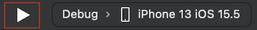
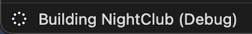
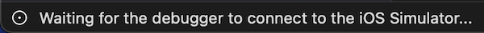

<!--more-->

<style>
.img-sizes{min-height:50px;max-height:600px;min-width:50px;max-width:600px;height:auto;width:auto}
</style>


Pour assurer le bon déroulement de cet article, je t’invite à repartir du projet reprenant les différentes étapes appliquées dans les articles précédents. Pour cela, [télécharge mon cours depuis GitHub](https://github.com/Kapusch/blog-dotnet-maui) si ce n’est pas déjà fait, et ouvre le projet NightClub situé dans le dossier *“0 - Get Started”*.



Allez, il est temps de faire tourner l’application. On en profitera aussi pour jeter un œil au code source ! 🙂

Mais pour que notre application puisse fonctionner, il nous reste deux points à aborder : l’initialisation de l’app et surtout, gérer son état d’exécution.

# Initialisation de l’app

Pour chaque plateforme ciblée (iOS, Android, …), chaque application .NET MAUI sera initialisée depuis un seul point d’entrée via la méthode `CreateMauiApp()` située dans le fichier [MauiProgram.cs](https://github.com/Kapusch/blog-dotnet-maui/blob/main/Samples/NightClub/0%20-%20Get%20Started/NightClub/MauiProgram.cs). C’est ici que l’on configurera tout ce dont a besoin l’app pour fonctionner comme on le souhaite : les services Web, les dépendances externes, ou bien encore les polices de caractères spécifiques.

# Gestion de l’état de l’app

Mais on aura aussi besoin de quoi définir l’état actuel de notre application (quelle page afficher, que faire si l’application est arrêtée, …). Et pour ça on a justement une classe `Application` déclarée dans le fichier [App.cs](https://github.com/Kapusch/blog-dotnet-maui/blob/main/Samples/NightClub/0%20-%20Get%20Started/NightClub/App.cs).

# Lancement de l’app

Allez, il est temps de faire tourner l’application ! Choisis donc la plateforme que tu souhaites cibler, puis clique sur le bouton encadré en rouge pour démarrer le projet:

<figure><p align="center"></p></figure>


Dans un premier temps, tu verras ton projet être compilé avec la configuration choisie (c’est l’étape du build):

<figure><p align="center"></p><figcaption class="image-caption">Sous Visual Studio for Mac, le statut actuel du projet peut facilement être consulté en bas à gauche de la fenêtre.</figcaption></figure>


Puis tu verras ton application se déployer automatiquement vers la plateforme choisie (ici, une simulation de l’iPhone 13, iOS 15.5).

<figure><p align="center"></p></figure>


Et voilà le résultat !

<figure><p align="center"></p></figure>



🐒‎ ‎ Héééé mais il ne se passe rien quand je clique sur le bouton !


Ce n’est évidemment que le début de notre app, le plus gros reste à faire !

# La page d’accueil

Ce que tu vois pour le moment, c’est la page d’accueil dont le contenu est spécifié dans le fichier `HomeView.cs`. Il s’agit là d’une [ContentPage](https://docs.microsoft.com/fr-fr/dotnet/maui/user-interface/pages/contentpage) (littéralement une page avec du contenu) qui est le type de page le plus courant.


Et comme tu peux le voir, ce qu’elle définit est très simple:

<p align="center" style="margin-bottom:-10px"><strong>Nom du fichier :</strong><code>HomeView.cs</code></p>

```csharp
public HomeView()
{
    BackgroundColor = Colors.Black;

    Content = new VerticalStackLayout
    {
        Children =
        {
            NightClubImage,
            EnterButton
        }
    }.CenterVertical();
}
```


C’est une page avec un arrière-plan noir et dont le contenu est défini par une image et un bouton qui sont empilés verticalement dans un [VerticalStackLayout](https://docs.microsoft.com/fr-fr/dotnet/maui/user-interface/layouts/verticalstacklayout).

Et si tu veux savoir comment sont définis ces deux composants, il te suffit de regarder un peu plus bas dans le code de la page :

<p align="center" style="margin-bottom:-10px"><strong>Nom du fichier :</strong><code>HomeView.cs</code></p>

```csharp
#region Controls

Image NightClubImage => new Image
{
    // .NET MAUI converts SVG files to PNG files.
    Source = "night_club.png"
};

Button EnterButton => new Button
{
    Text = "ENTER",
    TextColor = Colors.White,
    BackgroundColor = Colors.Magenta,
    CornerRadius = 10
} .Bold() .Paddings(50, 2, 50, 2) .CenterHorizontal();

#endregion
```


Rien de très complexe à ce stade:

* On définit l’image du composant `NightClubImage` via la propriété “Source”,
* Et pour le bouton, on définit quelques propriétés de base comme le texte, la couleur, … mais tu aurais peut-être remarqué qu’on applique des fonctions au composant `EnterButton` :
    * *Bold()* pour mettre en gras le texte du bouton,
    * *Paddings()* pour rajouter un peu d’espace autour du texte, notamment à gauche et à droite du texte,
    * Et enfin, *CenterHorizontal()* pour positionner le texte au centre du bouton.



Ces méthodes sont fournies par un type de programmation particulière appelée “Declarative UI” ou encore “Fluent UI”. Grâce à cela, la page est entièrement codée en C#, comme pour le reste de l’app !


___



🐒‎ ‎ D’accord ! Et il ne faudrait pas lui déclarer une action à ce bouton ?



Tout juste ! Et on va voir comment déclencher l’exécution de code en cliquant sur ce bouton, mais pas n’importe comment. En effet, nous allons appliquer ce merveilleux patron de conception qu’est le <a href="../4-mvvm-is-the-key-to-succeed/">Model-View-ViewModel (MVVM)</a>.

---
Plus d'articles dans la même série:

