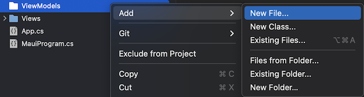
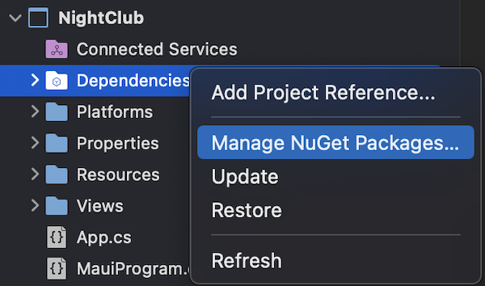

<!--more-->



Pour assurer le bon déroulement de cet article, je t’invite à récupérer le projet reprenant toutes les étapes appliquées jusqu’ici dans ce cours. Pour cela, réfère-toi au <a href="../2-setup-the-project/">guide d’installation du projet</a> et repars de l’exemple situé dans le dossier *“0 - Get Started”*.



Dans ce chapitre, nous découvrirons un patron de conception majeur pour le développement d’application mobile, le [Model-View-ViewModel](https://docs.microsoft.com/fr-fr/dotnet/maui/xaml/fundamentals/mvvm) ! (plus couramment appelé “le MVVM”)

# Le Model-View-ViewModel
Le MVVM est un patron de conception qui propose au développeur une séparation logique de son code en 3 couches :

* La **View**, qui correspond à l’interface utilisateur, c’est-à-dire tout ce que l’on va afficher à l’écran (e.g. la page `HomeView`),

* Le **Model**, qui fait référence au type de données affichées dans cette View, 

* Et enfin le **ViewModel**, qui fait le lien entre la View et le Model. Par exemple, pour récupérer des données depuis le Cloud ou répondre aux interactions de l’utilisateur.



🐒‎ ‎ Je vois bien la séparation en effet, mais pourquoi est-ce recommandé ?



L’un des principaux avantages du MVVM est de pouvoir isoler la vue (i.e. l’interface utilisateur) de la logique “métier”. Dans le cadre de notre première page, on obtient finalement deux fichiers :

1. `HomeView.cs` qui définit précisément comment notre page s’affichera (i.e. une couleur de fond, une image en haut, un bouton en bas),

1. Et `HomeViewModel.cs` qui regroupe toute la logique pour faire fonctionner notre page (ici, le comportement du bouton quand l’utilisateur appuie dessus).


En suivant ce principe, le découpage de ton code est clair et tu limites le nombre de lignes de code par fichier. Tu ne voudrais pas d’un fichier de plus de 10 000 lignes ! 😄 En plus, il n’y a aucun risque d’affecter la logique de ton app en changeant seulement la couleur d’un bouton.



🐒‎ ‎ C’est clair ! Mais il y a un truc que je ne comprends pas, on n’a aucun Model pour la page HomeView ?



Bonne remarque ! En effet, certaines pages sont tellement simples qu’elles ne nécessitent pas de Model. Dans ces cas-là, seuls les View et ViewModel seront donc requis.

# Le Data Binding
On sait désormais bien découper notre code en plusieurs couches. Par exemple, définir un bouton dans une **View** et déclarer son action dans un **ViewModel**. Mais est-ce que tu saurais dire comment elles vont fonctionner ensemble ?



🐒‎ ‎ Hmm… peut-être dire au bouton de cette View d’agir selon ce qui a été déclaré dans ce ViewModel ?



En effet, c’est quasiment ça ! Cela se déroule en deux temps :

1. On associe d’abord un **ViewModel** à sa **View** (généralement via le `BindingContext` de la View),

1. Puis on définit le comportement de chaque élément de la View dans le ViewModel, en recourant au principe du [Data Binding](https://docs.microsoft.com/fr-fr/dotnet/maui/xaml/fundamentals/data-binding-basics).


Le Data Binding est une technique permettant de lier deux objets de sorte que, lorsque l’un des deux est modifié, l’autre le sera également. Ça peut paraître un peu flou comme ça, mais tu comprendras mieux son rôle dans la section d’après. Pour le moment, on continue !

# Appliquer le MVVM
Maintenant que tu connais les bases du MVVM, je vais pouvoir t’apprendre à l’appliquer concrètement dans l’application.

Commençons par créer un fichier qui servira de **ViewModel** pour notre `HomeView`. Pour cela, crée d’abord un nouveau dossier *ViewModels* dans le projet, puis ajoutes-y un nouveau fichier.

<p align="center"></p>
<figure></figure>


Ce sera une nouvelle classe vide appelée `HomeViewModel.cs` :

<p align="center"></p>
<figure></figure>


Ensuite, remplace son contenu par le suivant:

<p align="center" style="margin-bottom:-10px"><strong>Nom du fichier :</strong><code>HomeViewModel.cs</code></p>

```csharp
using System;

namespace NightClub.ViewModels;

public class HomeViewModel
{
	public HomeViewModel()
	{
	}

	async Task Enter()
	{
		await Application.Current.MainPage.DisplayAlert(
			"Well Done !",
			"You have successfully reached the end of this chapter.",
			"Next !");
	}
}
```


Bon, il n’y a vraiment rien de spécial ici. C’est juste une classe d’objet C# avec une méthode *Enter()* qui affiche du texte à l’écran après un clic de l’utilisateur sur le bouton “ENTER”.



🐒‎ ‎ Ah ben quand même, on vient de définir l’action du bouton de la page d’accueil !



Eh oui tu as raison, mais en l’état, il reste inutilisable ! Souviens-toi, il n’y a toujours aucun lien entre la `HomeView` et le `HomeViewModel`.

Heureusement, il existe une librairie mise à disposition par Microsoft qui va grandement nous simplifier la vie: le [MVVM Toolkit](https://learn.microsoft.com/fr-fr/dotnet/communitytoolkit/mvvm/).

Cette librairie a déjà été ajoutée au projet et tu peux le vérifier facilement en ouvrant la gestion des paquets NuGet. Fais donc un clic droit sur les dépendances du projet:

<p align="center"></p>
<figure></figure>


Et voilà la librairie en question ! Elle s’appelle *CommunityToolkit.Mvvm* :

<p align="center"></p>
<figure></figure>



Aller plus loin avec [les paquets NuGet](https://learn.microsoft.com/fr-fr/nuget/)

___
Voyons désormais comment préparer notre classe `HomeViewModel` pour être un véritable **ViewModel** :

1. Premièrement, fais-le hériter de la classe `ObservableObject`,

1. puis, définis-le comme une classe partielle avec le mot-clé **partial**.


Tu devrais avoir la configuration suivante:

<p align="center" style="margin-bottom:-10px"><strong>Nom du fichier :</strong><code>HomeViewModel.cs</code></p>

```csharp
using System;
using CommunityToolkit.Mvvm.ComponentModel;

namespace NightClub.ViewModels;

public partial class HomeViewModel : ObservableObject
...
```



En faisant hériter HomeViewModel de la classe **ObservableObject**, Visual Studio rajoute automatiquement les `using` nécessaires à la compilation. En effet, une référence à *CommunityToolkit.Mvvm.ComponentModel* est requise pour que **ObservableObject** devienne réellement compréhensible par l’application.



Ces deux étapes sont nécessaires pour permettre au *MVVM Toolkit* de générer du code source à la simple mention de mots-clés spécifiques. Concrètement, on écrit un seul mot et hop, ça génère tout seul des dizaines de lignes de code, c’est génial, non ?! 🤘


Par exemple ici, on va définir notre méthode *Enter()* comme étant une commande en lui rajoutant un simple attribut `[RelayCommand]` , voilà comment :

<p align="center" style="margin-bottom:-10px"><strong>Nom du fichier :</strong><code>HomeViewModel.cs</code></p>

```csharp
[RelayCommand]
async Task Enter()
{
    await Application.Current.MainPage.DisplayAlert(
        "Well Done !",
        "You have successfully reached the end of this chapter.",
        "Next !");
}
```


Avec seulement un mot, on a désormais une commande *Enter()* qui supporte la technique du **Data Binding** ! Et ce uniquement grâce à la librairie *MVVM Toolkit* qui s’occupe de générer tout le code source nécessaire.



Aller plus loin avec les [générateurs de code source MVVM](https://learn.microsoft.com/fr-fr/dotnet/communitytoolkit/mvvm/generators/overview)



# Bientôt la démo !
On y est presque ! Il ne reste plus qu’à actionner la commande *Enter()* au clic du bouton “ENTER”.

Tout d’abord, retourne dans le fichier `HomeView.cs` pour lier la vue au `HomeViewModel` via le **BindingContext **:

<p align="center" style="margin-bottom:-10px"><strong>Nom du fichier :</strong><code>HomeView.cs</code></p>

```csharp
public HomeView()
{
	BindingContext = new HomeViewModel();
	
	BackgroundColor = Colors.Black;
	
	Content = ...
}
```


Puis définissons l’action du bouton `EnterButton` avec **BindCommand** pour déclencher la commande *Enter()* spécifiée dans le `HomeViewModel`:

<p align="center" style="margin-bottom:-10px"><strong>Nom du fichier :</strong><code>HomeView.cs</code></p>

```csharp
Button EnterButton => new Button
{
	Text = "ENTER",
	TextColor = Colors.White,
	BackgroundColor = Colors.Magenta,
	CornerRadius = 10
} .Bold() .Paddings(50, 2, 50, 2) .CenterHorizontal()
	.BindCommand("EnterCommand"); // Note: on doit ajouter "Command" après "Enter"
```


Et voilà le travail !

<p align="center"></p>
<figure></figure>



🐒‎ ‎ Ok donc si je comprends bien il faut faire ça à peu près sur toutes les pages de l’app, c’est pas si compliqué !



Eh bien oui en théorie ! Mais il manque tout de même plusieurs fonctionnalités clés d’une application : un système d’authentification, une base de données, etc…

Tiens par exemple, une fois qu’on aura créé la page principale de l’application, il faudra bien pouvoir s’y rendre depuis la page d’accueil ! C’est ce qu’on verra dans <a href="../5-how-to-navigate/">le prochain chapitre</a>.

___
Plus d'articles dans la même série:

