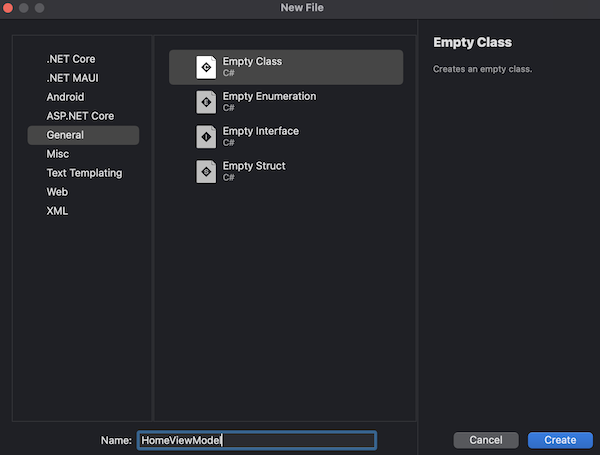
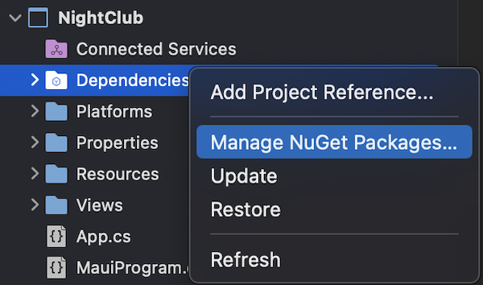
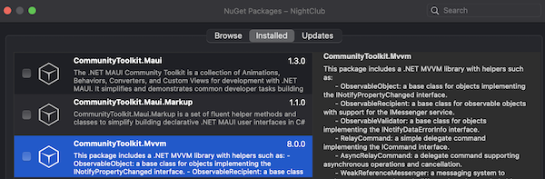

<!--more-->



To ease your read, please start from the project containing all the different steps applied so far in this tutorial. To do so, refer to the <a href="../2-setup-the-project/">project setup guide</a> and resume from the sample located in the folder *"0 - Get Started"*.



In this chapter, we will discover a major design pattern for mobile application development, the [Model-View-ViewModel](https://docs.microsoft.com/en-us/dotnet/maui/xaml/fundamentals/mvvm)! (usually referred as “MVVM”)

## Model-View-ViewModel
MVVM is a design pattern which provides the developer with a logical separation of the code into 3 layers:

* The **View**, which refers to the user interface, i.e. everything that will be displayed on the screen (e.g. the `HomeView` page),

* The **Model**, which refers to the kind of data to be displayed in this View,

* And finally, the **ViewModel** which is the link between the View and the Model. For example, to retrieve data from the Cloud or react to user interactions.



🐒‎ ‎ Indeed, I can see the separation, but why is it recommended?



One of the main advantages of MVVM is isolating the view (i.e. the user interface) from the business logic. In the context of our first page, we finally obtain two files:

1. `HomeView.cs` which defines exactly how our page will be displayed (i.e. a background colour, an image at the top, a bottom button),

1. And `HomeViewModel.cs` which contains all the logic to run our page (in this case, the behaviour of the button when the user presses it).


By following this principle, the breakdown of your code is clear and you reduce the number of lines of code per file. You wouldn't want a file with more than 10,000 lines! 😄 Besides, there is no risk of affecting the logic of your app if you only change the colour of a button.



🐒‎ ‎ It's all clear! But there's one thing I don't understand, there's no Model for the HomeView page.


Good catch! Indeed, some pages are so simple that they do not require a Model. In such cases, only the View and ViewModel are required.

## Data Binding
We now understand how to split our code into several layers. For example, defining a button in a **View** and declaring its action in a **ViewModel**. But can you tell how they will work together?



🐒‎ ‎ Hmm... maybe tell the button in this View about what has been declared in this ViewModel?



Indeed, that's almost it! It takes place in two steps:

1. First, a **ViewModel** is associated to its **View** (usually with the View’s `BindingContext`),

1. Then we define the behaviour of each element of the **View** into the **ViewModel**, using the principle of [Data Binding](https://docs.microsoft.com/en-us/dotnet/maui/xaml/fundamentals/data-binding-basics).


Data Binding is a technique for linking two objects so that when one is changed, the other is also changed. It may sound a bit vague, but you'll understand its role better in the next section. For now, let’s move on!

## Apply MVVM
Now that you know the basics of MVVM, I can show you how to apply it concretely in the application.

Let's start by creating a file to be the **ViewModel** for our `HomeView`. To do this, first create a new folder called *ViewModels* in the project, then add a new file to it.

<p align="center"></p>
<figure></figure>


This will be an empty class named `HomeViewModel.cs` :

<p align="center"></p>
<figure></figure>


Then, replace its content with the following one:

<p align="center" style="margin-bottom:-10px"><strong>Filename:</strong><code>HomeViewModel.cs</code></p>

```csharp
using System;

namespace NightClub.ViewModels;

public class HomeViewModel
{
	public HomeViewModel()
	{
	}

	async Task Enter()
	{
		await Application.Current.MainPage.DisplayAlert(
			"Well Done !",
			"You have successfully reached the end of this chapter.",
			"Next !");
	}
}
```


Well, there's nothing special here. It's just a C# object class with an *Enter() *method that prints some text on the screen right after the user clicks the "ENTER" button.



🐒‎ ‎ Still, we just defined the action of the home page button!



And you’re right, but as it is, it remains unusable! Remember, there’s absolutely no link between the `HomeView` and the `HomeViewModel`.

Fortunately, there is a library provided by Microsoft that will greatly simplify our lives: the [MVVM Toolkit](https://learn.microsoft.com/en-us/dotnet/communitytoolkit/mvvm/).

This library has already been added to the project and you can easily verify this by opening the NuGet packages management window. Just right click on the project's dependencies:

<p align="center"></p>
<figure></figure>


And here is the library! It is called *CommunityToolkit.Mvvm*:

<p align="center"></p>
<figure></figure>



Going further with [NuGet packages](https://learn.microsoft.com/en-us/nuget/)

___
Now let's see how to prepare our class `HomeViewModel` to act as a real **ViewModel**:

1. First, make it inherit from the class `ObservableObject`,

1. then, define it as a **partial** class.


You should have the following:

<p align="center" style="margin-bottom:-10px"><strong>Filename:</strong><code>HomeViewModel.cs</code></p>

```csharp
using System;
using CommunityToolkit.Mvvm.ComponentModel;

namespace NightClub.ViewModels;

public partial class HomeViewModel : ObservableObject
...
```



By making HomeViewModel inherit from the **ObservableObject** class, Visual Studio automatically adds the necessary `using` for being compiled. Indeed, a reference to *CommunityToolkit.Mvvm.ComponentModel* is required for **ObservableObject** to become truly understandable by the application.



These two steps are necessary for *MVVM Toolkit* to generate source code with just specific keywords. In short, you write a single word and it automatically generates dozens of lines of code, isn't that great? 🤘


For example, we will define our *Enter()* method as a command by adding a simple `[RelayCommand]` attribute. Here’s how:

<p align="center" style="margin-bottom:-10px"><strong>Filename:</strong><code>HomeViewModel.cs</code></p>

```csharp
[RelayCommand]
async Task Enter()
{
    await Application.Current.MainPage.DisplayAlert(
        "Well Done !",
        "You have successfully reached the end of this chapter.",
        "Next !");
}
```


With just one word, we now have an *Enter()* command which supports the **Data Binding** technique! And this is only possible thanks to the *MVVM Toolkit* library that takes care of generating all the necessary source code.



Going further with [MVVM source code generators](https://learn.microsoft.com/en-us/dotnet/communitytoolkit/mvvm/generators/overview)



## Demo is coming soon!
Almost there! Only remaining is to activate the *Enter()* command when the "ENTER" button is clicked.

Let's first reopen the file `HomeView.cs` to link the view to the `HomeViewModel` via the **BindingContext**:

<p align="center" style="margin-bottom:-10px"><strong>Filename:</strong><code>HomeView.cs</code></p>

```csharp
public HomeView()
{
	BindingContext = new HomeViewModel();
	
	BackgroundColor = Colors.Black;
	
	Content = ...
}
```


Then define the action for `EnterButton` with **BindCommand** to trigger the *Enter()* command that is specified in the `HomeViewModel`:

<p align="center" style="margin-bottom:-10px"><strong>Filename:</strong><code>HomeView.cs</code></p>

```csharp
Button EnterButton => new Button
{
	Text = "ENTER",
	TextColor = Colors.White,
	BackgroundColor = Colors.Magenta,
	CornerRadius = 10
} .Bold() .Paddings(50, 2, 50, 2) .CenterHorizontal()
	.BindCommand("EnterCommand"); // Note: we need to add "Command" after "Enter"
```


And there you have it!

<p align="center"></p>
<figure></figure>



🐒‎ ‎ Okay, so if I got it properly, it’s almost the same on every page of the app, not that complicated!



Well, yes in theory! But our app still lacks several key features: an authentication system, a database, etc…

For example, once we will have created the main page of the application, we’ll need to configure its access from the home page! And this is what we will see in <a href="../5-navigate-to-a-new-page/">the next chapter</a>.


___
More articles in the series:

