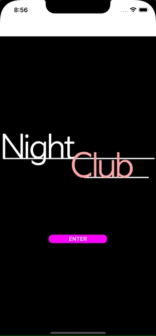

<!--more-->



To ease your read, please start from the project containing all the different steps applied in the previous articles. To do so, [download my class from GitHub](https://github.com/Kapusch/blog-dotnet-maui) if not already done, and open the NightClub project located in the folder named *“1 - MVVM”*.



Hey, you’re back! We're now done with MVVM and believe me, you did take a big step forward!

Today it will be much simpler, we start the creation of the application main page. But new page also means, enable the user going to that page! So let's see how to implement the navigation from one page to another.


# Navigate to a new page

Let's start by adding our new page. To do this, right click on the *Views* folder to add a new file, then choose the template ".NET MAUI ContentPage (C#)" as below. We'll name this file: `MusicPlayerView.cs`.


<p align="center"></p>
<figure></figure>


As you will have noticed, the template used to create the page provides us with a default content. So all we have to do now is navigating to this new page!

To do so, go to the file `HomeViewModel.cs` and modify the method *Enter()* as follows:


<p align="center" style="margin-bottom:-10px"><strong>Filename:</strong><code>HomeViewModel.cs</code></p>

```csharp
using NightClub.Views; // Reminder: without this line, it would not compile!

...

[RelayCommand]
async Task Enter()
{
    await Application.Current.MainPage.Navigation.PushAsync(
        new MusicPlayerView());
}
```


All that is done here is accessing the navigation service provided by the application in order to display a new page *MusicPlayerView*.

Actually, when the method *PushAsync()* is called, the page *MusicPlayerView* is then added to the very top of the stack of existing pages, exactly as shown in the diagram below:


<p align="center"></p>
<figure><figcaption class="image-caption">As with a deck of playing cards, only the top one is visible.</figcaption></figure>



🐒‎ ‎ Ha! That's it, can I test it then?



We're almost there! For the navigation to work, we need the first page displayed at startup to be included in a [NavigationPage](https://learn.microsoft.com/en-us/dotnet/maui/user-interface/pages/navigationpage#create-the-root-page).

If you go back to the `App.cs` file, there is a method called *OnStart()* that is automatically executed each time the app is initialized. So modify this method to set *HomeView* as the application root page, in a *NavigationPage*:


<p align="center" style="margin-bottom:-10px"><strong>Filename:</strong><code>App.cs</code></p>

```csharp
protected override void OnStart()
{
    base.OnStart();

    Console.WriteLine("[NightClub] App - OnStart");

    MainPage = new NavigationPage(new HomeView());
}
```


That's it, restart the application and click on the *Enter* button!


<p align="center"></p>
<figure></figure>


# Remove the navigation bar

As you will surely have understood, our home page is now contained in a page specially configured for navigation. It therefore contains a navigation bar by default:


<p align="center"></p>
<figure></figure>


From a design point of view, this is not necessarily what you want. So let's take a quick look at how to remove this header for the home page. Go to the file `HomeView.cs` and invoke the method *SetHasNavigationBar()* in the page constructor, like this:


<p align="center" style="margin-bottom:-10px"><strong>Filename:</strong><code>HomeView.cs</code></p>

```csharp
public HomeView()
{
	...
	BindingContext = new HomeViewModel();
	
	NavigationPage.SetHasNavigationBar(this, false);
	BackgroundColor = Colors.Black;
	...
}
```


And now restarting the app, it’s a lot nicer!

<p align="center"></p>
<figure></figure>


The application is slowly coming alive, and even more so with <a href="../6-scaffolding/">the next chapter</a>! See you soon for the construction of our main page.

---
More articles in the series:

