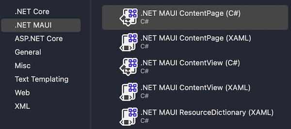
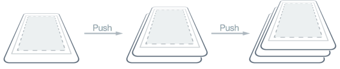
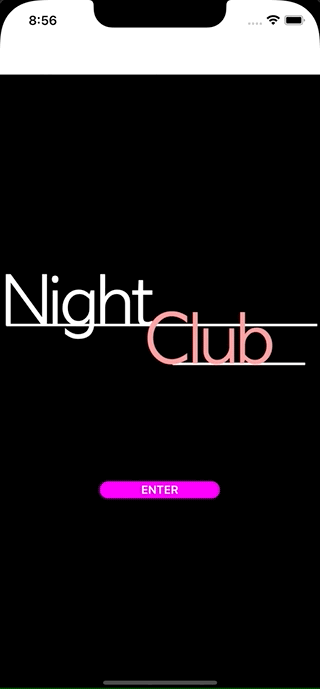
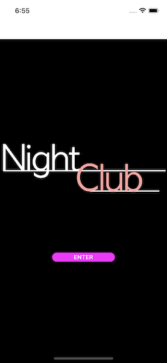

<!--more-->



Pour assurer le bon déroulement de cet article, je t’invite à récupérer le projet reprenant toutes les étapes appliquées jusqu’ici dans ce cours. Pour cela, réfère-toi au <a href="../2-setup-the-project/">guide d’installation du projet</a> et repars de l’exemple situé dans le dossier *“1 - MVVM”*.



Hé, mais te revoilà ! On en a maintenant fini avec le MVVM et crois-moi, tu viens de faire un grand pas en avant !

Aujourd’hui ce sera bien plus simple, on attaque la création de la page principale de l’application. Mais qui dit nouvelle page dit aussi: permettre à l’utilisateur de s’y rendre ! Voyons donc comment implémenter la navigation d’une page à une autre.


# Naviguer vers une nouvelle page

Commençons déjà par ajouter notre nouvelle page. Pour cela, fais un clic droit sur le dossier *Views* pour ajouter un nouveau fichier, puis choisis le template “.NET MAUI ContentPage (C#)” comme ci-dessous. On va nommer ce fichier : `MusicPlayerView.cs`.


<p align="center"></p>
<figure></figure>


Comme tu l’auras remarqué, le template utilisé pour créer la page nous fournit un contenu par défaut. Il n’y a donc plus qu’à naviguer vers cette nouvelle page !

Pour cela, rends-toi dans le fichier `HomeViewModel.cs` et modifie la méthode *Enter()* de la façon suivante :


<p align="center" style="margin-bottom:-10px"><strong>Nom du fichier :</strong><code>HomeViewModel.cs</code></p>

```csharp
using NightClub.Views; // Rappel: sans cette ligne, ça ne compilerait pas !

...

[RelayCommand]
async Task Enter()
{
    await Application.Current.MainPage.Navigation.PushAsync(
        new MusicPlayerView());
}
```


Tout ce qu’on fait ici, c’est accéder au service de navigation fourni par l’application pour afficher une nouvelle page de type *MusicPlayerView*.

En fait, lorsqu’on fait appel à la méthode *PushAsync()*, on ajoute la page *MusicPlayerView* tout en haut de la pile de pages déjà existantes, exactement comme sur le schéma ci-dessous:


<p align="center"></p>
<figure><figcaption class="image-caption">Comme avec un paquet de cartes à jouer, il n’y a que celle du dessus qui est visible.</figcaption></figure>



🐒‎ ‎ Ah! Et c’est tout, je peux tester alors ?



On y est presque ! En effet pour que la navigation fonctionne, on a besoin que la première page affichée au démarrage soit englobée dans une [NavigationPage](https://learn.microsoft.com/fr-fr/dotnet/maui/user-interface/pages/navigationpage#create-the-root-page).

Si tu retournes dans le fichier `App.cs`, il y a justement une méthode *OnStart()* qui est automatiquement exécutée à chaque fois que l’app est initialisée. Modifie donc cette méthode de sorte à définir *HomeView* comme la page racine de l’application, dans une *NavigationPage*:


<p align="center" style="margin-bottom:-10px"><strong>Nom du fichier :</strong><code>App.cs</code></p>

```csharp
protected override void OnStart()
{
    base.OnStart();

    Console.WriteLine("[NightClub] App - OnStart");

    MainPage = new NavigationPage(new HomeView());
}
```


Voilà c’est bon, relance l’application et clique sur le bouton *Enter* !


<p align="center"></p>
<figure></figure>


# Supprimer l’en-tête de navigation

Comme tu l’auras sûrement compris, notre page d’accueil est désormais contenue dans une page spécialement configurée pour la navigation. Elle contient donc par défaut une en-tête de navigation :


<p align="center"></p>
<figure></figure>


D’un point de vue design, ce n’est pas nécessairement ce que l’on souhaite. Voyons donc rapidement comment supprimer cette en-tête pour la page d’accueil. Rends-toi dans le fichier `HomeView.cs` et invoque la méthode *SetHasNavigationBar()* dans le constructeur de la page, comme ceci:


<p align="center" style="margin-bottom:-10px"><strong>Nom du fichier :</strong><code>HomeView.cs</code></p>

```csharp
public HomeView()
{
	...
	BindingContext = new HomeViewModel();
	
	NavigationPage.SetHasNavigationBar(this, false);
	BackgroundColor = Colors.Black;
	...
}
```


Et maintenant, si tu relances l’app, c’est quand même plus joli !

<p align="center"></p>
<figure></figure>


L’application commence à prendre forme tout doucement, et d’autant plus avec <a href="../6-scaffolding/">le prochain chapitre</a> ! On se revoit très bientôt pour l’élaboration de notre page principale.

---
Plus d'articles dans la même série:

