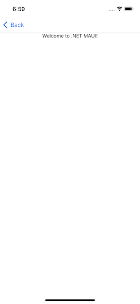
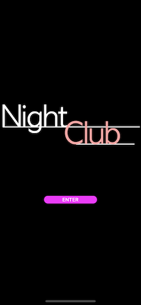

<!--more-->

<style>
.img-sizes{min-height:50px;max-height:600px;min-width:50px;max-width:600px;height:auto;width:auto}
</style>




Commençons déjà par ajouter notre nouvelle page. Pour cela, clic droit sur le dossier *Views* pour ajouter un nouveau fichier, puis choisir le template “.NET MAUI ContentPage (C#)” depuis la catégorie “.NET MAUI”. On va nommer ce fichier : `MusicPlayerView.cs`.

<p align="center"></p>

Comme tu l’auras remarqué, le template utilisé crée la page avec un contenu par défaut. On n’a donc plus qu’à naviguer vers notre nouvelle page ! Dans le fichier `HomeViewModel.cs`, modifie la méthode *Enter()* de la façon suivante :

```csharp
[RelayCommand]
async Task Enter()
{
    await Application.Current.MainPage.Navigation.PushAsync(
        new MusicPlayerView());
}
```





On y est presque ! En effet, on doit simplement initialiser la navigation dans l’app en lui informant quelle en sera la page racine. Pour cela, on fait appel à une [NavigationPage](https://learn.microsoft.com/en-us/dotnet/maui/user-interface/pages/navigationpage#create-the-root-page) pour contenir notre *HomeView* en modifiant la méthode *OnStart()* du fichier `App.cs` de cette façon:

```csharp
protected override void OnStart()
{
    base.OnStart();

    Console.WriteLine("[NightClub] App - OnStart");

    MainPage = new NavigationPage(new HomeView());
}
```


Voilà c’est bon, relance l’application et clique sur le bouton *Enter* !

<p align="center"></p>

Comme tu l’auras sûrement remarqué, notre page d’accueil est désormais contenue dans une page configurée pour la navigation, elle contiendra donc une en-tête de navigation :

<p align="center"></p>

Ce n’est pas nécessairement ce que l’on souhaite alors on va vite voir comment supprimer cette en-tête. Rends-toi dans le fichier `HomeView.cs` et fais appel à la méthode* SetHasNavigationBar() *dans le constructeur de la *HomeView* comme ceci:

```csharp
public HomeView()
{
    ...
		BindingContext = new HomeViewModel();

    NavigationPage.SetHasNavigationBar(this, false);
    BackgroundColor = Colors.Black;
    ...
}
```


Voilà, et si tu relances l’app, c’est quand même plus joli !

<p align="center"></p>

Allez il est temps de passer à un nouveau chapitre, l’élaboration de notre page principale !

