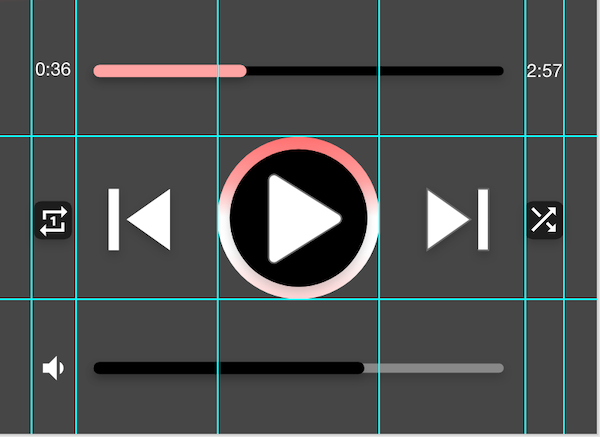

<!--more-->



To ease your read, please start from the project containing all the different steps applied so far in this tutorial. To do so, refer to the <a href="../2-setup-the-project/">project setup guide</a> and resume from the sample located in the folder named *"2 - Navigation"*.

With this new chapter, we begin a series of articles focused on the visual aspect of the app, and there is a good chance that you will like it! Indeed, developing a visual interface requires numerous tests of the rendering on the screen, and there is nothing better for learning. And it's through regular practice that you'll naturally understand and retain a lot of things 🙂

Now it’s time to set up the foundations of the main page!


# The design
But before any visual development, it is best to think about the layout of the various elements that we want to display. Precisely, .NET MAUI provides [several simple solutions for structuring our pages](https://learn.microsoft.com/en-us/dotnet/maui/user-interface/layouts/). And you'll see, it's a real architect's job!



🐒‎ ‎ But what should our page actually look like?



This is a very good question! In general, when imagining a new page for our application, it is recommended to work out the design with a pencil on a paper. Because phone screens are quite small, it is not easy to arrange all the desired elements. Then, when we are satisfied with the rendering on paper, we prepare a digital mock-up for a more realistic rendering: this greatly facilitates the integration of the page into the application.


For our course, the main page should look like the following layout:

<p align="center"></p>
<figure></figure>


# Structuring the page
On this model, you can see the elements are arranged in a fairly regular way. One could even imagine lines to relatively align the elements on each other:

<p align="center"></p>
<figure><figcaption class="image-caption">Arranging the elements along imaginary lines is a bit special at first, but it becomes a habit over time.</figcaption></figure>


These lines might make you think of a grid... and if so, good for you! This is the whole principle of the [Grid](https://learn.microsoft.com/en-us/dotnet/maui/user-interface/layouts/grid) component, which as its name indicates, allows you to arrange elements on a grid. We will use it several times for this page.


# Introduction to the Grid
To comply with the layout, the first thing to do is dividing the page in two:

* The top part which displays nothing but a black background,

* and the bottom part to control our music player.


<p align="center"></p>
<figure></figure>


You will notice that the top part is slightly larger than the bottom part. You could even say that the black part spreads vertically over 60% of the page, leaving 40% of the page for the rest.

This is very useful to know! Let's apply these values to define the content of our *MusicPlayerView* page with a *Grid* :

<p align="center" style="margin-bottom:-10px"><strong>Filename:</strong><code>MusicPlayerView.cs</code></p>

```csharp
using CommunityToolkit.Maui.Markup;
using static CommunityToolkit.Maui.Markup.GridRowsColumns;

...

public MusicPlayerView()
{
	...
	Content = new Grid
	{
		RowDefinitions = Rows.Define(
			Stars(60),
			Stars(40)),
		RowSpacing = 0,
		Children =
		{
			TopLayout.Row(0),
			BottomLayout.Row(1),
		}
	};
}
```


With the *RowDefinitions* parameter, we configure a grid of 2 lines: the first one will be able to extend up to 60% of the page vertically against 40% for the second one, as per design!

When initializing the *Grid*, we also define two other parameters:

* the *RowSpacing* set to 0 for having no space between the lines of our grid,

* and *Children* which will contain all the elements of our grid, to be distributed over two lines.


And if you wonder where these *TopLayout* and *BottomLayout* come from, they're actually two element containers to define outside the page constructor. Indeed, we again use a *Grid* for each of these two controls to help us with positioning the remaining elements. The first *Grid* (the *TopLayout*) corresponds to the top part of our page and therefore has a black background. As for the other *Grid* (the *BottomLayout*), we define a dark grey background to represent the lower part.

Copy the following code and paste it into the region dedicated to controls in the file `MusicPlayerView.cs`:

<p align="center" style="margin-bottom:-10px"><strong>Filename:</strong><code>MusicPlayerView.cs</code></p>

```csharp
#region Controls

Grid TopLayout => new Grid
{
    BackgroundColor = Colors.Black
};

Grid BottomLayout => new Grid
{
    BackgroundColor = Colors.DimGray
};

#endregion
```


# The main foundations
Let's focus first on the content of the *BottomLayout*. If we take a closer look at the design, we can see new rows, but also columns.

More exactly:

* there are 3 rows from top to bottom, all the same size,

* and there are 7 columns from left to right (2 small, 3 large and then 2 small again).


<p align="center"></p>
<figure><figcaption class="image-caption">By squaring the lower area of the page, you can see that each visual element has its own cell.</figcaption></figure>


Now let's define the rows and columns composing our *BottomLayout* to comply with the alignment of the visual elements, as on the mock-up:

<p align="center" style="margin-bottom:-10px"><strong>Filename:</strong><code>MusicPlayerView.cs</code></p>

```csharp
Grid BottomLayout => new Grid
{
    BackgroundColor = Colors.DimGray,
    RowDefinitions = Rows.Define(
            Stars(1),
            Stars(1),
            Stars(1)),
    RowSpacing = 0,
    ColumnDefinitions = Columns.Define(
            Stars(10),
            Stars(10),
            Stars(20),
            Stars(20),
            Stars(20),
            Stars(10),
            Stars(10)),
    ColumnSpacing = 0
};
```


As you can see, the code above proposes a split into 3 rows of the same size and 7 columns with different sizes.



🐒‎ ‎ Well, if I add up the sizes of each column, I get a total of 100%! But when it comes to rows, there’s a problem, right?



Good point! Actually, I started with a 100% size scale because it's often easier to understand.

So, when you write…

<p align="center" style="margin-bottom:-10px"><strong>Filename:</strong><code>MusicPlayerView.cs</code></p>

```csharp
RowDefinitions = Rows.Define(
    Stars(60),
    Stars(40))
```


... the application understands that the first line will have a weight of 60 compared to the second line, which will only have a weight of 40. This is a dynamic way of assigning a height to our lines depending on the size of the screen, as it changes from one mobile phone to another.

Finally, you can see this weight as a multiplier. For example, this same piece of code can be rewritten in this way:

<p align="center" style="margin-bottom:-10px"><strong>Filename:</strong><code>MusicPlayerView.cs</code></p>

```csharp
RowDefinitions = Rows.Define(
    Stars(1.5), // 1.5 x 40 = 60
    Stars(1)) // 1 x 40 = 40
```


Choose what makes more sense to you!


# Validating the rendering on screen
Now that our bottom grid is in place, let's check the settings are correct. With a *Grid* of 3 rows and 7 columns, that's a lot of cells to validate!

But I have a trick to quickly test if the slicing is what you expected or if some adjustments are required. To do this, you can draw a geometric shape in each cell of the grid, each with its own colour. With the *BoxView*, this is very easy:

<p align="center" style="margin-bottom:-10px"><strong>Filename:</strong><code>MusicPlayerView.cs</code></p>

```csharp
Grid BottomLayout => new Grid
{
		[...]
    ColumnSpacing = 0,
		Children =
		{
		    new BoxView { Color = Color.FromArgb("#ffffff") }.Row(0).Column(0),
		    new BoxView { Color = Color.FromArgb("#d0d0d0") }.Row(0).Column(1),
		    new BoxView { Color = Color.FromArgb("#a2a3a3") }.Row(0).Column(2),
		    new BoxView { Color = Color.FromArgb("#777879") }.Row(0).Column(3),
		    new BoxView { Color = Color.FromArgb("#4e5051") }.Row(0).Column(4),
		    new BoxView { Color = Color.FromArgb("#292b2c") }.Row(0).Column(5),
		    new BoxView { Color = Color.FromArgb("#000405") }.Row(0).Column(6),
		    new BoxView { Color = Color.FromArgb("#f3f337") }.Row(1).Column(0),
		    new BoxView { Color = Color.FromArgb("#a2eb5b") }.Row(1).Column(1),
		    new BoxView { Color = Color.FromArgb("#4edb80") }.Row(1).Column(2),
		    new BoxView { Color = Color.FromArgb("#00c89f") }.Row(1).Column(3),
		    new BoxView { Color = Color.FromArgb("#00b1b1") }.Row(1).Column(4),
		    new BoxView { Color = Color.FromArgb("#0098b2") }.Row(1).Column(5),
		    new BoxView { Color = Color.FromArgb("#177ea2") }.Row(1).Column(6),
		    new BoxView { Color = Color.FromArgb("#bf7aef") }.Row(2).Column(0),
		    new BoxView { Color = Color.FromArgb("#ea6cd4") }.Row(2).Column(1),
		    new BoxView { Color = Color.FromArgb("#ff63b3") }.Row(2).Column(2),
		    new BoxView { Color = Color.FromArgb("#ff6590") }.Row(2).Column(3),
		    new BoxView { Color = Color.FromArgb("#ff716e") }.Row(2).Column(4),
		    new BoxView { Color = Color.FromArgb("#ff844e") }.Row(2).Column(5),
		    new BoxView { Color = Color.FromArgb("#f89832") }.Row(2).Column(6),
		}
};
```


And if you run the app, you will see that our use of the *Grid* is indeed correct:

<p align="center"></p>
<figure><figcaption class="image-caption">It's a bit similar to the old colour televisions.</figcaption></figure>


Well, there is nothing functional for the user, but now that our foundations are ready, it will greatly simplify our lives!

We will finally be able to have fun arranging all the control elements <a href="../7-time-tracker/">from the next chapter</a>, starting with the timing management.

___
More articles in the series:

