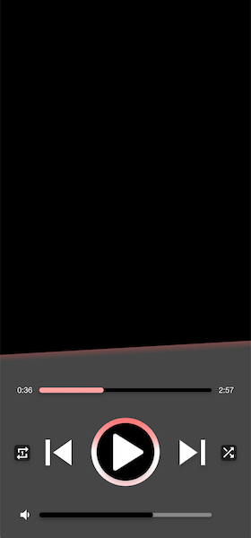
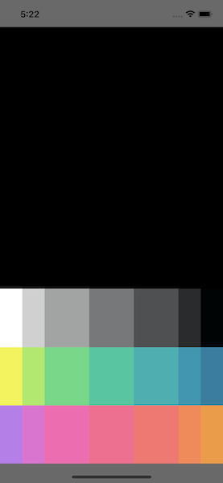

<!--more-->



Pour assurer le bon déroulement de cet article, je t’invite à récupérer le projet reprenant toutes les étapes appliquées jusqu’ici dans ce cours. Pour cela, réfère-toi au <a href="../2-setup-the-project/">guide d’installation du projet</a> et repars de l’exemple situé dans le dossier *“2 - Navigation”*.

Avec ce nouveau chapitre, on entame une série d’articles axés autour du visuel de l’app, et il y a de bonnes chances que cela te plaise ! En effet, développer une interface visuelle nécessite de nombreux tests du rendu à l’écran, et il n’y a rien de mieux pour apprendre. Et c’est par la pratique régulière que tu vas naturellement comprendre et retenir tout un tas de choses 🙂

Allez, on est partis pour mettre en place les fondations de la page principale !


# Le design
Mais avant tout développement graphique, il vaut mieux réfléchir à la disposition des différents éléments que l’on souhaite afficher. Justement, .NET MAUI fournit pour cela [plusieurs solutions simples pour structurer nos pages](https://learn.microsoft.com/fr-fr/dotnet/maui/user-interface/layouts/). Et tu vas voir, c’est un vrai travail d’architecte !



🐒‎ ‎ Mais au fait, à quoi doit ressembler notre page ?



C’est une très bonne question ! En général, quand imagine une nouvelle page pour notre application, il est conseillé d’en élaborer le design au crayon sur une feuille. En effet, comme les écrans de téléphone sont assez petits, il n’est pas facile de disposer tous les éléments souhaités. Puis, quand on est satisfait du rendu sur papier, on prépare alors une maquette sur ordinateur pour un rendu plus réaliste : ça facilite grandement l’intégration de la page dans l’application.


Dans le cadre de notre cours, la page principale devra ressembler à la maquette suivante :

<p align="center"></p>
<figure></figure>


# Structuration de la page
Sur cette maquette, on remarque que les éléments sont disposés de façon assez régulière. On pourrait même imaginer des lignes pour aligner les éléments les uns par rapport aux autres :

<p align="center"></p>
<figure><figcaption class="image-caption">Disposer les éléments suivant des lignes imaginaires est un exercice un peu spécial au début, mais cela devient une habitude avec le temps.</figcaption></figure>


Ces lignes te feront peut-être penser à une grille… et si c’est le cas, bien vu ! C’est tout le principe du composant [Grid](https://learn.microsoft.com/fr-fr/dotnet/maui/user-interface/layouts/grid), qui comme son nom l’indique, permet de disposer des éléments sur une grille. On va l’utiliser plusieurs fois pour cette page.


# Initiation au Grid
Pour respecter la maquette, la première chose à faire est de diviser la page en deux :

* La partie du haut qui n’affiche rien d’autre qu’un fond noir,
* Et celle du bas pour contrôler notre lecteur de musique.


<p align="center"></p>
<figure></figure>


Tu remarqueras que la partie supérieure est légèrement plus grande que la partie inférieure. On pourrait même dire que la partie noire s’étale verticalement sur 60% de la page, ce qui laisse 40% d’espace pour le reste.

Ce sont des données très utiles ! Mettons-les en application pour définir le contenu de notre page *MusicPlayerView* avec un *Grid* :

<p align="center" style="margin-bottom:-10px"><strong>Nom du fichier :</strong><code>MusicPlayerView.cs</code></p>

```csharp
using CommunityToolkit.Maui.Markup;
using static CommunityToolkit.Maui.Markup.GridRowsColumns;

...

public MusicPlayerView()
{
	...
	Content = new Grid
	{
		RowDefinitions = Rows.Define(
			Stars(60),
			Stars(40)),
		RowSpacing = 0,
		Children =
		{
			TopLayout.Row(0),
			BottomLayout.Row(1),
		}
	};
}
```


Avec le paramètre *RowDefinitions*, on configure une grille de 2 lignes : la première pourra s’étendre jusqu’à 60% de la page verticalement contre 40% pour la deuxième, comme sur notre design !

A l’initialisation du *Grid*, on définit également deux autres paramètres :

* le *RowSpacing* défini à 0 pour ne laisser aucun espace entre les lignes de notre grille,
* et *Children* qui contiendra tous les éléments de notre grille, à répartir sur deux lignes.


Et si tu te demandes d’où sortent ces fameux *TopLayout* et *BottomLayout*, il s’agit de deux conteneurs d’éléments à définir en dehors du constructeur de la page. En effet, on utilise à nouveau un *Grid* pour chacun de ces deux contrôles pour nous aider dans le placement des éléments restants. Le premier *Grid* (le *TopLayout*) correspond à la partie supérieure de notre page et a donc un fond noir. Quant à l’autre *Grid* (le *BottomLayout*), on lui définit un fond gris foncé pour représenter la partie inférieure.

Copie le code suivant et colle-le dans la région dédiée aux contrôles du fichier `MusicPlayerView.cs`:

<p align="center" style="margin-bottom:-10px"><strong>Nom du fichier :</strong><code>MusicPlayerView.cs</code></p>

```csharp
#region Controls

Grid TopLayout => new Grid
{
    BackgroundColor = Colors.Black
};

Grid BottomLayout => new Grid
{
    BackgroundColor = Colors.DimGray
};

#endregion
```


# Les fondations principales
Concentrons-nous dans un premier temps sur le contenu du *BottomLayout*. En regardant d’un peu plus près le design, on remarque de nouvelles lignes, mais également des colonnes.

Plus exactement :

* on remarque 3 lignes de haut en bas, à taille identique,
* et il y a 7 colonnes de gauche à droite (2 petites, 3 grandes et 2 petites à nouveau).


<p align="center"></p>
<figure><figcaption class="image-caption">En quadrillant la zone inférieure de la page, on remarque que chaque élément visuel a bien sa case attitrée.</figcaption></figure>


Définissons maintenant les lignes et colonnes qui composent notre *BottomLayout* de sorte à respecter l’alignement des éléments visuels, comme sur la maquette :

<p align="center" style="margin-bottom:-10px"><strong>Nom du fichier :</strong><code>MusicPlayerView.cs</code></p>

```csharp
Grid BottomLayout => new Grid
{
    BackgroundColor = Colors.DimGray,
    RowDefinitions = Rows.Define(
            Stars(1),
            Stars(1),
            Stars(1)),
    RowSpacing = 0,
    ColumnDefinitions = Columns.Define(
            Stars(10),
            Stars(10),
            Stars(20),
            Stars(20),
            Stars(20),
            Stars(10),
            Stars(10)),
    ColumnSpacing = 0
};
```


Comme tu vois, le code ci-dessus propose un découpage en 3 lignes de même taille et 7 colonnes avec des tailles différentes.



🐒‎ ‎ Euh… alors si j’additionne les tailles de chaque colonne, j’obtiens bien 100% ! Mais pour ce qui est des lignes, on a un problème non ?



Très bonne remarque ! En fait si je suis parti au début avec un échelonnement des tailles sur 100%, c’est parce que c’est souvent plus facile à comprendre.

En réalité, quand tu écris…

<p align="center" style="margin-bottom:-10px"><strong>Nom du fichier :</strong><code>MusicPlayerView.cs</code></p>

```csharp
RowDefinitions = Rows.Define(
    Stars(60),
    Stars(40))
```


… l’application comprend que la première ligne aura un poids de 60 par rapport à la deuxième ligne, qui elle n’aura qu’un poids de 40. C’est une façon dynamique d’attribuer une hauteur à nos lignes en fonction de la taille de l’écran, puisqu’elle change d’un modèle de téléphone à un autre.

Finalement, tu peux voir ce poids comme un coefficient multiplicateur. Par exemple, ce même bout de code peut être réécrit de cette façon:

<p align="center" style="margin-bottom:-10px"><strong>Nom du fichier :</strong><code>MusicPlayerView.cs</code></p>

```csharp
RowDefinitions = Rows.Define(
    Stars(1.5), // 1.5 x 40 = 60
    Stars(1)) // 1 x 40 = 40
```


A toi de choisir ce qui te semble plus cohérent !


# Vérification du rendu à l’écran
Maintenant que notre quadrillage de la partie inférieure est en place, vérifions si les paramètres sont corrects. Avec une *Grid* configurée sur 3 lignes et 7 colonnes, ça fait beaucoup de cases à valider !

Mais j’ai une astuce pour tester rapidement si le découpage est bien celui attendu ou s’il y a des ajustements à faire. Pour cela, tu peux dessiner une forme géométrique dans chaque case du quadrillage, avec chacune sa propre couleur. Avec la *BoxView*, c’est très facile :

<p align="center" style="margin-bottom:-10px"><strong>Nom du fichier :</strong><code>MusicPlayerView.cs</code></p>

```csharp
Grid BottomLayout => new Grid
{
		[...]
    ColumnSpacing = 0,
		Children =
		{
		    new BoxView { Color = Color.FromArgb("#ffffff") }.Row(0).Column(0),
		    new BoxView { Color = Color.FromArgb("#d0d0d0") }.Row(0).Column(1),
		    new BoxView { Color = Color.FromArgb("#a2a3a3") }.Row(0).Column(2),
		    new BoxView { Color = Color.FromArgb("#777879") }.Row(0).Column(3),
		    new BoxView { Color = Color.FromArgb("#4e5051") }.Row(0).Column(4),
		    new BoxView { Color = Color.FromArgb("#292b2c") }.Row(0).Column(5),
		    new BoxView { Color = Color.FromArgb("#000405") }.Row(0).Column(6),
		    new BoxView { Color = Color.FromArgb("#f3f337") }.Row(1).Column(0),
		    new BoxView { Color = Color.FromArgb("#a2eb5b") }.Row(1).Column(1),
		    new BoxView { Color = Color.FromArgb("#4edb80") }.Row(1).Column(2),
		    new BoxView { Color = Color.FromArgb("#00c89f") }.Row(1).Column(3),
		    new BoxView { Color = Color.FromArgb("#00b1b1") }.Row(1).Column(4),
		    new BoxView { Color = Color.FromArgb("#0098b2") }.Row(1).Column(5),
		    new BoxView { Color = Color.FromArgb("#177ea2") }.Row(1).Column(6),
		    new BoxView { Color = Color.FromArgb("#bf7aef") }.Row(2).Column(0),
		    new BoxView { Color = Color.FromArgb("#ea6cd4") }.Row(2).Column(1),
		    new BoxView { Color = Color.FromArgb("#ff63b3") }.Row(2).Column(2),
		    new BoxView { Color = Color.FromArgb("#ff6590") }.Row(2).Column(3),
		    new BoxView { Color = Color.FromArgb("#ff716e") }.Row(2).Column(4),
		    new BoxView { Color = Color.FromArgb("#ff844e") }.Row(2).Column(5),
		    new BoxView { Color = Color.FromArgb("#f89832") }.Row(2).Column(6),
		}
};
```


Et si tu lances l’application, tu pourras alors confirmer avec certitude que notre emploi des *Grid* est effectivement correct :

<p align="center"></p>
<figure><figcaption class="image-caption">Ça fait un peu penser aux vieilles télévisions en couleur.</figcaption></figure>


Bon, il n’y a rien de fonctionnel pour l’utilisateur, mais maintenant que nos fondations sont prêtes, ça va grandement nous simplifier la vie !

On va enfin pouvoir s’amuser à disposer tous les éléments de contrôle <a href="../7-time-tracker/">dès le prochain chapitre</a>, en commençant par la gestion du minutage.


___
Plus d'articles dans la même série:

