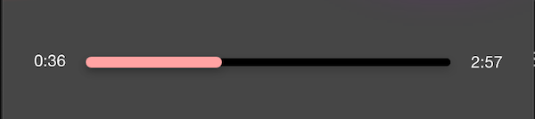

<!--more-->

<style>
.img-sizes{min-height:50px;max-height:600px;min-width:50px;max-width:600px;height:auto;width:auto}
</style>
Maintenant que les fondations de ta page sont prêtes, tu vas pouvoir commencer à disposer tous les éléments de contrôle. Voyons déjà pour la première ligne:

<p align="center"></p>

On utilisera le composant [Label](https://learn.microsoft.com/en-us/dotnet/maui/user-interface/controls/label) pour afficher les minutages correspondant à la position actuelle dans la piste en cours de lecture, ainsi que le temps d’écoute restant:

```csharp
Label ElapsedTime => new Label
{
    FontSize = 14,
    Text = "0:36",
    TextColor = Colors.White
}.TextCenter();

Label RemainingTime => new Label
{
    FontSize = 14,
    Text = "2:57",
    TextColor = Colors.White
}.TextCenter();
```


La taille de police définie pour ces deux labels est relativement petite. Cependant, elle s’adaptera automatiquement au niveau d’agrandissement du texte défini par l’utilisateur dans les réglages d’accessibilité de son téléphone.





Et pour ce qui est de la barre de navigation, on utilisera le [Slider](https://learn.microsoft.com/en-us/dotnet/maui/user-interface/controls/slider):

```csharp
Slider TimeTracker => new Slider
{
    Minimum = 0,
    MinimumTrackColor = Colors.LightSalmon,
    Maximum = 100,
    MaximumTrackColor = Colors.Black,
    Value = 20
};
```


Bon évidemment ici encore, les valeurs de configuration sont factices. L’idée est surtout de rapidement se rendre compte du rendu final ! Pour le moment, on demande au *Slider* de considérer toutes les valeurs allant de 0 à 100 et de positionner son curseur à la position n°20.

Pour vérifier l’affichage de cette première partie du lecteur musical, je te propose d’effacer tous les éléments enfants de notre *BottomLayout* et de lui assigner les premiers éléments que l’on vient de définir. Pour cela, tu seras sûrement tenté d’écrire quelque chose comme:

```csharp
Grid BottomLayout => new Grid
{
    ...

    Children =
    {
        ElapsedTime.Row(0).Column(1),
        TimeTracker.Row(0).Column(2),
        RemainingTime.Row(0).Column(5)
    }
};
```


C’est un bon début ! Cependant, si tu démarres l’application, tu constateras qu’il y un léger problème d’affichage:

<p align="center"></p>

Pas de panique ! Si tu te rappelles, on a initialement divisé le *BottomLayout* en 7 colonnes. Or, si notre code positionne bien notre *Slider* à partir de la case n°3 de la première ligne, il ne lui dit pas clairement où s’arrêter ! On pourrait alors simplement dire au *Slider* de s’étaler sur les colonnes suivantes, comme ceci:

<p align="center"></p>

Pour cela, on utilise la commande *ColumnSpan* pour indiquer au *Slider* de s’étendre jusqu’à 3 colonnes à partir de la case n°3 :

```csharp
TimeTracker.Row(0).Column(2).ColumnSpan(3)
```


Et voilà on en a fini avec la première ligne de notre grille ! Voyons ce que ça donne à l’image:

<p align="center"></p>


