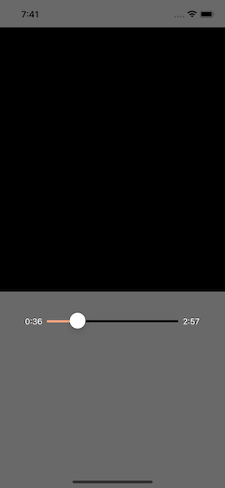

<!--more-->



To ease your read, please start from the project containing all the different steps applied so far in this tutorial. To do so, refer to the <a href="../2-setup-the-project/">project setup guide</a> and resume from the sample located in the folder *"3 - Page Scaffolding"*.

In the previous article, we set up a matrix to display all the controls of our music player. So we can now add concrete elements for the user!

## Timing display
Let's start with the part dedicated to the timing of the song. According to the mock-up, we will have a text on the left for the current listening time, and on the right, for the total duration of the track:

<p align="center"></p>
<figure><figcaption class="image-caption">The application shows that the song has been playing for 36 seconds and is 2 minutes and 57 seconds long.</figcaption></figure>


To reproduce it in the application, we will use the [Label](https://learn.microsoft.com/en-us/dotnet/maui/user-interface/controls/label) component which allows to display some text on the screen:

<p align="center" style="margin-bottom:-10px"><strong>Filename:</strong><code>MusicPlayerView.cs</code></p>

```csharp
Label ElapsedTime => new Label
{
    FontSize = 14,
    Text = "0:36",
    TextColor = Colors.White
}.TextCenter();

Label TotalTime => new Label
{
    FontSize = 14,
    Text = "2:57",
    TextColor = Colors.White
}.TextCenter();
```


These two new elements are set to display static text in white and with a relatively small font size. However, the font size will automatically be adjusted to the level of text enlargement set by the user in the phone's accessibility settings.



Going further with [accessibility for mobile applications](https://learn.microsoft.com/en-us/dotnet/maui/fundamentals/accessibility).



## Adjusting the playback head
The middle element has two functions: displaying and controlling the playback position in the song. Indeed, the user can move forward or backward in the song by sliding his finger horizontally. In addition, this component has a pink part that represents the elapsed time, and a black part for the remaining time.

To reproduce this navigation bar, we will use the [Slider](https://learn.microsoft.com/en-us/dotnet/maui/user-interface/controls/slider) component:

<p align="center" style="margin-bottom:-10px"><strong>Filename:</strong><code>MusicPlayerView.cs</code></p>

```csharp
Slider TimeTracker => new Slider
{
    Minimum = 0,
    MinimumTrackColor = Colors.LightSalmon,
    Maximum = 100,
    MaximumTrackColor = Colors.Black,
    Value = 20
};
```


A *Slider* is a control with a cursor that allows the user to select a specific value from a range of possible values. In our case, it's like having a ruler which is graduated from 0 to 100 with a cursor positioned on 20.

<p align="center"></p>
<figure></figure>



🐒‎ ‎ Oh yes, I see, we are actually at 20% of the song! So we will have a pink bar from 0 to 20, and a black bar from 20 to 100.



That's it! Well, actually here, all the configuration values are static, but the final idea is allowing the user to advance or rewind the track to the nearest second.

___
Now, we're done with the first row of elements of the music player. To check that the display is correct, I would like you delete all the child elements of the *BottomLayout* before assigning all the components that we have defined in this chapter.

To do this, you may be tempted to write something like :

<p align="center" style="margin-bottom:-10px"><strong>Filename:</strong><code>MusicPlayerView.cs</code></p>

```csharp
Grid BottomLayout => new Grid
{
    ...
    Children =
    {
        ElapsedTime.Row(0).Column(1),
        TimeTracker.Row(0).Column(2),
        TotalTime.Row(0).Column(5)
    }
};
```


At first glance, it looks pretty good! However, if you start the application, you will notice that there is a slight problem with the display:

<p align="center"></p>
<figure><figcaption class="image-caption">Positioned this way, the Slider does not look good.</figcaption></figure>


Don't panic! We will see right away how to readjust it.

## Better use of the Grid
If you remember, we initially divided the *BottomLayout* into 7 columns. However, even if our *Slider* is well positioned from box n°3 of the first row, it does not clearly say where to stop! We could then simply tell the *Slider* to spread out over the next columns, like this:

<p align="center"></p>
<figure><figcaption class="image-caption">The Slider overlaps with boxes n°3, n°4 and n°5.</figcaption></figure>


To do this, we use the *ColumnSpan()* method to ask the *Slider* to expand up to 3 columns from the cell n°3:

<p align="center" style="margin-bottom:-10px"><strong>Filename:</strong><code>MusicPlayerView.cs</code></p>

```csharp
TimeTracker.Row(0).Column(2).ColumnSpan(3)
```


Now we're really done! Let's run the application again to see what it looks like:

<p align="center"></p>
<figure></figure>


Well, that's true, it's nice but it doesn't do much! But we'll finish the visual part first before moving on to a more functional part of the application.

Besides, we still have a lot of buttons to put in place! Our goal for <a href="../8-music-player-display-media-playback/">the next chapter</a> is to control the playback of the media.

___
More articles in the series:

