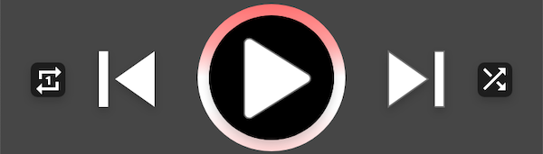
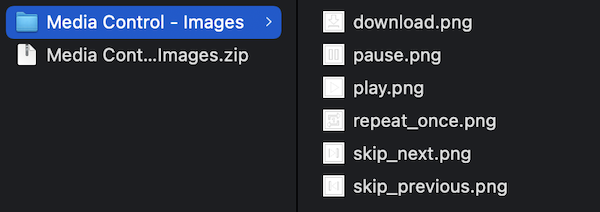
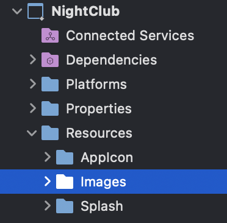
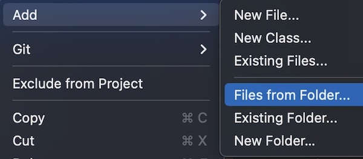
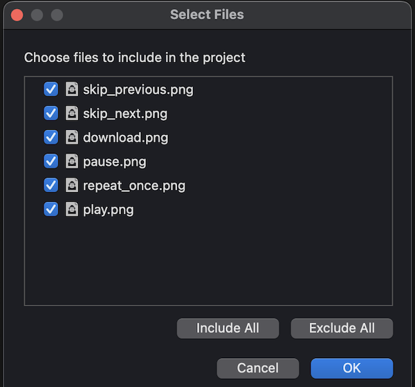
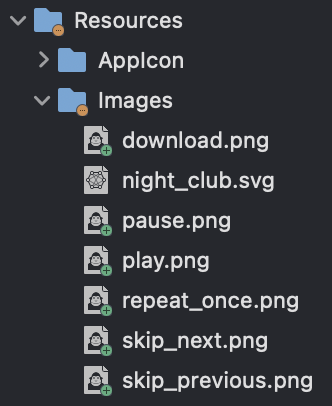
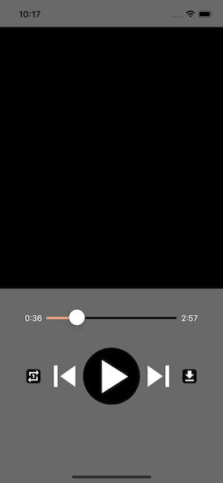

<!--more-->

<style>
.img-sizes{min-height:50px;max-height:600px;min-width:50px;max-width:600px;height:auto;width:auto}
</style>


To ease your read, please start <a href="../7-time-tracker/">from this chapter</a> where we started setting up the music player controls.


In the last chapter, we worked on setting up the first visual elements of the music player. Two components were discovered: the [Label](https://learn.microsoft.com/en-us/dotnet/maui/user-interface/controls/label) and the [Slider](https://learn.microsoft.com/en-us/dotnet/maui/user-interface/controls/slider).

Today, we're going to continue our good work and reproduce a whole series of buttons to control the media.


### War of the Buttons

To listen to music, our user needs key functions like: play a song, skip to the next track, etc. If you remember about the mock-up, we had a main row of 5 buttons:

<figure><p align="center"></p><figcaption class="image-caption">5 buttons well aligned in the same row, but they are not all the same size.</figcaption></figure>


The difference with the "ENTER" button on the home page is that here, our 5 buttons represent a clickable image. To reproduce them in the app, we will use the [ImageButton](https://learn.microsoft.com/en-us/dotnet/maui/user-interface/controls/imagebutton) component.

But first, you will need to add these images to the project. So start by downloading them to your computer:




Then unzip the downloaded file. You should have the following 6 images:

<figure><p align="center"></p></figure>



🐒‎ ‎ 6 images... but didn't we say 5 buttons?



Indeed, there will be 5 buttons on this row. But nothing prevents us from replacing the image of the button by another one!

Going back to the mock-up, there will be from left to right :

* a button to replay the track (only once) ⇒ it’s the image *repeat_once.png*
* another to return to the previous song ⇒ *skip_previous.png*
* there will also be a big central button to play or pause the music. The image of this button will automatically change accordingly to the following cases:
    * either the track is not playing ⇒ it will be the image *play.png*
    * or it is already being played ⇒ then *pause.png* will be displayed
* then we will have a button to go to the next song ⇒ *skip_next.png*
* and a last one to download the song ⇒ *download.png*


Yes I know, this last function "download" was not planned in the program! It was originally supposed to be for shuffle playback, but I changed my mind. 😄

So it's important to make the mock-up as reliable as possible!

### Add images to the project

Now that you have downloaded all the images, you need to import them into the project so that they can be used by the application. To do this, open the project in Visual Studio and right click on the *Images* folder:

<figure><p align="center"></p><figcaption class="image-caption">Remember, the Resources folder is where we store all the media (icons, images, audio and video tracks, ...)</figcaption></figure>


In the pop-up menu that appears, in the *Add* section, click on the option to add files from a folder:

<figure><p align="center"></p></figure>


Then, select the folder where you have unzipped the 6 images and validate your choice. A window will appear for you to choose the files to be included in the project.

In our case, we want to import all the images in the folder. So select all the available files and click on OK :

<figure><p align="center"></p></figure>



Visual Studio may ask you which strategy to use to import the files into the *Resources/Images* folder. I suggest you choose to copy them, or move them.



That's it, make sure that you have the 6 new images imported into the folder!

<figure><p align="center"></p></figure>


### Discovering ImageButton

Now that the images are ready to use, let's get to the code!

Let's first define the two smallest buttons (those at the ends):

<p align="center" style="margin-bottom:-10px"><strong>Filename:</strong><code>MusicPlayerView.cs</code></p>

```csharp
ImageButton RepeatOnceButton => new ImageButton
{
    CornerRadius = 5,
    HeightRequest = 25,
    WidthRequest = 25,
    Source = "repeat_once",
    BackgroundColor = Colors.Black
};

ImageButton DownloadButton => new ImageButton
{
    CornerRadius = 5,
    HeightRequest = 25,
    WidthRequest = 25,
    Source = "download",
    BackgroundColor = Colors.Black
};
```


As you can see, they were given a small square size (25 high by 25 wide), with a black background and slightly rounded corners (via the `CornerRadius` property). Then they each had their own image assigned via the `Source` property, with the corresponding file name.



It is not mandatory to specify the *".png"* extension in the file name.



All that remains is defining the 3 buttons to control the playback of the song, always using the *ImageButton* :

<p align="center" style="margin-bottom:-10px"><strong>Filename:</strong><code>MusicPlayerView.cs</code></p>

```csharp
ImageButton SkipPreviousButton => new ImageButton
{
    HeightRequest = 75,
    WidthRequest = 75,
    Source = "skip_previous"
};

ImageButton PlayButton => new ImageButton
{
    CornerRadius = 50,
    HeightRequest = 100,
    WidthRequest = 100,
    Source = "play",
    BackgroundColor = Colors.Black
};

ImageButton SkipNextButton => new ImageButton
{
    HeightRequest = 75,
    WidthRequest = 75,
    Source = "skip_next"
};
```


In the end, it's not that different! However, you will notice that these controls are larger, and more importantly, the *SkipPrevious* and *SkipNext* buttons do not have a background colour.

On the other hand, the *Play* button has a black background and very rounded corners... so rounded that the shape is no longer square, but round!



🐒‎ ‎ Really, a round shape? But how did you do it?



The technique is very simple: the `HeightRequest` and `WidthRequest` values must be the same, while the `CornerRadius` value must be twice as small. So, if you want a round button with a height of 200, its rounding should have a value of 100.

### Preparing for the demo

Now it's time for you to arrange these new controls in the second row of the *BottomLayout*! Since we have 5 buttons for 7 columns, you may have opted for the following layout:

<p align="center" style="margin-bottom:-10px"><strong>Filename:</strong><code>MusicPlayerView.cs</code></p>

```csharp
RepeatOnceButton.Row(1).Column(1),
SkipPreviousButton.Row(1).Column(2),
PlayButton.Row(1).Column(3),
SkipNextButton.Row(1).Column(4),
DownloadButton.Row(1).Column(5)
```



🐒‎ ‎ Well yes, I did... why not? 🙈



Nothing, that’s perfectly fine! You must have relaunched your app to check, and it doesn't look bad.

On my side, I preferred to recreate a *Grid* specifically to wrap the *Play*, *SkipPrevious* and *SkipNext* buttons, like this:

<p align="center" style="margin-bottom:-10px"><strong>Filename:</strong><code>MusicPlayerView.cs</code></p>

```csharp
Grid MediaControlLayout => new Grid
{
    ColumnDefinitions = Columns.Define(
            Stars(30),
            Stars(40),
            Stars(30)),
    ColumnSpacing = 0,
    Children =
    {
        SkipPreviousButton.Column(0),
        PlayButton.Column(1),
        SkipNextButton.Column(2)
    }
};
```


It is a simple grid divided into three columns, each with a specific size. So the *Play* button will take up a bit more space than the other two. But hey, this is all getting easy for you, you start mastering it now! 😎


Now, just position the *MediaControlLayout* like this:

```csharp
RepeatOnceButton.Row(1).Column(1),
MediaControlLayout.Row(1).Column(2).ColumnSpan(3),
DownloadButton.Row(1).Column(5)
```


And here we go, this is really starting to take shape! 🤩

<figure><p align="center"></p></figure>


You did really well, keep it up! By the way, we still have the music volume control to reproduce in the app, and that's the topic of the next chapter!

---
More articles in the series:

