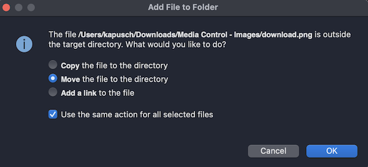

<!--more-->

<style>
.img-sizes{min-height:50px;max-height:600px;min-width:50px;max-width:600px;height:auto;width:auto}
</style>
Passons ensuite à la seconde rangée de boutons:

<figure><p align="center"></p></figure>

On a ici 5 boutons qui représentent une image cliquable, on fera donc appel au composant [ImageButton](https://learn.microsoft.com/en-us/dotnet/maui/user-interface/controls/imagebutton). Mais avant de pouvoir les coder, tu vas devoir dans un premier temps importer ces images dans le projet. Commence par télécharger l’ensemble des images:




Décompresse le fichier pour obtenir les 6 images suivantes:

<figure><p align="center"></p></figure>



🐒‎ ‎ 6 images… mais on n’avait pas dit 5 boutons seulement ?


Oui en effet, on aura bien 5 boutons pour contrôler le média. De gauche à droite ça donne:

* Répéter la chanson une fois (repeat_once.png)
* Revenir à la chanson précédente (skip_previous.png)
* Jouer la chanson (play.png) quand elle n’est pas déjà en cours de lecture, ou la mettre en pause (pause.png) quand elle est en train d’être jouée !
* Passer à la chanson suivante (skip_next.png)
* Télécharger le morceau (download.png)
Oui je sais, initialement j’avais pensé à un mode aléatoire de lecture, mais j’ai changé d’avis ! 😄 Comme quoi, c’est important de concevoir une maquette !

Maintenant que tu as obtenu les images, tu vas devoir les importer dans le projet afin de les rendre disponibles dans l’app. Pour cela, déplie le dossier *Resources* et fais un clic droit sur le dossier *Images*:

<figure><p align="center"></p></figure>

Dans le menu contextuel qui s’affiche, sous *Ajouter*, clique pour ajouter des fichiers depuis un dossier:

<figure><p align="center"></p></figure>

Sélectionne alors le dossier décompressé qui contient les 6 images, et valide. Une fenêtre apparaît pour sélectionner les fichiers à inclure dans le projet:

<figure><p align="center"></p></figure>

Dans notre cas, on veut importer toutes les images du dossier. Sélectionne-les toutes et valide.

A ce moment-là, il y a de grandes chances pour que Visual Studio te demande comment il doit les importer dans le dossier *Resources/Images*. Je te conseille de choisir de les copier, ou de les déplacer (pense à cocher la case pour appliquer ton choix à tous les fichiers !):

<figure><p align="center"></p></figure>

Voilà c’est terminé, vérifie que tu as bien tes 6 nouvelles images importées dans le dossier !

<figure><p align="center"></p></figure>

Allez c’est parti, on passe au code !

On définit d’abord les boutons aux extrémité, qui sont les plus simples:

```csharp
ImageButton RepeatOnceButton => new ImageButton
{
    CornerRadius = 5,
    HeightRequest = 25,
    WidthRequest = 25,
    Source = "repeat_once",
    BackgroundColor = Colors.Black
};

ImageButton DownloadButton => new ImageButton
{
    CornerRadius = 5,
    HeightRequest = 25,
    WidthRequest = 25,
    Source = "download",
    BackgroundColor = Colors.Black
};
```


On y définit la source de l’image par le nom du fichier associé, sans nécessairement préciser l’extension “.png”. Mais aussi, une forme carrée (25 de hauteur sur 25 de largeur) à fond noir et aux bords légèrement arrondis.

Ensuite, il reste à définir les 3 boutons pour contrôler le lecteur :

```csharp
ImageButton SkipPreviousButton => new ImageButton
{
    HeightRequest = 75,
    WidthRequest = 75,
    Source = "skip_previous"
};

ImageButton PlayButton => new ImageButton
{
    CornerRadius = 50,
    HeightRequest = 100,
    WidthRequest = 100,
    Source = "play",
    BackgroundColor = Colors.Black
};

ImageButton SkipNextButton => new ImageButton
{
    HeightRequest = 75,
    WidthRequest = 75,
    Source = "skip_next"
};
```


Rien de bien différent ici comparé aux deux premiers, si ce n’est que ceux-là sont plus grands, et que les boutons *SkipPrevious* et *SkipNext* n’ont de couleur définie en fond, contrairement au bouton *Jouer*. Ce dernier d’ailleurs a des bords très arrondis… tellement arrondis que le carré devient en fait un cercle parfait !



🐒‎ ‎ Un cercle parfait ? Comment as-tu fait ?


Il y a une technique très simple: la valeur assignée aux bords arrondis doit être égale à la moitié de la taille du composant. Ainsi, si tu veux un bouton de forme ronde d’une hauteur de 200, il faudra lui donner une valeur de 100 aux bords arrondis.

Allez il est désormais temps pour toi d’assigner ces nouveaux boutons sur la deuxième ligne de notre *BottomLayout* ! Comme on a 5 boutons pour 7 colonnes, ton intuition t’orientera peut-être à écrire le code suivant:

```csharp
RepeatOnceButton.Row(1).Column(1),
SkipPreviousButton.Row(1).Column(2),
PlayButton.Row(1).Column(3),
SkipNextButton.Row(1).Column(4),
DownloadButton.Row(1).Column(5)
```



🐒‎ ‎ Ben oui c’est ce que j’ai fait… et alors fallait pas ? 🙈


Si, bien sûr ! Tu as forcément dû vérifier en relançant ton app, et le résultat n’est pas si mal ! C’est juste une question de préférence. Pour ma part, j’ai recréé un *Grid* spécialement pour englober les boutons *Play, SkipPrevious* et *SkipNext*:

```csharp
Grid MediaControlLayout => new Grid
{
    ColumnDefinitions = Columns.Define(
            Stars(30),
            Stars(40),
            Stars(30)),
    ColumnSpacing = 0,
    Children =
    {
        SkipPreviousButton.Column(0),
        PlayButton.Column(1),
        SkipNextButton.Column(2)
    }
};
```


Et de positionner les boutons dans le *BottomLayout* de cette façon:

```csharp
RepeatOnceButton.Row(1).Column(1),
MediaControlLayout.Row(1).Column(2).ColumnSpan(3),
DownloadButton.Row(1).Column(5)
```


Et voilà, ça commence à prendre forme !

<figure><p align="center"></p></figure>

