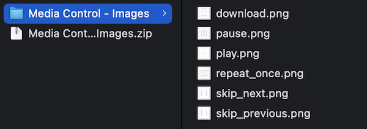
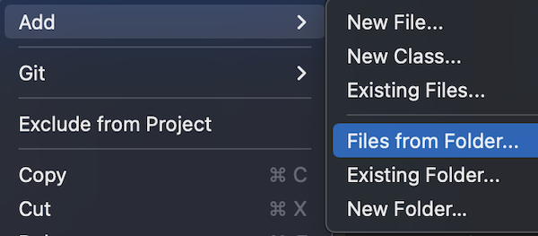

<!--more-->

<style>
.img-sizes{min-height:50px;max-height:600px;min-width:50px;max-width:600px;height:auto;width:auto}
</style>


Afin d’assurer le bon déroulement de cet article, je t’invite à repartir <a href="../7-time-tracker/">depuis ce chapitre</a> où l’on a démarré la mise en place des contrôles du lecteur musical.


Lors du dernier chapitre, on s’était attelés à la mise en place des premiers éléments visuels du lecteur musical. On y avait notamment découvert deux composants: le [Label](https://learn.microsoft.com/fr-fr/dotnet/maui/user-interface/controls/label) et le [Slider](https://learn.microsoft.com/fr-fr/dotnet/maui/user-interface/controls/slider).

Aujourd’hui, on va continuer sur notre belle lancée et reproduire toute une série de boutons pour contrôler le média.


# La guerre des boutons

Pour écouter de la musique, notre utilisateur a besoin de fonctions clés comme : jouer un morceau, passer à la piste suivante, etc. Si tu te souviens de la maquette, on avait une rangée principale de 5 boutons :

<figure><p align="center"></p><figcaption class="image-caption">5 boutons bien alignés sur la même rangée, mais ils n’ont pas tous la même taille.</figcaption></figure>


La différence avec le bouton “ENTER” de la page d’accueil, c’est qu’ici, nos 5 boutons représentent une image cliquable. Pour les reproduire dans l’app, on fera donc appel au composant [ImageButton](https://learn.microsoft.com/fr-fr/dotnet/maui/user-interface/controls/imagebutton).

Mais tout d’abord, il faudra ajouter ces fameuses images au projet. Commence donc par les télécharger sur ton ordinateur :




Puis décompresse le fichier obtenu. Tu devrais avoir les 6 images suivantes :

<figure><p align="center"></p></figure>



🐒‎ ‎ 6 images… mais on n’avait pas dit 5 boutons ?



En effet, il y aura bien 5 boutons sur cette rangée. Mais rien ne nous empêche de remplacer l’image du bouton par une autre !

Si tu reprends la maquette, il y aura de gauche à droite :

* un bouton pour rejouer la piste musicale (une seule fois) ⇒ c’est l’image *repeat_once.png*
* un autre pour revenir à la chanson précédente ⇒ *skip_previous.png*
* on aura aussi un gros bouton central pour jouer ou mettre en pause la musique. C’est l’image de ce bouton qui changera automatiquement selon les cas suivants :
    * soit la piste n’est pas en cours de lecture ⇒ ce sera l’image *play.png*
    * ou bien elle est déjà en train d’être jouée ⇒ on affichera alors *pause.png*
* puis on aura un bouton pour passer à la chanson suivante ⇒ *skip_next.png*
* et un dernier pour télécharger le morceau ⇒ *download.png*


Oui je sais, cette dernière fonction “télécharger” n’était pas prévue au programme ! Çà devait initialement être pour lire les titres en mode aléatoire, mais j’ai changé d’avis. 😄

Comme quoi, c’est important de concevoir une maquette aussi fiable que possible !

# Ajouter les images au projet

Maintenant que tu as téléchargé toutes les images, tu dois les importer dans le projet pour qu’elles deviennent utilisables par l’application. Pour cela, ouvre le projet dans Visual Studio et fais un clic droit sur le dossier *Images* :

<figure><p align="center"></p><figcaption class="image-caption">Rappelle-toi, c’est dans le dossier Resources qu’on stocke tous les médias (icônes, images, pistes audio et vidéo, …)</figcaption></figure>


Dans le menu contextuel qui s’affiche, dans la section *Ajouter*, clique sur l’option pour ajouter des fichiers depuis un dossier :

<figure><p align="center"></p></figure>


Puis, sélectionne le dossier où tu as décompressé les 6 images et valide ton choix. Une fenêtre apparaît alors pour choisir les fichiers à inclure dans le projet.

Dans notre cas, on veut importer toutes les images du dossier. Sélectionne donc tous les fichiers disponibles et clique sur OK :

<figure><p align="center"></p></figure>



Il y a de grandes chances pour que Visual Studio te demande quelle stratégie appliquer pour importer les fichiers dans le dossier *Resources/Images*. Je te conseille de choisir de les copier, ou de les déplacer.



Voilà c’est terminé, vérifie que tu as bien les 6 nouvelles images importées dans le dossier !

<figure><p align="center"></p></figure>


# Découverte des ImageButton

Maintenant que les images sont prêtes à l’emploi, on passe au code !

Définissons d’abord les deux boutons les plus petits (ceux aux extrémités) :

<p align="center" style="margin-bottom:-10px"><strong>Nom du fichier :</strong><code>MusicPlayerView.cs</code></p>

```csharp
ImageButton RepeatOnceButton => new ImageButton
{
    CornerRadius = 5,
    HeightRequest = 25,
    WidthRequest = 25,
    Source = "repeat_once.png",
    BackgroundColor = Colors.Black
};

ImageButton DownloadButton => new ImageButton
{
    CornerRadius = 5,
    HeightRequest = 25,
    WidthRequest = 25,
    Source = "download.png",
    BackgroundColor = Colors.Black
};
```


Comme tu peux le constater, on leur a défini une petite taille de forme carrée (25 de hauteur sur 25 de largeur), à fond noir et aux coins légèrement arrondis (via la propriété `CornerRadius`). Puis, ils ont eu chacun leur propre image assignée grâce à la propriété `Source`, en lui passant le nom du fichier correspondant.



Si tu ne prévois pas de cibler la plateforme Windows, alors il n’est pas nécessaire de préciser l’extension *”.png”* dans le nom du fichier.



Reste alors à définir les 3 boutons pour contrôler la lecture du morceau, en ayant toujours recours à l’*ImageButton* :

<p align="center" style="margin-bottom:-10px"><strong>Nom du fichier :</strong><code>MusicPlayerView.cs</code></p>

```csharp
ImageButton SkipPreviousButton => new ImageButton
{
    HeightRequest = 75,
    WidthRequest = 75,
    Source = "skip_previous.png"
};

ImageButton PlayButton => new ImageButton
{
    CornerRadius = 50,
    HeightRequest = 100,
    WidthRequest = 100,
    Source = "play.png",
    BackgroundColor = Colors.Black
};

ImageButton SkipNextButton => new ImageButton
{
    HeightRequest = 75,
    WidthRequest = 75,
    Source = "skip_next.png"
};
```


Finalement, ce n’est pas tellement différent ! Cependant, tu noteras que ces contrôles sont plus grands, et surtout, les boutons *SkipPrevious* et *SkipNext* n’ont pas de couleur de fond.

Au contraire, le bouton *Jouer*, lui, est doté d’un arrière-plan noir et a les coins très arrondis… tellement arrondis que la forme n’est plus carrée, mais ronde !



🐒‎ ‎ Ah bon, une forme ronde ? Mais comment as-tu fait ?



La technique est très simple : les valeurs de `HeightRequest` et `WidthRequest` doivent être identiques, tandis que celle du `CornerRadius` doit leur être deux fois inférieure. Ainsi, si tu veux un bouton de forme ronde avec une hauteur de 200, son arrondissement devra avoir une valeur de 100.

# Préparation pour la démo

Allez, il est désormais temps pour toi de répartir ces nouveaux contrôles sur la deuxième ligne du *BottomLayout* ! Étant donné qu’on a 5 boutons pour 7 colonnes, tu auras peut-être opté pour la disposition suivante :

<p align="center" style="margin-bottom:-10px"><strong>Nom du fichier :</strong><code>MusicPlayerView.cs</code></p>

```csharp
RepeatOnceButton.Row(1).Column(1),
SkipPreviousButton.Row(1).Column(2),
PlayButton.Row(1).Column(3),
SkipNextButton.Row(1).Column(4),
DownloadButton.Row(1).Column(5)
```



🐒‎ ‎ Ben oui c’est ce que j’ai fait… et alors fallait pas ? 🙈



Si, bien sûr ! Tu as forcément dû relancer ton app pour vérifier, et le rendu n’est pas si mal.

Pour ma part, j’ai préféré recréer un *Grid* spécialement pour englober les boutons *Play, SkipPrevious* et *SkipNext*, comme ceci :

<p align="center" style="margin-bottom:-10px"><strong>Nom du fichier :</strong><code>MusicPlayerView.cs</code></p>

```csharp
Grid MediaControlLayout => new Grid
{
    ColumnDefinitions = Columns.Define(
            Stars(30),
            Stars(40),
            Stars(30)),
    ColumnSpacing = 0,
    Children =
    {
        SkipPreviousButton.Column(0),
        PlayButton.Column(1),
        SkipNextButton.Column(2)
    }
};
```


Il s’agit seulement d’une grille divisée en trois colonnes, avec chacune une taille spécifique. Ainsi, le bouton *Play* prendra un peu plus d’espace que les deux autres. Mais bon, tout ça est devenu facile pour toi, tu commences à maîtriser maintenant ! 😎


Allez, il ne reste plus qu’à positionner le *MediaControlLayout* de cette façon :

```csharp
RepeatOnceButton.Row(1).Column(1),
MediaControlLayout.Row(1).Column(2).ColumnSpan(3),
DownloadButton.Row(1).Column(5)
```


Et hop, ça y est, ça commence vraiment à prendre forme ! 🤩

<figure><p align="center"></p></figure>


Tu t’en es vraiment bien sorti, continue comme ça ! D’ailleurs, il nous reste encore la gestion du volume de la musique à reproduire dans l’app, et c’est justement l’objet du <a href="../9-volume-tracker/">prochain chapitre</a> !

---
Plus d'articles dans la même série:

