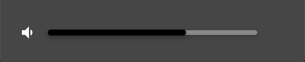
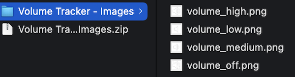
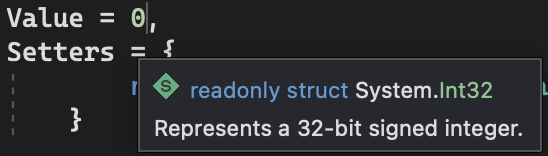
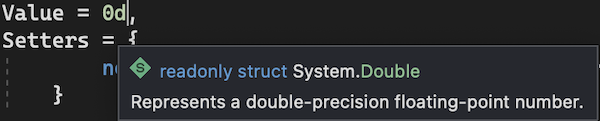

<!--more-->

<style>
.img-sizes{min-height:50px;max-height:600px;min-width:50px;max-width:600px;height:auto;width:auto}
</style>


Afin d’assurer le bon déroulement de cet article, je t’invite à repartir <a href="../7-time-tracker/">depuis ce chapitre</a> où l’on a démarré la mise en place des contrôles du lecteur musical.


Lors du dernier chapitre, on s’était attelés à la mise en place des contrôles de lecture du média. On y avait notamment découvert un nouveau type de bouton: le composant [ImageButton](https://learn.microsoft.com/fr-fr/dotnet/maui/user-interface/controls/imagebutton).

Aujourd’hui, on va encore développer notre interface utilisateur avec l’intégration des contrôles du volume. C’est la dernière ligne droite avant de commencer à implémenter le cœur de notre lecteur musical, alors accroche-toi !

# Tout l’art de reproduire

Allez, reprenons donc la maquette, voici ce que l’on devra reproduire dans l’app :

<figure><p align="center"></p><figcaption class="image-caption">Cette fois-ci, il n’y a que deux contrôles, ça devrait être rapide !</figcaption></figure>


Comme tu peux le constater, ce n’est rien d’autre qu’un bouton pour couper le son et une barre de contrôle du volume sonore. Ça ne devrait pas être très long, commence par télécharger les différentes images utilisées pour afficher l’état du volume.




En décompressant ce fichier, tu verras 4 nouvelles images:

<figure><p align="center"></p></figure>


Ici, on a donc une image pour chaque niveau de volume : quand il est très fort, moyen ou très bas. D’ailleurs, il y en a même une pour quand le son sera coupé.

Maintenant que tu as les images, il ne te reste alors plus qu’à les inclure dans le dossier *Resources/Images*, exactement comme la dernière fois !



Si tu as des doutes, tu peux te référer <a href="../8-media-control/">au chapitre précédent</a> .


# À vos marques, prêt ? Codez !

C’est bon, tout est prêt ? Allez on passe au code !

Pour cela, on aura besoin d’un *ImageButton* pour couper le son et d’un *Slider* pour contrôler le volume sonore de manière précise.



🐒‎ ‎ Ah ! Mais je les connais ceux-là !



Eh oui ! Techniquement, c’est du déjà-vu, alors essaye de reproduire ces contrôles par toi-même avant de regarder le code qui suit :

<p align="center" style="margin-bottom:-10px"><strong>Nom du fichier :</strong><code>MusicPlayerView.cs</code></p>

```csharp
ImageButton MuteButton = new ImageButton
{
    HeightRequest = 25,
    WidthRequest = 25,
    Source = "volume_medium"
};

Slider VolumeTracker = new Slider
{
    Minimum = 0,
    MinimumTrackColor = Colors.Black,
    Maximum = 100,
    MaximumTrackColor = Colors.Gray,
    Value = 60
};
```


Voilà, on a donc défini un *ImageButton* avec une image par défaut, et un *Slider* pour contrôler le volume sonore de 0% à 100%. Et tu l’auras sûrement noté, le *Slider* est composé d’une barre noire qui représente le volume actuel, et d’une barre grise pour le volume supérieur disponible.

Il ne te reste alors plus qu’à rajouter les contrôles dans le *BottomLayout* :

<p align="center" style="margin-bottom:-10px"><strong>Nom du fichier :</strong><code>MusicPlayerView.cs</code></p>

```csharp
MuteButton.Row(2).Column(1),
VolumeTracker.Row(2).Column(2).ColumnSpan(3),
```


Alors, tu avais bien pensé à appliquer un *ColumnSpan* ? 😛 On en a en effet besoin pour afficher la barre de son à cheval sur trois colonnes de notre *Grid*.

Allez, il est temps de relancer l’appli ! Voyons ce que ça donne :

<figure><p align="center"></p><figcaption class="image-caption">Vu comme ça, on dirait presque que l’application est terminée…</figcaption></figure>

# Changer d’image quand le son est coupé 

Ça devient plus facile avec tout cet entraînement, tu commences à prendre le coup de main ? 🙂

Bon, cette fois-ci, il n’y avait que deux composants à définir, alors on va aller un petit plus loin. Tu te rappelles des différentes images pour notre volume ? Il est temps de leur trouver une utilité !


L’idée, c’est que notre `MuteButton` change d’apparence en fonction du niveau de volume demandé. On aura donc une référence directe au `VolumeTracker` pour trouver la bonne image à associer au `MuteButton`. Pour cela, on utilisera un [DataTrigger](https://learn.microsoft.com/fr-fr/dotnet/maui/fundamentals/triggers#data-triggers) qui permet de modifier la propriété d’un objet lorsqu’une certaine valeur est détectée.

Prenons le cas le plus simple, celui où le volume sonore détecté est de 0 :

<p align="center" style="margin-bottom:-10px"><strong>Nom du fichier :</strong><code>MusicPlayerView.cs</code></p>

```csharp
DataTrigger VolumeOffTrigger => new DataTrigger(typeof(ImageButton))
{
	Binding = new Binding(nameof(Slider.Value), source: VolumeTracker),
	Value = 0d,
	Setters = {
		new Setter { Property = ImageButton.SourceProperty, Value = "volume_off" }
	}
};
```


Dans un premier temps, on précise sur quel type d’objet appliquer des modifications. Dans notre cas, ce sera un *ImageButton*, puisque c’est l’image du `MuteButton` que l’on veut changer :

<p align="center" style="margin-bottom:-10px"><strong>Nom du fichier :</strong><code>MusicPlayerView.cs</code></p>

```csharp
DataTrigger VolumeOffTrigger => new DataTrigger(typeof(ImageButton))
```


Puis, à l’aide d’un *Setter*, on demande au `VolumeOffTrigger` de changer la source d’image du `MuteButton` pour l’icône correspondant au volume éteint :

<p align="center" style="margin-bottom:-10px"><strong>Nom du fichier :</strong><code>MusicPlayerView.cs</code></p>

```csharp
new Setter { Property = ImageButton.SourceProperty, Value = "volume_off" }
```


Or, la modification ne doit s’appliquer que dans le cas où la valeur du `VolumeTracker` atteint 0 !

Ceci est rendu possible par la technique du *Binding*. On crée alors un lien vers ce composant pour suivre l’évolution de la propriété *Value* :

<p align="center" style="margin-bottom:-10px"><strong>Nom du fichier :</strong><code>MusicPlayerView.cs</code></p>

```csharp
Binding = new Binding(nameof(Slider.Value), source: VolumeTracker)
```


Enfin, la valeur cible à atteindre est définie dans le `VolumeOffTrigger` de cette façon :

<p align="center" style="margin-bottom:-10px"><strong>Nom du fichier :</strong><code>MusicPlayerView.cs</code></p>

```csharp
 Value = 0d
```


En résumé, on a donc un déclencheur qui modifiera l’icône au moment où l’utilisateur abaissera la valeur du *Slider* à zéro.



🐒‎ ‎ Ok ! Mais pourquoi mettre un “d” après le “0” ?



Héhé, bien vu ! En effet, ce n’était pas une erreur typographique 😄

En fait, la [documentation du Slider](https://learn.microsoft.com/fr-fr/dotnet/maui/user-interface/controls/slider) précise que la propriété *Value* est de type [double](https://learn.microsoft.com/fr-fr/dotnet/api/system.double?view=net-6.0). Cela donne à l’utilisateur un peu plus de contrôle quand il manipule un *Slider* (à la virgule près !).

Or, si tu supprimes le “d” et que tu passes ta souris au-dessus du “0”, tu constateras que ce n’est plus considéré comme un double, mais un [int](https://learn.microsoft.com/fr-fr/dotnet/api/system.int32?view=net-6.0) !

<figure><p align="center"></p><figcaption class="image-caption">Visual Studio est clair sur ce point, “0” est bien un entier !</figcaption></figure>


Et comme la propriété *Value* de notre déclencheur est de type *object*, elle accepte potentiellement n’importe quel type de valeur. On doit donc explicitement lui indiquer comment considérer ce “0” : comme un double !

On doit rajouter le “d” juste après :

<figure><p align="center"></p><figcaption class="image-caption">À présent, “0” est bien un double ! Visual Studio n’y a vu que du feu. </figcaption></figure>


Il ne reste alors plus qu’à rattacher ce déclencheur à notre composant `MuteButton`. D’ailleurs, comme il sera sujet à des configurations supplémentaires, on va isoler son initialisation dans une méthode `InitMuteButton()`. Cela permettra de garder notre code clair :

<p align="center" style="margin-bottom:-10px"><strong>Nom du fichier :</strong><code>MusicPlayerView.cs</code></p>

```csharp
public MusicPlayerView()
{
	...
	InitMuteButton();
	
	Content = new Grid
	{
		...
	};
}

void InitMuteButton()
{
	MuteButton.Triggers.Add(VolumeOffTrigger);
}
```


Et voilà ! Essaye maintenant de glisser la valeur du *Slider* tout à gauche :

<figure><p align="center"></p><figcaption class="image-caption">L’icône du son coupé apparaît aussitôt que le curseur est déplacé tout à gauche.</figcaption></figure>


# Un bouton dans tous ses états !

Maintenant que tu sais comment fonctionnent les déclencheurs, on va en créer d’autres pour gérer tous les différents états du bouton.

Fonctionnellement, voici ce que l’on aimerait mettre en place :

* l’icône du volume bas apparaîtra pour toutes les valeurs comprises entre 1 et 15,
* entre 16 et 50, on affichera l’icône du volume modéré,
* et pour l’icône du volume élevé, ce sera entre 51 et 100.


Pour tous ces cas-là, le déclencheur ne dépend plus d’une seule valeur bien précise, mais plutôt de toute une plage de valeurs. On va donc faire appel à un nouveau déclencheur spécifique, le [MultiTrigger](https://learn.microsoft.com/fr-fr/dotnet/maui/fundamentals/triggers?view=net-maui-7.0#multi-triggers). C’est le même principe que pour le *DataTrigger*, à la différence que le *MultiTrigger* dépendra du résultat de plusieurs conditions. Je vais t’expliquer juste après.


Pour le moment, déclarons nos trois nouveaux états possibles :

<p align="center" style="margin-bottom:-10px"><strong>Nom du fichier :</strong><code>MusicPlayerView.cs</code></p>

```csharp
MultiTrigger VolumeLowTrigger = new MultiTrigger(typeof(ImageButton))
{
	Setters = {
		new Setter { Property = ImageButton.SourceProperty, Value = "volume_low" }
	}
};

MultiTrigger VolumeMediumTrigger = new MultiTrigger(typeof(ImageButton))
{
	Setters = {
		new Setter { Property = ImageButton.SourceProperty, Value = "volume_medium" }
	}
};

MultiTrigger VolumeHighTrigger = new MultiTrigger(typeof(ImageButton))
{
	Setters = {
		new Setter { Property = ImageButton.SourceProperty, Value = "volume_high" }
	}
	};
```


Tout ce qu’on a fait, c’est définir les changements d’apparence à l’aide de *Setters*, pour un volume bas, moyen ou élevé.

On peut désormais définir les conditions de déclenchement pour ces trois états. Modifie la méthode `InitMuteButton()` comme indiqué ci-après :

<p align="center" style="margin-bottom:-10px"><strong>Nom du fichier :</strong><code>MusicPlayerView.cs</code></p>

```csharp
void InitMuteButton()
{
    BindingCondition CreateRangeCondition(OperatorType comparison, double value) => new BindingCondition
    {
        Binding = new Binding(
                    nameof(Slider.Value),
                    source: VolumeTracker,
                    converter: new CompareConverter
                    {
                        ComparisonOperator = comparison,
                        ComparingValue = value
                    }),
        Value = true
    };

    BindingCondition CreateMinRangeCondition(double value) => CreateRangeCondition(OperatorType.GreaterOrEqual, value);
    BindingCondition CreateMaxRangeCondition(double value) => CreateRangeCondition(OperatorType.SmallerOrEqual, value);

    VolumeLowTrigger.Conditions.Add(CreateMinRangeCondition(1d));
    VolumeLowTrigger.Conditions.Add(CreateMaxRangeCondition(15d));
    VolumeMediumTrigger.Conditions.Add(CreateMinRangeCondition(16d));
    VolumeMediumTrigger.Conditions.Add(CreateMaxRangeCondition(50d));
    VolumeHighTrigger.Conditions.Add(CreateMinRangeCondition(51d));
    VolumeHighTrigger.Conditions.Add(CreateMaxRangeCondition(100d));

    MuteButton.Triggers.Add(VolumeOffTrigger);
    MuteButton.Triggers.Add(VolumeLowTrigger);
    MuteButton.Triggers.Add(VolumeMediumTrigger);
    MuteButton.Triggers.Add(VolumeHighTrigger);
}
```


Oui je sais, ça peut faire beaucoup d’un coup, mais ce n’est pas dur à comprendre. D’ailleurs, tu peux voir qu’on répète souvent les mêmes opérations dans ce bout de code !



🐒‎ ‎ Bah ouais, même pas peur ! Je fais quoi ensuite ?



A ce stade, quelques erreurs auront probablement été mises en évidence par Visual Studio. Pour les résoudre, déclare les en-têtes suivantes tout en haut du fichier :

<p align="center" style="margin-bottom:-10px"><strong>Nom du fichier :</strong><code>MusicPlayerView.cs</code></p>

```csharp
using CommunityToolkit.Maui.Converters;
using static CommunityToolkit.Maui.Converters.CompareConverter<object>;
```



Cette étape est requise pour que le compilateur comprenne à quoi correspondent les nouveaux objets utilisés : *CompareConverter* et *Operator.Type*.



Il est maintenant temps de passer aux explications. Décortiquons un peu cette méthode `InitMuteButton()` en commençant par cette portion de code :

<p align="center" style="margin-bottom:-10px"><strong>Nom du fichier :</strong><code>MusicPlayerView.cs</code></p>

```csharp
VolumeLowTrigger.Conditions.Add(CreateMinRangeCondition(1d));
VolumeLowTrigger.Conditions.Add(CreateMaxRangeCondition(15d));
VolumeMediumTrigger.Conditions.Add(CreateMinRangeCondition(16d));
VolumeMediumTrigger.Conditions.Add(CreateMaxRangeCondition(50d));
VolumeHighTrigger.Conditions.Add(CreateMinRangeCondition(51d));
VolumeHighTrigger.Conditions.Add(CreateMaxRangeCondition(100d));
```


Ça paraît déjà plus simple comme ça, non ? Tout ce qu’on fait ici, c’est ajouter à chacun des déclencheurs deux conditions nécessaires au changement d’icône du `MuteButton`.

Par exemple, si tu regardes pour le `VolumeLowTrigger`, tu verras que la première condition de déclenchement est liée à une valeur minimale de 1, tandis que l’autre condition dépend d’une valeur maximale de 15. Ça te rappelle quelque chose maintenant ?



🐒‎ ‎ Mais oui ! C’est pour que l’icône correspondant au volume bas apparaisse dès que le volume est compris entre 1 et 15 !



Tout à fait ! Et la même logique s’applique pour le `VolumeMediumTrigger` et le `VolumeHighTrigger`. 🙂

Bon, mais ça n’est pas magique non plus ! La création de ces conditions s’appuie sur les méthodes `CreateMinRangeCondition(double value)` et `CreateMaxRangeCondition(double value)` :

<p align="center" style="margin-bottom:-10px"><strong>Nom du fichier :</strong><code>MusicPlayerView.cs</code></p>

```csharp
BindingCondition CreateMinRangeCondition(double value) => CreateRangeCondition(OperatorType.GreaterOrEqual, value);
BindingCondition CreateMaxRangeCondition(double value) => CreateRangeCondition(OperatorType.SmallerOrEqual, value);
```


La première méthode représente la valeur minimale de déclenchement du nouvel état, et la seconde la valeur maximale. Pour créer ces conditions, il faut donc une valeur cible, et un type d’opérateur : `GreaterOrEqual` ou `SmallerOrEqual`.

Ces paramètres sont justement pris en compte par une méthode de base définie tout au début du `InitMuteButton()`. Elle reprend le même principe que pour le *DataTrigger* qui est utilisé pour le déclencheur `VolumeOffTrigger` :

<p align="center" style="margin-bottom:-10px"><strong>Nom du fichier :</strong><code>MusicPlayerView.cs</code></p>

```csharp
BindingCondition CreateRangeCondition(OperatorType comparison, double value) => new BindingCondition
{
    Binding = new Binding(
                nameof(Slider.Value),
                source: VolumeTracker,
                converter: new CompareConverter
                {
                    ComparisonOperator = comparison,
                    ComparingValue = value
                }),
    Value = true
};
```


La seule nouveauté ici, c’est qu’on ne cherche plus à atteindre une valeur cible numérique (comme auparavant avec le “0”). En effet, on se base plutôt sur le résultat d’une comparaison.

Le but de la méthode `CreateRangeCondition(OperatorType comparison, double value)` est de créer une condition de déclenchement en fonction d’une valeur étalon et d’un type de comparaison. Et en y regardant de plus près, tu verras qu’elle définit un *Binding* sur la valeur du `VolumeTracker` tout en lui appliquant un [CompareConverter](https://learn.microsoft.com/fr-fr/dotnet/communitytoolkit/maui/converters/compare-converter).

L’idée est simple, on veut définir des conditions pour qu’elles soient remplies uniquement si le résultat de la comparaison de la valeur étalon avec la valeur détectée est vraie.



🐒‎ ‎ Euh… Mais ça donne quoi avec un exemple concret ? 🙊



Ça va venir, pas de panique ! Imagine que l’on ait créé une condition lambda, et que cette condition n’est remplie que si la valeur détectée est supérieure ou égale à 80.

Si le volume actuel est à 50, tu es d’accord pour dire que ça ne fera rien ? Bon, et maintenant imagine que tu montes le volume à 88… Boom, ça y est ! Ta condition est désormais satisfaite et cela va logiquement déclencher quelque chose 🙂


Courage, tu y es presque ! Il ne manque plus qu’à ajouter nos trois nouveaux déclencheurs au `MuteButton`. Et ça, je sais que tu sais faire ! On procède donc comme ci-après :

<p align="center" style="margin-bottom:-10px"><strong>Nom du fichier :</strong><code>MusicPlayerView.cs</code></p>

```csharp
MuteButton.Triggers.Add(VolumeOffTrigger);
MuteButton.Triggers.Add(VolumeLowTrigger);
MuteButton.Triggers.Add(VolumeMediumTrigger);
MuteButton.Triggers.Add(VolumeHighTrigger);
```


Voilà, c’est terminé ! Vas-y réessaye de lancer l’appli !

<figure><p align="center"></p><figcaption class="image-caption">Magie, magie ! L’image du bouton change en fonction de la position du curseur.</figcaption></figure>


L’application commence sérieusement à prendre forme, j’espère que tu es fier de toi !

Seulement… tout ce qu’on a pour le moment n’est que visuel. Rien ne se passe vraiment quand on manipule tous les boutons !

Rassure-toi, tu es maintenant prêt pour développer les fonctionnalités clés de l’appli, dès le prochain chapitre !

---
Plus d'articles dans la même série:

